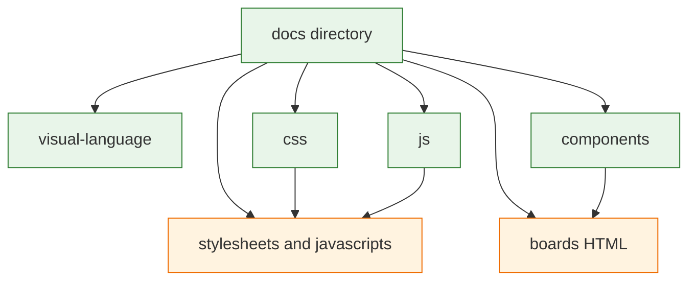

# Architecture Decision: Docs tree and catalog map

## Requirements & Constraints

**Functional requirements**
- Directory hierarchy is the nav (no `nav:` in `properdocs.yml`).
- CSS documentation and JS documentation live in separate folders.
- Section homes are `index.md` or `README.md`.
- One catalog page per component *family* (all panel variants together, all list variants together). Not one class per page. Not a suggested serving.
- Existing visual-language essays stay reachable.

**Quality attributes (ranked)**
1. Maintainability — a later page must have an obvious folder.
2. Fitness — inferred nav must match how someone learns the system (language, then CSS, then JS, then components).
3. Simplicity — no plugin or extra folder unless the tree cannot do the job.
4. Risk — URL and skill-path churn should be a single move, not a scheme we will redo.

**Technical constraints**
- `docs/stylesheets/` and `docs/javascripts/` are dual-load *asset* dirs (`extra_css` / `extra_javascript`). Markdown must not live there.
- Those dirs are currently gitignored wholesale, so `docs-init.js` and `docs-islands.css` are untracked. The tree decision must leave a place for tracked chrome CSS/JS vs gitignored `nerv.css` / `nerv.js`.
- MkDocs 1.6 `not_in_nav` hides files from inferred nav without awesome-pages.
- Material `navigation.indexes` attaches `index.md` to the section header ([section index pages](https://squidfunk.github.io/mkdocs-material/setup/setting-up-navigation/)).
- awesome-pages / `.pages` only when ordering cannot come from the tree.

**Boundaries**
- In: folder names, page inventory, section homes, how nav is ordered, gitignore for asset dirs.
- Out: how swatch HTML is published (next open question). Motion class rename (issue #12). New idea boards for servings.

## Components

- `docs/visual-language/` — stills-and-feel essays (existing three files).
- `docs/components/css/` — colors, fonts, effects, and the alert cascade on the section home; CSS family pages.
- `docs/components/javascript/` — `NERV` method table on the section home; JS family pages. Distinct from `docs/javascripts/` (scripts).
- Asset dirs — tracked `docs-islands.css` / `docs-init.js`; gitignored `nerv.css` / `nerv.js`.
- `skills/nerv/` is a placeholder `SKILL.md`. Catalog markdown is not copied there.

## Options Evaluated

- **A — Flat Using plus components/**: Keep taxonomy at `docs/` root; add `css/` and `js/` folders; leave `components/`. Fewest moves. Inferred nav still interleaves `design-language.md` with `service-manual.md` and new folders.
- **B — Layered folders + `index.md` + root `.pages`**: Four section folders (`visual-language`, `css`, `js`, `components`), section homes as `index.md`, one awesome-pages `.pages` at `docs/` so the sidebar is language → CSS → JS → components → service manual. `not_in_nav` for `reading.md` and boards.
- **C — Numbered folder prefixes instead of `.pages`**: `01-visual-language/` etc. Ordering without a plugin. Ugly URLs forever; skill paths inherit the numbers.

## Analysis

| Criterion | A Flat | B Layered plus `.pages` | C Numbered prefixes |
|-----------|--------|-------------------------|---------------------|
| Fitness | Weak: taxonomy, service manual, and Using compete at one level | Matches the learning order we already had in `nav:` | Order works; names are noise |
| Simplicity | No plugin | One allowed `.pages` + `mkdocs-awesome-pages-plugin` | No plugin, worse names |
| Maintainability | New pages have no obvious parent | Folder *is* the parent | Renames hurt every link |
| Risk | We will restucture again | Plugin is small; URLs are stable words | Prefixes become a public contract |

Key insights:
- `css/` vs `stylesheets/` and `js/` vs `javascripts/` is the only collision to avoid. Documentation folders must not be the asset dirs.
- Alphabetical inferred nav puts `components` first. That is exactly the case “`.pages` when absolutely necessary.”
- `index.md` is the MkDocs/Material default for section homes. `README.md` would need extra config. Use `index.md`.
- Two radar documents are different jobs: `visual-language/radar.md` is the timing why; `components/css/heavies/radar.md` and `components/javascript/heavies/radar.md` are usage. Cross-link. Do not merge.

## Decision

### Choice Pre-Mortem

- The catalog map is too many tiny pages and nobody can find dividers vs grid-marks: **checked** — grouping is by *component family* from `src/nerv.scss` forwards, not one file per modifier. Chrome pieces (dividers, grid-marks, reticles) stay separate families because they are not variants of one component.
- awesome-pages fights ProperDocs 1.6: **unchecked until plan technology validation** — prove `uv run properdocs build --strict` with the plugin before preflight. If it fails, fall back to one root `.pages` alternative: a tiny `hooks.py` is not simpler; numbered prefixes are Option C.
- Putting JS docs in `docs/javascripts/` seemed to satisfy “JS in a folder” and then inferred nav lists `nerv.js`: **checked** — markdown goes in `docs/js/` only.

**Selected**: Option B — layered folders, `index.md` section homes, one root `.pages`, `not_in_nav` for non-catalog markdown/HTML.

**Operator correction 2026-09-13 (later):** CSS, JS, and a nested `components/css`+`components/js` was the same split twice. Flattened briefly to `docs/css/` + `docs/js/`.

**Operator correction 2026-09-13 (latest):** Wanted IA is `components/css` and `components/javascript` only. Tokens/type/glow live on `components/css/index.md`; the `NERV` method table lives on `components/javascript/index.md`. No top-level `docs/css/` or `docs/js/`. Dual families have an entry in both. Nested `.pages` are not used — awesome-pages infers child nav. One root `docs/.pages` only. Sidebar is the TOC; pages do not repeat it.

**Operator correction 2026-09-13 (layers):** Nested CSS layers `core` / `structure` / `atoms` / `heavies`. Core is paint (colors + folded gradients, typography, effects, alert cascade). Structure is regions (panels absorb dividers; MAGI and grid-marks are siblings). Atoms are one-job instruments. Heavies are named wholes of higher atomic weight (radar, reticles, JS-only data-bg) — not optional flourishes. JS mirrors only when a leaf has a hook. No nested `.pages`.

**Rationale**: Maintainability and fitness beat A’s fewer moves. C pollutes URLs to avoid a plugin the operator already allowed for ordering.
**Tradeoff**: One new docs dependency (`mkdocs-awesome-pages-plugin`). Visual-language file order can be a second `.pages` only if alpha puts atomic-elements before design-language and that proves annoying; default to alpha inside the folder unless a `.pages` is required.

## Implementation Notes

- Enable Material `navigation.indexes` next to existing `navigation.sections`.
- Root `docs/.pages` order: `index.md`, `visual-language`, `components`, `service-manual.md`. Hide `reading.md` via `not_in_nav`, not via `.pages` hide, so it still builds.
- **Catalog inventory**
  - `visual-language/index.md` — short section home linking the three essays.
  - `visual-language/design-language.md`, `atomic-elements.md`, `radar.md` — move, fix relative `img/` links (`../img/`).
  - `css/index.md` — tokens, type, then glow as modifier classes (one example per glow *kind*: text, box, drop — not every color).
  - `components/css/index.md` — colors, fonts, effects (including flicker family, blink, glitch, scanlines), alert cascade. Link the effects board from Effects.
  - `js/index.md` — scoped `NERV.init*` and `setState`. State that Material pages must not call `NERV.init()`.
  - `components/` one family per file: `panels`, `bar-meters`, `lists`, `tables`, `forms`, `cartouches`, `hex-grid`, `radar`, `stripe-bars`, `dividers`, `grid-marks`, `reticles`, `magi`, `label-box`, `status-text`, `segment-display`, `gradients`, `data-bg`, `states`.
  - `components/index.md` — section home, not a serving.
  - Alert cascade lives on `components/css/index.md` (`#alert-cascade`). No sibling `states.md`. `NERV.setState` is on the JavaScript landing.
- Gitignore: keep `docs/stylesheets/nerv.css` and `docs/javascripts/nerv.js`; **delete** the directory-wide `docs/stylesheets` and `docs/javascripts` ignores; track `docs-islands.css` and `docs-init.js`.
- Move `docs/css.md` → `docs/css/index.md`. Move `docs/components/*.md` in place (already correct folder).
- `docs/index.md` links become folder links.
- Skill copies follow the new relative paths (old skill paths deleted).
