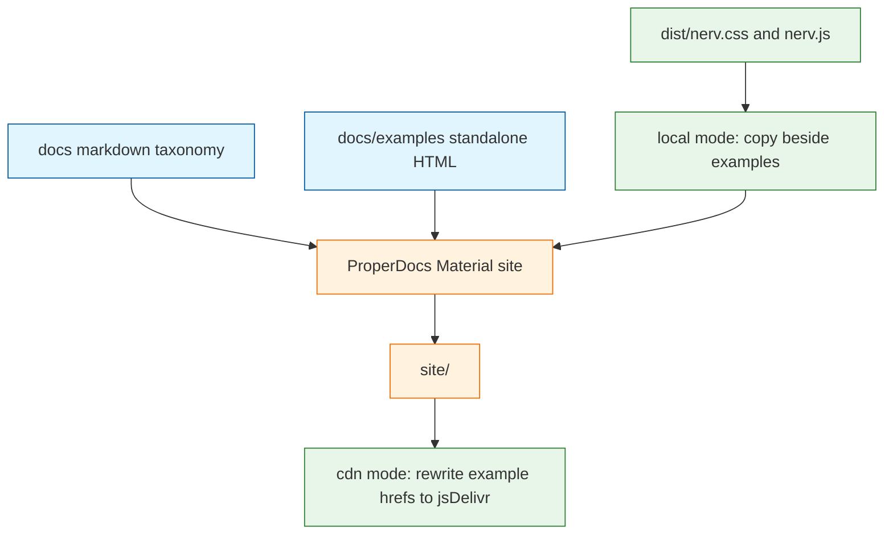

# Architecture Decision: Dual-load example hosting

**Superseded.** Operator rejected standalone HTML. See `creative-embedded-docs-examples.md`.

## Requirements & Constraints

## Requirements & Constraints

**Functional requirements**

- Released GitHub Pages examples load `nerv.css` / `nerv.js` from jsDelivr (npm CDN), not a bespoke host.
- Local ProperDocs serve/build loads on-disk `dist/` and errors if those files are missing.
- CSS-only example page works with JavaScript disabled.
- Existing `docs/` markdown stays the authoring source of truth and must not be overlaid with `nerv.css`.
- Two new live examples: one CSS-only, one that uses `nerv.js` (`window.NERV`).

**Quality attributes (ranked)**

1. Load-path correctness (AC3, AC5) — explicit local vs CDN, never silent fallback
2. JS-disabled CSS-only page (AC4)
3. Simplicity and sibling wiring (SLOBAC ProperDocs + Pages)
4. Testability in the existing `node:test` suite
5. Reversibility — Pages chrome can change later without retouching the design system

**Technical constraints**

- Follow SLOBAC for ProperDocs + `uv` + Material + GitHub Pages; do not invent a third SSG.
- `docs/` stays at repo root (`docs_dir: docs`). Do not move it into a skill (M5).
- Test shipped product; do not TDD GitHub Actions YAML.
- L4 advisory: one dual-load asset-resolution module unless a sibling already owns the switch. SLOBAC does not load this package's CSS/JS.
- Published files remain `dist/nerv.css` and `dist/nerv.js` only.

**Out of scope**

- Placeholder skill, `SKILL.md`, release-please extra-files (M5)
- Vendoring fonts / offline bundle (issue #7)
- Restyling the Material docs chrome to look like NERV
- Changing `ref/` visual fixtures

## Components

ProperDocs owns markdown → HTML chrome. The Node module owns only example asset URLs. The two example pages are extra files under `docs/examples/`, not Material templates.

## Options Evaluated

- **A. Site-wide `extra_css` / `extra_javascript`**: Toggle CDN vs `dist/` in `properdocs.yml`. Would paint `nerv.css` onto every taxonomy page and wrap the CSS-only demo in Material's JS chrome.
- **B. Runtime JS loader**: Example pages detect host and inject tags. The CSS-only page cannot load CSS with JavaScript disabled.
- **C. Python ProperDocs hook as the dual-load module**: Sibling-shaped, but the contract would live in Python while this repo's tests and published artifacts are Node.
- **D. Node dual-load module + standalone HTML examples**: Committed HTML uses relative `nerv.css` / `nerv.js`. Local mode copies `dist/` beside them and errors if missing. CDN mode rewrites the built `site/examples/` files to jsDelivr URLs keyed from `package.json`. ProperDocs copies HTML as-is (verified).

## Analysis

| Criterion | A extra_css | B runtime JS | C Python hook | D Node module + HTML |
|-----------|-------------|--------------|---------------|----------------------|
| Fitness | Fails AC4 and overlays docs | Fails AC4 | Can pass | Passes |
| Constraints | Fights design-system overlay rule | Fails JS-disabled | Tests leave node:test | Matches L4 advisory and test runner |
| Simplicity | One YAML knob | Small script | Second language for URLs | One Node module, SSG unchanged |
| Maintainability | Hidden coupling to theme | Mode logic in the demo | Python in a CSS repo | Package version already in package.json |
| Risk | High: every docs page changes | High: AC4 impossible | Medium: untested or new pytest | Low: PoC copied HTML as-is |

Key insights:

- AC4 eliminates A and B. Material-wrapped markdown is not a CSS-only page.
- SLOBAC's Python hooks solve image rewriting, not npm asset URLs. Copying that layer here would be cargo-cult.
- A `/tmp` ProperDocs 1.6.7 + Material 9.7 build copied `docs/examples/css-only.html` byte-for-byte and allowed `nav` to point at it. Default theme must be `material` (the implicit `mkdocs` theme is not installed).
- Building this repo's real `docs/` with `--strict` fails on one link: `docs/service-manual.md` → `../.gitattributes` (outside `docs_dir`). That is a work-step, not an architecture fork.
- Without `index.md`, the site has no `/` page. Add a landing page.

## Decision

### Choice Pre-Mortem

- ProperDocs would wrap extra HTML in the Material theme so AC4 fails: **checked** — PoC copied the file as-is; nav links to `examples/css-only.html`.
- Local missing `dist/` would silently use CDN: **checked** — mode is an explicit CLI flag, never inferred from file presence.
- jsDelivr 404 on the first Pages deploy after a release: **checked as operational**, not architectural — same lag M2 already saw on the registry; deploy Pages on `release` like SLOBAC, after npm publish. Mitigation lives in Challenges, not a different module.

**Selected**: Option D — Node dual-load module + standalone HTML examples
**Rationale**: Rank 1–2 require explicit modes and a JS-free CSS page; rank 3 keeps SLOBAC's SSG; rank 4 keeps the contract in `node:test`.
**Tradeoff**: Asset URL rewriting is a Node step around ProperDocs, not a plugin inside it. That is the split we want: package URLs vs docs chrome.

## Implementation Notes

- Committed pages: `docs/examples/css-only.html` and `docs/examples/js.html` with same-directory `href="nerv.css"` / `src="nerv.js"`. CSS-only has no `nerv.js` script tag. JS page loads it and calls `NERV.init()`.
- Local: `node scripts/resolve-docs-assets.mjs --mode local` copies `dist/nerv.css` and `dist/nerv.js` into `docs/examples/` or throws. Then `uv run properdocs serve` / `build --strict`.
- CDN: `uv run properdocs build --strict`, then `node scripts/resolve-docs-assets.mjs --mode cdn --site site` rewrites those relative URLs to `https://cdn.jsdelivr.net/npm/nervouscsstem@<package.json version>/dist/nerv.css` (and `.js`).
- Gitignore `site/`, `.venv`, `docs/examples/nerv.css`, `docs/examples/nerv.js`.
- `docs_dir: docs`. `site_url: https://texarkanine.github.io/nervouscsstem/`.
- Do not add SLOBAC's awesome-pages, llms-source, or image hooks — this tree is four markdown files plus two examples.
- Pages workflow follows SLOBAC (`release` published + `workflow_dispatch`, `actions/deploy-pages`). PR/CI docs build uses local mode (must `npm run build` first) so `--strict` and the missing-dist error are exercised without depending on a just-published tarball.
- Checkout for docs builds needs Git LFS so `docs/img/**` are PNGs, not pointer files.
