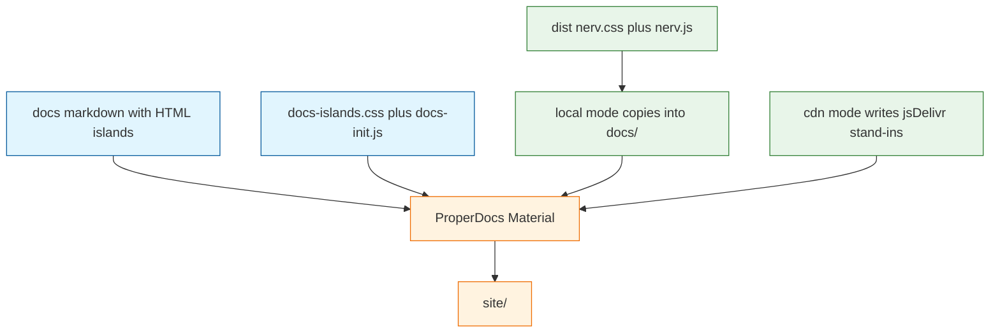

# Architecture Decision: Embedded docs examples

Supersedes `creative-dual-load-example-hosting.md` (standalone HTML). Operator rejected that hosting model.

## Requirements & Constraints

**Functional requirements**

- Live examples sit on ProperDocs teaching pages: preview island, then spec, then code.
- Released site loads `nerv.css` / `nerv.js` from jsDelivr. Local serve/build uses `dist/` and errors if those files are missing.
- CSS example islands render without `nerv.js`.
- JS example islands use scoped `NERV.*` helpers. They must not call `NERV.init()` (that injects a viewport-fixed `.nerv-scanlines` on `document.body`).
- Existing taxonomy markdown stays; v0.1 adds a CSS section plus a small set of component pages, not a page per component.

**Quality attributes (ranked)**

1. Teaching-site fitness — examples are in the docs, not beside them
2. Load-path correctness — explicit local vs CDN, never silent fallback
3. Chrome isolation — Material nav/search stays Material; NERV stays inside islands
4. Simplicity — SLOBAC ProperDocs + existing `node:test`
5. Extensibility — adding another component page later is copy-the-template, not a new architecture

**Technical constraints**

- ProperDocs + Material. `extra_css` / `extra_javascript` paths are relative to `docs_dir`.
- `md_in_html` so preview islands can be HTML in markdown.
- Test shipped product; do not TDD GitHub Actions YAML.
- `.nerv-` namespaced CSS; `:root` tokens only; no `body` restyle.

**Out of scope**

- Full component encyclopedia
- Skill / extra-files (M5)
- Vendoring fonts
- Restyling Material chrome to look like NERV
- Changing `ref/` fixtures
- Changing `NERV.init()` itself so scanlines can be scoped (that is a design-system change, not a docs milestone)

## Components

ProperDocs owns chrome. The Node resolver owns only how `nerv.css` / `nerv.js` appear under `docs/`. Preview islands are HTML in the markdown. `docs-init.js` calls scoped `NERV` methods inside `.nerv-docs-island`.

## Options Evaluated

- **A. Standalone HTML example pages**: Separate documents copied as extra files. Operator rejected: examples must teach from inside the docs site.
- **B. Iframe islands**: Markdown pages embed `iframe`s pointing at fragment HTML. Isolates scanlines, but the example payload is still standalone HTML and the code sample is a second copy.
- **C. Inline HTML islands plus `extra_css` / `extra_javascript` dual-load**: Markdown pages contain `.nerv-docs-island` previews and fenced code. `properdocs.yml` always points at `stylesheets/nerv.css` and `javascripts/nerv.js`. The resolver copies `dist/` there (local) or writes jsDelivr stand-ins (CDN).
- **D. Two ProperDocs configs**: Local vs CDN `extra_css` URLs. Duplicates nav/theme; still needs a missing-dist check.

## Analysis

| Criterion | A standalone | B iframe | C inline plus extra_* | D two configs |
|-----------|--------------|----------|------------------------|---------------|
| Teaching-site | Fail (rejected) | In the page, payload is still a file | Pass | Pass |
| Load-path | Can pass | Can pass | Pass | Pass, duplicated YAML |
| Isolation | Trivial | Strong | Needs scoped init; no `NERV.init()` | Same as C |
| Simplicity | Extra HTML tree | Two representations | One markdown page | Two configs |

Key insights:

- AC4 as originally written (a whole page with JS disabled) forced A. The operator restated it: CSS islands must not need `nerv.js`. Material chrome may use JS. That puts C back on the table.
- `nerv.css` is class-namespaced. Loading it via `extra_css` does not restyle Material unless we put `.nerv-*` on the chrome. `:root` `--nerv-*` tokens are inert for Material.
- `NERV.init()` is unsafe on docs pages. `injectScanlines` appends a `position: fixed` overlay to `body`. JS islands must call `NERV.initBarMeters(island)` (and the like) with the island as `container`.
- MkDocs `extra_css` is relative to `docs_dir`. CDN mode cannot put a jsDelivr URL in `properdocs.yml` without a second config. Writing a tiny `@import url("https://cdn.jsdelivr.net/npm/nervouscsstem@<version>/dist/nerv.css")` stand-in is one file, one config, and the stylesheet still loads without JS.

## Decision

### Choice Pre-Mortem

- Someone will call `NERV.init()` on the docs site and scanlines will cover Material: **checked** — `docs-init.js` must not contain `NERV.init`; tests assert that. Islands opt in with `data-nerv-init`.
- `@import` stand-in for CDN CSS would be blocked or rewritten: **checked as unused plugin** — this repo will not add Material privacy/external-asset rewriting in M4.
- Taxonomy screenshot pages would look like NERV: **checked** — no `.nerv-*` on those pages; islands only exist on the Using pages.

**Selected**: Option C — inline HTML islands plus `extra_css` / `extra_javascript` dual-load
**Rationale**: Rank 1 is the operator’s hosting model. Rank 2 stays a Node resolver. Rank 3 is scoped init, not iframes. Rank 4 keeps one `properdocs.yml`.
**Tradeoff**: JS examples cannot demo viewport-fixed scanlines inside an island. That is accepted; scanlines stay a `ref/` fixture.

## Implementation Notes

- Committed: `docs/stylesheets/docs-islands.css`, `docs/javascripts/docs-init.js`, Using pages in markdown.
- Gitignored generated: `docs/stylesheets/nerv.css`, `docs/javascripts/nerv.js`.
- `properdocs.yml`: `extra_css: [stylesheets/docs-islands.css, stylesheets/nerv.css]`, `extra_javascript: [javascripts/nerv.js, javascripts/docs-init.js]`, `markdown_extensions: [md_in_html, ...]`.
- Local: copy `dist/nerv.css` and `dist/nerv.js` into those gitignored paths, or throw.
- CDN: write `nerv.css` as `@import` of the jsDelivr URL for this `package.json` version; write `nerv.js` as a stub that inserts a `script` pointing at the matching jsDelivr `nerv.js`.
- v0.1 Using pages: `docs/css.md` (tokens/type, CSS-only islands), `docs/components/panels.md` (CSS-only), `docs/components/bar-meters.md` (`data-nerv-init="bar-meters"`). Same island template for later pages.
- Do not call `NERV.init()`. Do not add `.nerv-scanlines` to islands.
