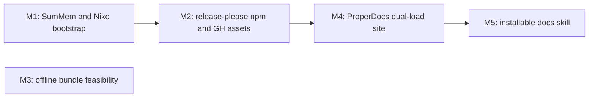

# Milestones: nerv-v01-release-pipeline

## Cross-milestone invariants & constraints

1. **`docs/` stays the authoring source of truth.** Do not move the existing documentation tree into the skill. The skill may carry a copy or a build-time inclusion so installers get the site; editors keep working in `docs/`.
2. **No bespoke CDN.** Public CSS/JS are reached by publishing the npm package and loading jsDelivr or the equivalent that follows from npm. Do not stand up a separate file host.
3. **Offline bundles are not a 0.1 ship.** The feasibility note may recommend bundling; no milestone may add vendored font files or an offline artifact unless a later, explicit decision says so.
4. **release-please is the only version bumper.** Package version, Git tags, changelog, and (once it exists) `SKILL.md` version are updated by release-please extra-files — not by hand in a sub-run except to add the extra-files hook.
5. **M2 creates release-please; M5 only extends extra-files.** M2 adds `release-please-config.json`, the manifest, and the release workflow, and makes the package publishable. It does not add a `SKILL.md` extra-file. M5, after that file exists, may add only the `SKILL.md` extra-files entry. M5 does not replace or redesign the release workflow.
6. **SumMem activation stays at the top of `AGENTS.md`.** Later README or docs edits must not overwrite or relocate that block. `CLAUDE.md` remains `@AGENTS.md`.
7. **Live examples stay inside design-system constraints.** `.nerv-` prefix, no canvas/WebGL, no image files, minimal JS. The CSS-only page must not require JavaScript.
8. **Copy SumMem as a consumer.** Drop in the script and the 0BSD prompt; do not modify the SumMem program. Invoking it does not make this repo a covered work.
9. **This list is L4 design, not a sub-run plan.** File paths, numbered implementation steps, and test-first sequences belong in each milestone's own L1/L2/L3 plan. Do not expand these one-liners into implementation plans.

## Execution Order

M3 has no edges: it can run any time. Serial order below is M1 → M2 → M3 → M4 → M5 so the first `/niko` after review starts with the onboard the operator asked to do first.

## Scope estimates

- **M1 L2** — self-contained onboard of one script plus two root prompt files; no architectural choice once the SumMem README recipe is followed.
- **M2 L3** — complete publish feature: package metadata, release-please, npm trusted-publish, and attaching `dist` CSS/JS to the GitHub Release. Several workflows and the public package contract.
- **M3 L2** — research plus one written note; no code ship.
- **M4 L3** — ProperDocs, GH Pages, two example pages, and the local-vs-released asset switch. Multiple components; the load-path contract is the design work.
- **M5 L2** — add a placeholder skill, include the docs for `npx skills` install, and hook `SKILL.md` version into release-please extra-files. Depends on M4 existing but does not rework it.

- [x] M1: Install SumMem under `.summem/` and add Niko `AGENTS.md`/`CLAUDE.md` bootstrap with the SumMem init block at the top of `AGENTS.md` (est. L2)
- [ ] M2: Wire release-please, npm publish, and GitHub Release attachments for the built `dist/nerv.css` and `dist/nerv.js` (est. L3)
- [ ] M3: Write a feasibility note on offline font-and-JS bundles covering the licenses of every font the CSS currently loads (est. L2)
- [ ] M4: Add a ProperDocs GitHub Pages site from existing `docs/` plus CSS-only and JS example pages that load CDN assets on release and `dist/` locally, erroring if local bundles are missing (est. L3)
- [ ] M5: Add a placeholder agent skill installable via `npx skills` that carries the docs site and a `SKILL.md` version bumped by release-please (est. L2)
