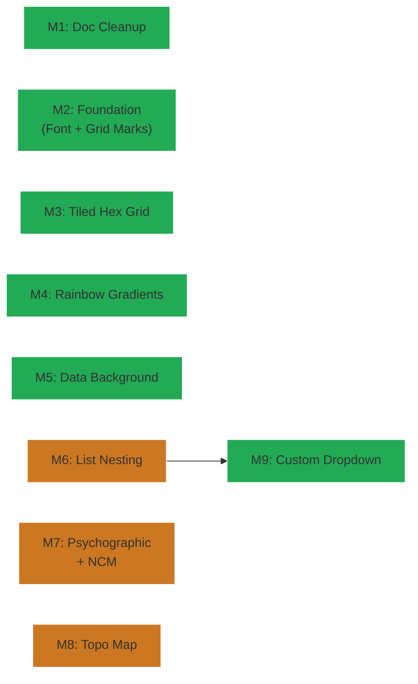

# Milestones: nerv-phase7-expansion

## Cross-milestone invariants & constraints

1. **`.nerv-` prefix discipline** — All new selectors use the `.nerv-` namespace. No exceptions.
2. **Alert cascade compatibility** — New features integrating with criticality must consume ambiance tokens (`--nerv-primary`, `--nerv-animation-speed`, etc.), not hard-coded values. Named data tokens remain stable.
3. **Accessibility** — `prefers-reduced-motion` suppresses all new animations. `prefers-contrast` adjusts new borders/glows. Every milestone must verify both.
4. **No image files, no canvas, no WebGL** — CSS, SVG data URIs, and JS-generated inline SVGs only.
5. **No regression** — Existing ref pages and components must render identically after each milestone. `npm run build` must succeed at every boundary.
6. **SCSS convention** — New modules are `_`-prefixed partials, `@forward`ed in `nerv.scss` in dependency-graph order. JS orchestration follows the existing `NERV.*` namespace pattern.
7. **Ref page coverage** — Each milestone that adds visible features must update or create a ref page demonstrating them.

## Execution Order

All milestones are independent except M9 (Custom Dropdown), which uses `.nerv-list` items and should execute after M6 (List Nesting Overhaul) to build on the stabilized list structure.

- [ ] M1: Reorganize and deduplicate `docs/atomic-elements.md` and `docs/design-language.md` — proper atom vs. composition categorization, remove redundancy, verify cross-references (est. L2)
- [ ] M2: Add DOS/BIOS monospace boot-screen font to `_typography.scss`; add `×` rotated-cross grid marks variant and hex-grid background pattern to `_grid-marks.scss` (est. L2)
- [ ] M3: Implement `.nerv-hex-grid-tiled` true honeycomb tessellation in `_hex-grid.scss` with no gaps/overlaps, verified to support the lockout hex-wall use case (est. L2)
- [ ] M4: Assess rainbow gradient current state and implement reusable gradient mixin/utility classes (`.nerv-rainbow-bg` etc.) with configurable hue range, direction, and opacity (est. L2)
- [ ] M5: Create data background module (`.nerv-data-bg`) with binary and DNA fill modes, seamless scroll animation, and criticality-driven speed escalation (est. L2)
- [ ] M6: Overhaul list nesting in `_list.scss` — fix contained sublists and indented non-contained sublists for all shape/rotation combinations including angled variants (est. L3)
- [ ] M7: Build psychographic display (full x/y graph with SVG traces, axis grid, squigglemass chaos mode) and neural channel monitor (narrow vertical waveform variant with Richter-scale amplitude), both with criticality-escalating animation (est. L3)
- [ ] M8: Create seedable JS-generated SVG green wireframe topographic map background fill with map-like contour generation and deterministic output per seed (est. L3)
- [ ] M9: Implement custom dropdown (`.nerv-dropdown`) with JS interaction layer (open/close, arrow keys, selection, ARIA) and CSS states, built from `.nerv-list` and `.nerv-panel` (est. L2)
