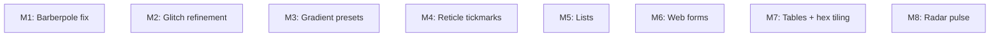

# Milestones: nerv-future-features

## Cross-milestone invariants & constraints

- All selectors use the `.nerv-` prefix — no exceptions
- `prefers-reduced-motion` suppresses all new animations; static state must still look recognizably NERV
- `prefers-contrast` increases border widths and reduces reliance on glow/shadow for new components
- No image files — all visual effects via CSS; SVG data URIs in `background-image` are permitted
- No canvas, WebGL, or framework dependencies
- Token architecture preserved: ambiance tokens shift with alert state, named data tokens remain stable
- New SCSS partials follow the `_name.scss` convention and are `@forward`ed from `nerv.scss` before `states`
- Existing features and reference pages remain unbroken after each milestone
- Ref page strategy: fixes/refinements to existing components update the existing ref page that already demonstrates them; new capabilities get demonstrated in ref pages (new sections on existing pages for small additions, new pages for substantial features)
- Stylelint + Node.js test runner must pass after each milestone

## Execution Order

All milestones are independent — no cross-milestone dependencies. They can be executed in any order. The listing below sequences quick fixes first, then moderate features, then the largest feature, then the most experimental.

- [x] M1: Fix barberpole stripe opacity — make bands fully opaque and add configurable glow border (L1 — bug fix, single file `_stripe-bar.scss`)
- [x] M2: Refine glitch effect — increase transform magnitudes and reduce keyframe density for sharper discontinuous jumps (L1 — enhancement, single file `_glitch.scss`)
- [ ] M3: Add built-in gradient presets for bar meters — review NGE UIs for common color pairings, provide off-the-shelf preset classes/attributes that set `--nerv-bar-from`/`--nerv-bar-to` automatically (L2 — design research + utility classes on `_bar-meter.scss`)
- [ ] M4: Add reticle tickmarks — CSS-based measurement-ruler tickmarks along panel edges via utility classes and/or mixin (L2 — new structural component, new SCSS partial)
- [ ] M5: Add list styling — angled 45-degree pillbox helper classes with configurable color for list items (L2 — new component, new SCSS partial)
- [ ] M6: Style web form elements — text input, textarea, select, radio, checkbox, and button in NERV aesthetic (L2 — new component set, new SCSS partial)
- [ ] M7: Implement table styling with special row types — base phosphor-outline tables, alternating triangle rows, hexagon rows (with in-phase/out-of-phase offset), stretchable trapezoid rows, and tiled hex grid variant decision (L3 — multiple sub-components, design decisions, new SCSS partial)
- [ ] M8: Investigate and implement radar pulse — elements that pulse/fade on radar sweep, sync mechanism for external UI actions to radar position (L2 — extends `_radar.scss`, feasibility investigation required, possible JS orchestration)
