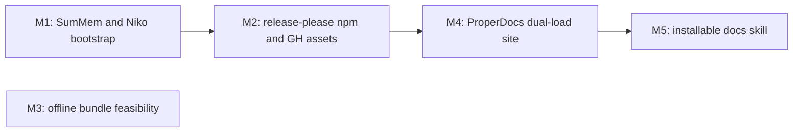

# Milestones: nerv-v01-release-pipeline

## Cross-milestone invariants & constraints

1. **`docs/` stays the authoring source of truth.** Editors keep working in `docs/`. M4 may add a landing page, a CSS section, and exemplar component pages with embedded live examples. M5 may copy or include the site so installers get it; M5 must not relocate the authoring tree into the skill.
2. **No bespoke CDN.** Public CSS/JS are reached by publishing the npm package and loading jsDelivr or the equivalent that follows from npm. M2 owns publish wiring and the package `files` list. M4 and M5 consume those URLs; they must not stand up a separate file host or change the tarball contract.
3. **Offline bundles are not a 0.1 ship.** The feasibility note may recommend bundling. No milestone may add vendored font files or an offline artifact unless a later, explicit decision says so.
4. **release-please is the only version bumper.** Package version, Git tags, changelog, and (once it exists) `SKILL.md` version are updated by release-please extra-files — not by hand in a sub-run except to add the extra-files hook.
5. **M2 creates release-please; M5 only extends extra-files.** M2 adds the config, manifest, and release workflow, and makes the package publishable. It does not add a `SKILL.md` extra-file. M5, after that file exists, may add only the `SKILL.md` extra-files entry. M5 does not replace or redesign the release workflow.
6. **SumMem activation stays at the top of `AGENTS.md`.** Later README or docs edits must not overwrite or relocate that block. `CLAUDE.md` remains `@AGENTS.md`.
7. **Live examples stay inside design-system constraints.** `.nerv-` prefix, no canvas/WebGL, no image files, minimal JS. CSS example islands must not require `nerv.js`. Docs pages must not call `NERV.init()` (it injects a viewport-fixed scanline overlay on `body`).
8. **Copy SumMem as a consumer.** Drop in the script and the 0BSD prompt; do not modify the SumMem program. Invoking it does not make this repo a covered work.
9. **M4 owns the ProperDocs site; M5 includes it.** M5 may copy or include the built site for skill install. It does not replace, relocate, or redesign the site or its local-vs-CDN load contract.

## Execution Order

M3 has no edges: it can run any time. The checklist below is a serial-safe walk of that DAG: M1 → M2 → M3 → M4 → M5.

- [x] M1: Install SumMem as a consumer copy and add the Niko root bootstrap pair
- [x] M2: Wire release-please, npm publish, and GitHub Release attachments for the built CSS and JS
- [x] M3: Write a feasibility note on offline font-and-JS bundles covering the licenses of every font the CSS currently loads #7
- [ ] M4: Add a ProperDocs GitHub Pages site from existing docs plus component pages with embedded live examples that load CDN assets on release and dist locally, erroring if local bundles are missing
- [ ] M5: Add a placeholder agent skill installable via npx skills that carries the docs site and a SKILL.md version bumped by release-please

## Per-milestone done and risks

### M1: Install SumMem as a consumer copy and add the Niko root bootstrap pair

- Done: An agent in this repo wakes SumMem from `AGENTS.md`. `CLAUDE.md` is `@AGENTS.md`. SumMem is an unmodified consumer copy with `__pycache__` gitignored.
- Risks: see invariants 6 and 8

### M2: Wire release-please, npm publish, and GitHub Release attachments for the built CSS and JS

- Done: release-please is the version bumper. A GitHub Release attaches the built CSS and JS. The package is on npm so jsDelivr can serve those files.
- Risks: see invariants 2, 4, and 5. Do not add extra-files for a skill.

### M3: Write a feasibility note on offline font-and-JS bundles covering the licenses of every font the CSS currently loads #7

- Done: A written licensing answer exists for every font the CSS loads. That answer lives at issue #7. No font files or offline zip shipped.
- Risks: see invariant 3

### M4: Add a ProperDocs GitHub Pages site from existing docs plus component pages with embedded live examples that load CDN assets on release and dist locally, erroring if local bundles are missing

- Done: GitHub Pages hosts the existing docs plus a CSS section and exemplar component pages. Each live example is a preview island, spec, and code on the same page. Released pages load CSS/JS from the npm CDN. Local serve/build uses on-disk dist bundles and errors if they are missing. CSS islands do not require `nerv.js`.
- Risks: see invariants 1, 2, 7, and 9. Do not add a skill, extra-files, or vendored fonts. Do not call `NERV.init()` on docs pages. Do not document every component; ship the pattern.

### M5: Add a placeholder agent skill installable via npx skills that carries the docs site and a SKILL.md version bumped by release-please

- Done: `npx skills` installs a placeholder skill that carries the documentation site. `SKILL.md` version matches the published package.
- Risks: see invariants 1, 4, 5, and 9. Add only the `SKILL.md` extra-files entry. Do not relocate `docs/` or redesign the release workflow or the site.
