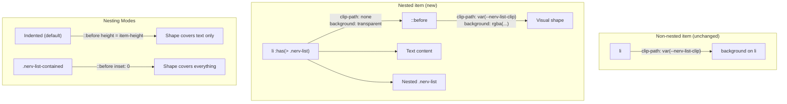

# Task: M5 — List Nesting Overhaul

* Task ID: nerv-phase7-m5
* Complexity: Level 3
* Type: refactor + feature

Overhaul list nesting in `_list.scss` — fix contained sublists and indented non-contained sublists for all shape/rotation combinations including angled variants.

## Pinned Info

### Nesting Architecture

How the `::before` shape-delegation pattern works for nested items. This is the load-bearing design decision for the entire milestone.

### Shape × Nesting Interaction

Each shape has a different visual mechanism. All converge on `::before` for nested items.

| Shape | Non-nested mechanism | Nested `::before` mechanism |
|-------|---------------------|---------------------------|
| Hex (default) | `clip-path: polygon()` on `li` | `clip-path: var(--nerv-list-clip)` on `::before` |
| Rect | `clip-path: none` on `li` | `clip-path: none` on `::before` (just background) |
| Arrow | `clip-path: polygon()` on `li` | `clip-path: var(--nerv-list-clip)` on `::before` |
| Arrow-reverse | `clip-path: polygon()` on `li` | `clip-path: var(--nerv-list-clip)` on `::before` |
| Para | `transform: skewX()` on `::before` | Same `::before`, height adjusted |

## Component Analysis

### Affected Components
- **`src/_list.scss`** (224 lines): Primary target. Add nesting rules, refactor clip-path to custom property, add contained/indented modes, rotation counter-rotation, fill mode overrides for nesting.
- **`ref/ref-lists.html`** (236 lines): Update with nesting demos for all shape × rotation combinations. Fix invalid HTML (`<ul>` as direct child of `<ul>` on line 91).
- **`test/components.test.mjs`**: Add nesting-specific test cases to the "List styling CSS" describe block.

### Cross-Module Dependencies
- `_list.scss` imports only `tokens` (for `$nerv-colors` iteration). No other SCSS module references `.nerv-list`.
- `nerv.js` has no list-specific code. No JS changes needed.
- **M8 dependency**: Custom Dropdown will build from `.nerv-list` + `.nerv-panel`. Nesting support must be forward-compatible with dropdown menu items containing submenus.

### Boundary Changes
- **New CSS classes**: `.nerv-list-contained` (on nested `<ul>` to enable contained mode)
- **New custom properties**: `--nerv-list-clip`, `--nerv-list-indent`, `--nerv-list-item-height`
- **Markup pattern change**: Nested `<ul>` must be inside a `<li>` (valid HTML). The old invalid pattern (`<ul>` as direct child of `<ul>`) is unsupported.

### Invariants & Constraints
1. `.nerv-` prefix on all new selectors
2. Ambiance tokens (`--nerv-primary`, `--nerv-primary-rgb`) for color — NOT hard-coded values
3. `prefers-contrast: more` must apply to nested items
4. No image files, canvas, or WebGL
5. Non-nested lists must render identically (zero regression)
6. `npm run build` must succeed
7. Ref page coverage for all nesting combinations

## Open Questions

None — implementation approach is clear. Key architectural decisions resolved during analysis:

1. **Shape abstraction via `--nerv-list-clip`**: Avoids polygon duplication between `li` and `::before`. Shape modifiers set the property; both non-nested (`li`) and nested (`::before`) read it.
2. **`:has()` for detection**: Browser baseline matches project's `color-mix()` usage (Chrome 111+). Auto-detects nesting without consumer-side classes on the parent `li`.
3. **Para reconciliation**: Para already uses `::before` for skewX. Nesting rules (higher specificity via `:has()`) compose with para's `transform` — skewX is NOT overridden since nesting rules don't set `transform`.

## Test Plan (TDD)

### Behaviors to Verify

**Refactor (backward compat):**
- B24: `--nerv-list-clip` custom property declared on `.nerv-list` with polygon value
- B25: `.nerv-list > li` uses `clip-path: var(--nerv-list-clip)`
- B26: `.nerv-list-rect` sets `--nerv-list-clip: none`
- B27: `.nerv-list-arrow` sets `--nerv-list-clip` to arrow polygon
- B28: `.nerv-list-arrow-reverse` sets `--nerv-list-clip` to arrow-reverse polygon

**Nesting detection + indented mode:**
- B29: `:has(` selector present in compiled CSS (verifies `:has()` nesting detection is emitted)
- B30: Nested-parent `li` has `clip-path: none` and `background: transparent` (via `:has()` rule)
- B31: `::before` on nested-parent item has `clip-path` referencing `--nerv-list-clip`
- B32: `--nerv-list-indent` custom property declared on `.nerv-list`
- B33: `--nerv-list-item-height` custom property declared on `.nerv-list`
- B34: Nested `.nerv-list` inside `li` gets margin-left for indent

**Contained mode:**
- B35: `.nerv-list-contained` class exists in compiled CSS
- B36: `:has(> .nerv-list-contained)` adjusts `::before` to cover full item (bottom: 0 or inset: 0)

**Fill × nesting:**
- B37: Bordered + nesting: `::before` has border property
- B38: Outline + nesting: `::before` has border and `--nerv-bg` background
- B39: Solid + nesting: `::before` has opaque `--nerv-list-color` background

**Rotation × nesting:**
- B40: Nested `.nerv-list` inside angled item has counter-rotation transform
- B41: Nested `.nerv-list` inside angled-reverse item has counter-rotation transform

**Accessibility:**
- B42: `prefers-contrast: more` targets nested-parent items

**Regression:**
- B43: All existing B1–B23 tests continue to pass (non-nested lists unchanged)

### Test Infrastructure

- Framework: Node.js built-in test runner (`node --test`)
- Test location: `test/components.test.mjs`
- Conventions: `describe` block per component, `it` blocks with `B<N>:` prefix, compiled CSS string matching
- New test files: none (add to existing "List styling CSS" describe block)

### Integration Tests

- B43 (regression) covers integration: non-nested list, bar-meter, label-box, segment-display selectors all still present after changes.

## Implementation Plan

1. **Refactor: Extract `--nerv-list-clip` custom property**
    - Files: `src/_list.scss`, `test/components.test.mjs`
    - Changes:
      - Add `--nerv-list-clip` to `.nerv-list` with hex polygon value
      - Change `.nerv-list > li` from inline `clip-path: polygon(...)` to `clip-path: var(--nerv-list-clip)`
      - `.nerv-list-rect`: add `--nerv-list-clip: none` (keep existing `clip-path: none` on `> li` for now)
      - `.nerv-list-arrow`: add `--nerv-list-clip` with arrow polygon
      - `.nerv-list-arrow-reverse`: add `--nerv-list-clip` with arrow-reverse polygon
      - `.nerv-list-para`: add `--nerv-list-clip: none` (para uses skewX, not clip-path)
    - Tests: B24–B28
    - Verify: existing B1–B23 still pass (backward compatible)

2. **Add nesting custom properties + detection rules**
    - Files: `src/_list.scss`, `test/components.test.mjs`
    - Changes:
      - Add `--nerv-list-indent: 1.5em` and `--nerv-list-item-height: 1.8em` to `.nerv-list`
      - Add `.nerv-list > li:has(> .nerv-list)` rule: `clip-path: none; background: transparent; border: 0; position: relative;`
      - Add `.nerv-list > li:has(> .nerv-list)::before` rule: `content: ''; position: absolute; top: 0; left: 0; right: 0; height: var(--nerv-list-item-height); clip-path: var(--nerv-list-clip); background: rgba(var(--nerv-list-color-rgb), 0.5); z-index: -1;`
      - Add `.nerv-list > li > .nerv-list` rule: `margin-left: var(--nerv-list-indent); margin-top: var(--nerv-list-gap);`
    - Tests: B29–B34

3. **Add contained mode**
    - Files: `src/_list.scss`, `test/components.test.mjs`
    - Changes:
      - Add `.nerv-list > li:has(> .nerv-list-contained)::before` rule: `bottom: 0; height: auto;`
      - Add `.nerv-list > li > .nerv-list-contained` rule: indent + spacing adjustments for contained context
    - Tests: B35–B36

4. **Fill mode overrides for nesting**
    - Files: `src/_list.scss`, `test/components.test.mjs`
    - Changes:
      - `.nerv-list-bordered > li:has(> .nerv-list)::before`: border
      - `.nerv-list-outline > li:has(> .nerv-list)::before`: border + bg
      - `.nerv-list-solid > li:has(> .nerv-list)::before`: opaque bg; `li` text color inversion
      - Para + fill + nesting: compositions should cascade correctly (para's `::before` properties compose with fill overrides)
    - Tests: B37–B39

5. **Rotation × nesting**
    - Files: `src/_list.scss`, `test/components.test.mjs`
    - Changes:
      - `.nerv-list-angled > li > .nerv-list`: `transform: rotate(calc(-1 * var(--nerv-list-angle))); transform-origin: 0% 0%;`
      - `.nerv-list-angled-reverse > li > .nerv-list`: same counter-rotation
      - Visual positioning adjustments as needed during implementation
    - Tests: B40–B41

6. **Accessibility**
    - Files: `src/_list.scss`, `test/components.test.mjs`
    - Changes:
      - `@media (prefers-contrast: more)` rule targeting nested-parent `::before` with higher-opacity background
    - Tests: B42

7. **Ref page update + cleanup**
    - Files: `ref/ref-lists.html`
    - Changes:
      - Fix invalid HTML (line 91: `<ul>` as direct child of `<ul>` → wrap in `<li>`)
      - Add nesting section: demos for indented × (hex, rect, arrow, arrow-reverse, para) × (default, bordered)
      - Add nesting section: demos for contained × (hex, rect, para)
      - Add nesting section: demos for angled × indented, angled × contained
    - Tests: visual verification + B43 regression

8. **Documentation update**
    - Files: `src/_list.scss` (doc comment header)
    - Changes:
      - Update module doc comment with nesting section documenting:
        - Markup pattern (nested `<ul class="nerv-list">` inside `<li>`)
        - Indented mode (default)
        - Contained mode (`.nerv-list-contained`)
        - New custom properties
      - No external doc changes needed (atomic-elements.md doesn't cover lists)

## Technology Validation

No new technology — validation not required. `:has()` pseudo-class is a CSS standard feature supported in Chrome 105+, Firefox 121+, Safari 15.4+. The project already requires Chrome 111+ (for `color-mix()`), so `:has()` is within the browser baseline.

## Challenges & Mitigations

- **Para `::before` reconciliation**: Para already uses `::before` for the skewX shape. Nesting rules have higher specificity (`:has()` adds class-level specificity) and compose with para's `transform` — para's skewX is preserved because nesting rules don't set `transform`. Mitigate by testing para + nesting combinations explicitly.
- **Rotation positioning**: Counter-rotating nested `<ul>` cancels the visual rotation but shifts position due to the rotated coordinate system. Mitigate by adjusting `transform-origin` and adding translation offsets during build, validated visually in ref page.
- **Item height approximation**: `--nerv-list-item-height: 1.8em` is a calculated approximation (`0.6em` padding + `1.2em` line-height). This is fragile if consumers change font size or padding. Mitigate by making it a custom property consumers can override.
- **Specificity cascade**: Multiple `:has()` selectors with fill/shape/rotation modifiers create a complex specificity graph. Mitigate by following the established source-order convention (fill → shape → rotation → nesting) and testing compound combinations.

## Status

- [x] Component analysis complete
- [x] Open questions resolved (none identified — approach is clear)
- [x] Test planning complete (TDD)
- [x] Implementation plan complete
- [x] Technology validation complete
- [x] Preflight — PASS. Advisory: `--nerv-list-clip` doubles as public API for custom shapes (document in doc comment).
- [ ] Build
- [ ] QA
