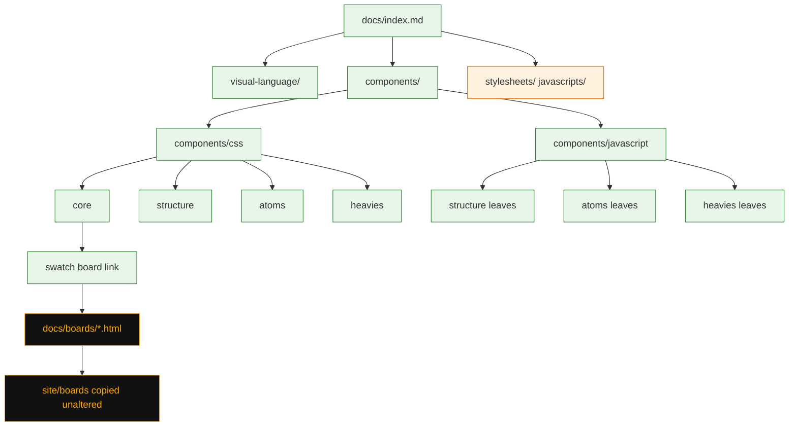

# Task: Canonical usage guide

* Task ID: canonical-usage-guide
* Complexity: Level 3
* Type: documentation feature

Fill out the ProperDocs site as the teaching surface for every design-system capability ([issue #9](https://github.com/Texarkanine/nervouscsstem/issues/9)). Catalog pages teach isolation (variants together, constant filler, modifiers last as classes). Five `ref/` swatch HTML pages become unthemed void boards on Pages, not in the skill. Motion rename is [issue #12](https://github.com/Texarkanine/nervouscsstem/issues/12).

Operator 2026-09-13: this work is user-facing prose (markdown and visual). No new tests. Sidebar order, `not_in_nav`, board HTML, and ProperDocs copying extra HTML are design-time choices; the HTML copy was probed and is vendor behavior. Do not delete `ref/` originals (operator will). Catalog lives only under `docs/`. Do not copy it into `skills/nerv/`. The old skill copy-identity test was a prose-pin; it is gone.

## Pinned Info

### Docs tree

Directory hierarchy is the nav. Asset dirs are not documentation folders. Boards are static HTML copied into `site/`, not Material pages.

Post-reflect 2026-09-13: four CSS layers core / structure / atoms / heavies. JS mirrors only when a leaf has a hook. Dividers fold into panels. Gradients fold into colors.

Creative refs: `memory-bank/active/creative/creative-docs-tree.md`, `memory-bank/active/creative/creative-swatch-boards.md`.

## Component Analysis

### Affected Components
- `docs/` markdown tree: catalog pages, section homes, moves of existing Using and visual-language files
- `properdocs.yml`: drop `nav:`; `navigation.indexes`; `not_in_nav` for boards and `reading.md`; awesome-pages plugin
- `docs/.pages`: root sidebar order (design-time, not tested)
- `skills/nerv/SKILL.md`: placeholder skill. No docs tree.
- `docs/img/` LFS stills: rename those that illustrate a catalogued component; retarget taxonomy links
- `docs/boards/*.html`: five adapted swatch pages (void HTML, visual prose)
- `ref/*.html`: source of boards this ticket; operator deletes the originals later
- Docs asset dirs: gitignore currently ignores the whole directories, so `docs-init.js` / `docs-islands.css` are untracked
- `scripts/resolve-docs-assets.mjs` and `test/docs-assets.test.mjs`: dual-load already covered; no new cases
- `.github/workflows/release-please.yaml` `publish-pages`: publishes `site/`
- `docs/javascripts/docs-init.js`: extend `data-nerv-init` kinds as JS catalog islands need them (docs chrome, not a new product API)
- `src/` / `dist/`: no CSS/JS product change

### Cross-Module Dependencies
- Catalog markdown → skill copies (existing lockstep test)
- Catalog islands → `docs-init.js` scoped `NERV.*` (never `NERV.init()` on Material chrome)
- Catalog pages → `docs/img/` stills
- Swatch HTML → `docs/stylesheets/nerv.css` and `docs/javascripts/nerv.js` (own `<link>`/`<script>`, not `extra_css`)
- `publish-pages` uploads `site/`

### Boundary Changes
- Public docs URL tree changes (file moves)
- Skill install markdown tree changes in lockstep
- Screenshot filenames in `docs/img/` change; taxonomy pages must keep resolving
- No CSS class rename (issue #12)
- `ref/` originals stay until the operator deletes them

### Invariants
- Must preserve `.nerv-` prefix, no canvas, no product image files, `prefers-reduced-motion` / `prefers-contrast`
- Must not copy `docs/` into `skills/nerv/`
- Must preserve dual-load of `nerv.css` / `nerv.js`
- Must not call `NERV.init()` from Material docs chrome
- Boards remain unthemed void HTML (ProperDocs copy already probed; do not list as `extra_templates`)
- Screenshot library stays Git LFS under `docs/img/**`; stills and boards do not enter the skill
- No new tests for this task

## Open Questions

- [x] **Docs tree and catalog map** → Resolved: layered folders (`visual-language`, `css`, `js`, `components`), `index.md` section homes, one root `.pages` for sidebar order, `not_in_nav` for `reading.md`. See `memory-bank/active/creative/creative-docs-tree.md`.
- [x] **Swatch board publication** → Resolved: Option A, `docs/boards/`. Probe showed unaltered copy. See `memory-bank/active/creative/creative-swatch-boards.md`.
- [x] **What to test** → Resolved (operator 2026-09-13): nothing new. Boards, nav, `not_in_nav`, and the five-file HTML set are visual/design-time prose. A later seventh board or a rename must not fight a test. ProperDocs extra-HTML copy is vendor behavior already probed.

## Test Plan (TDD)

### Behaviors to Verify

No new executable behavior.

### Test Infrastructure

- Framework: Node.js `node --test` (`package.json` `npm test`) — **do not add files to this list for this task**
- Existing gates that remain: `test/skill-contract.test.mjs` (markdown copies), `test/docs-assets.test.mjs` (dual-load + PyPI-only `uv.lock`), CSS product suites
- New test files: none

### Integration Tests

- `npm run docs:build` at the end of build as a smoke that ProperDocs still builds. Not a new unit, not a nav-order assertion.

## Implementation Plan

### 1. Docs chrome gitignore — prose/policy

- Files: `.gitignore`, `docs/javascripts/docs-init.js`, `docs/stylesheets/docs-islands.css`
- No tests: gitignore and docs chrome (always-tdd out of scope)
- Creative ref: `creative-docs-tree.md`

1. Remove directory-wide `docs/stylesheets` and `docs/javascripts` ignores; keep `docs/stylesheets/nerv.css` and `docs/javascripts/nerv.js`
2. Track `docs-init.js` and `docs-islands.css`

### 2. Swatch HTML — prose/policy

- Files: `docs/boards/{foundation,lists,tables,forms,effects}.html`
- No tests: visual prose
- Creative ref: `creative-swatch-boards.md`

1. Copy from `ref/ref-*.html` into `docs/boards/`
2. Point CSS/JS at dual-load paths (`../stylesheets/nerv.css`, `../javascripts/nerv.js`)
3. Wrap `NERV.init` / `initCartouches` so they run when `window.NERV` exists or on `nerv-docs:ready`
4. Comment the `ref/` source; do not add to `extra_templates`; do not copy into the skill
5. Do not delete `ref/` files

### 3. ProperDocs IA — prose/policy

- Files: `properdocs.yml`, `pyproject.toml`, `uv.lock`, `docs/.pages`
- No tests: design-time nav/config. Root `.pages` and `not_in_nav` are the one-time solution; do not assert sidebar order or board exclusion in Node
- Creative ref: `creative-docs-tree.md`

1. Drop `nav:`
2. Keep `navigation.sections`; add `navigation.indexes`
3. Add `mkdocs-awesome-pages-plugin`; `docs/.pages` order: `index.md`, `visual-language`, `css`, `js`, `components`, `service-manual.md`
4. `not_in_nav`: `reading.md`, `boards/**`
5. Relock with PyPI-only index (`--no-config --default-index https://pypi.org/simple`) so existing `docs-assets` lock test stays true
6. `npm run docs:build` must succeed before catalog-page volume
7. If the plugin cannot load under ProperDocs 1.6, use `mkdocs-awesome-nav` with `filename: .pages` or stop — do not restore `nav:`

### 4. Folder moves and section homes — prose/policy

- Files: `docs/visual-language/*`, `docs/css/index.md`, `docs/js/index.md`, `docs/components/index.md`, `docs/index.md`, `docs/service-manual.md`, `skills/nerv/docs/**`
- No tests: prose/policy artifact (existing skill-contract fails until copies exist — comply, do not extend the test)
- Creative ref: `creative-docs-tree.md`

1. Move `design-language.md`, `atomic-elements.md`, `radar.md` into `visual-language/`; add `visual-language/index.md`; fix still links to `../img/`
2. Move `css.md` → `css/index.md`; add glow as modifier-class section (one example per glow *kind*)
3. Add `css/effects.md` (scanlines, flicker family, glitch — current class names; link `../boards/effects.html`)
4. Add `js/index.md` (scoped `NERV.*`; never `NERV.init()` on Material pages)
5. Add `components/index.md`
6. Rewrite `docs/index.md` links to the new folders
7. Update `docs/service-manual.md` links to `visual-language/design-language.md`, `visual-language/atomic-elements.md`, `visual-language/radar.md` (same-directory paths would fail `docs:build --strict` after the move)
8. Copy every new/moved markdown into `skills/nerv/docs/` at the same relative path; delete stale skill paths (`skills/nerv/docs/css.md`, old taxonomy paths)

### 5. Component catalog pages — prose/policy

- Files: `docs/components/*.md` and matching `skills/nerv/docs/components/*.md`
- No tests: prose/policy artifact
- Creative ref: `creative-docs-tree.md`

For each family, same page grain: name/variant → NGE still if one exists → example island (constant filler across variants) → spec + HTML → extra detail only if needed → modifier-class examples at the bottom → swatch-board link if this family has one.

1. `panels.md` — retune existing page (constant filler; modifiers last)
2. `bar-meters.md` — keep as JS exemplar; `data-nerv-init="bar-meters"`
3. `lists.md` — fill/shape/rotation/nesting; board `../boards/lists.html`
4. `tables.md` — board `../boards/tables.html`
5. `forms.md` — each control in isolation; board `../boards/forms.html`
6. `cartouches.md` — flex, fixed, table-mode; `data-nerv-init` for JS variants
7. `hex-grid.md` — spaced/tiled/filled/solid + cell states; invented cell text
8. `radar.md` — usage islands; cross-link `visual-language/radar.md`
9. `stripe-bars.md`
10. `dividers.md`
11. `grid-marks.md`
12. `reticles.md`
13. `magi.md`
14. `label-box.md`
15. `status-text.md`
16. `segment-display.md`
17. `gradients.md`
18. `data-bg.md`
19. `states.md` — `.nerv-state-*` cascade only, not the alert-cascade serving
20. `css/index.md` board link to `../boards/foundation.html`

Do not publish `ref-panels`, `ref-patterns`, `ref-components`, or `ref-alert-cascade` as boards.

### 6. docs-init kinds — prose/policy

- Files: `docs/javascripts/docs-init.js`
- No tests: docs-site chrome for catalog islands. A kind↔markdown lockstep would go red on honest island edits.

1. Add `data-nerv-init` branches as those catalog pages land (`cartouches`, hex, magi, radar, label-box, data-bg, ghost segments, grid labels)
2. Each branch calls the matching `NERV.init*(island)` only. Never `NERV.init()`

### 7. Stills rename — prose/policy

- Files: `docs/img/*.png` (LFS), taxonomy markdown, catalog pages
- No tests: prose/policy artifact

1. For each catalog family, take stills already used in `atomic-elements.md` / `design-language.md` that illustrate that component (not all 149 stills)
2. `git lfs` rename so the filename names the component
3. Update every markdown link to the old hash name
4. Section order on the catalog page: name → still → island → spec + HTML → details
5. Do not copy stills into the skill

## Technology Validation

- **Static HTML in `docs/boards/`:** verified 2026-09-13. Probe file copied byte-identical to `site/boards/`; markdown pages still get Material `md-header`. Vendor behavior; no test.
- **mkdocs-awesome-pages-plugin:** new docs-group dependency. Validate in step 3 with `uv add` (PyPI-only) and `npm run docs:build`. If it will not load, use `mkdocs-awesome-nav` with `filename: .pages` — do not restore `nav:` in `properdocs.yml`.
- No CSS/JS product dependencies.

## Challenges & Mitigations

- **Material wraps boards:** already checked. If a plugin later wraps `.html`, switch to Option B. Do not list boards in `extra_templates`.
- **CDN async `nerv.js`:** wrap board boot in step 2 (review, not a test).
- **Skill copies forgotten after a move:** existing `skill-contract.test.mjs` fails until copies exist. Run the existing suite after markdown batches. Do not add “no HTML in skill” or a board-name list.
- **gitignore still hiding chrome:** step 1. `always-tdd` treats gitignore as out of scope.
- **LFS rename:** `git mv`; never a repo-wide `*.png` LFS rule.
- **Catalog pages become servings:** grain rules in step 5; `states.md` is the cascade *mechanism* only.
- **awesome-pages vs ProperDocs:** step 3 is a hard gate before writing twenty catalog pages.
- **Preflight demands tests for nav:** operator rejected them. This plan records that so the next preflight does not re-open change-detectors.

## Pre-Mortem

- **We documented current flicker names and then #12 ships immediately after:** accepted. Effects page uses current names.
- **We renamed every still in `docs/img/`:** step 7 is per catalog family from taxonomy tables, not a 149-file bulk rename.
- **A seventh board or a rename fights a test:** plan response — no board/nav filename tests, so that cannot happen.
- **`docs-init` misses a new island kind:** accepted as review; a lockstep test would be a change-detector on the catalog.

## Status

- [x] Component analysis complete
- [x] Open questions resolved
- [x] Test planning complete (TDD)
- [x] Implementation plan complete
- [x] Technology validation complete
- [x] Pre-Mortem complete
- [x] Preflight
- [x] Build
  - [x] 1. Docs chrome gitignore
  - [x] 2. Swatch HTML
  - [x] 3. ProperDocs IA (awesome-pages 2.10.1 loaded; `docs:build --strict` passed)
  - [x] 4. Folder moves and section homes
  - [x] 5. Component catalog pages (19 families)
  - [x] 6. docs-init kinds
  - [x] 7. Stills rename
- [x] QA — PASS (2026-09-13). Semantic review against plan, brief, and creative docs: no blocking findings. Verified nav/IA config, five void boards (byte-identical in `site/`, dual-load, wrapped boot), docs-init kinds 1:1 with markdown islands, catalog grain on sampled pages, 13 stills renamed and retargeted, skill lockstep (only `.pages` excluded), `ref/` originals intact, no debris. Re-ran gates: `npm test` 370/370, `docs:build` strict passes. One advisory: inline label layout style in `forms.md` checkbox/radio island (docs filler, acceptable). Details in `memory-bank/active/.qa-validation-status`.
- [x] Reflect
