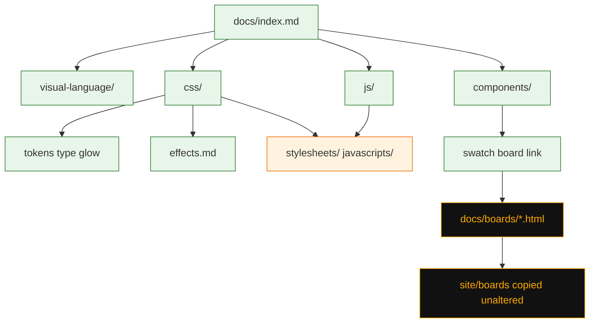

# Task: Canonical usage guide

* Task ID: canonical-usage-guide
* Complexity: Level 3
* Type: documentation feature

Fill out the ProperDocs site as the teaching surface for every design-system capability ([issue #9](https://github.com/Texarkanine/nervouscsstem/issues/9)). Catalog pages teach isolation (variants together, constant filler, modifiers last as classes). Five `ref/` swatch HTML pages become unthemed void boards on Pages, not in the skill. Motion rename is [issue #12](https://github.com/Texarkanine/nervouscsstem/issues/12).

## Pinned Info

### Docs tree

Directory hierarchy is the nav. Asset dirs are not documentation folders. Boards are static HTML copied into `site/`, not Material pages.

Creative refs: `memory-bank/active/creative/creative-docs-tree.md`, `memory-bank/active/creative/creative-swatch-boards.md`.

## Component Analysis

### Affected Components
- `docs/` markdown tree: catalog pages, section homes, moves of existing Using and visual-language files
- `properdocs.yml`: drop `nav:`; `navigation.indexes`; `not_in_nav` for boards and `reading.md`; awesome-pages plugin
- `docs/.pages`: root sidebar order
- `skills/nerv/docs/`: copy-identity for every new/moved markdown except `reading.md`
- `docs/img/` LFS stills: rename those that illustrate a catalogued component; retarget taxonomy links
- `docs/boards/*.html`: five adapted swatch pages (void HTML)
- `ref/*.html`: source of boards; four servings stay unpublished
- Docs asset dirs: gitignore currently ignores the whole directories, so `docs-init.js` / `docs-islands.css` are untracked
- `scripts/resolve-docs-assets.mjs` and `test/docs-assets.test.mjs`: dual-load of `nerv.css` / `nerv.js`
- `test/skill-contract.test.mjs`: markdown lockstep
- `.github/workflows/release-please.yaml` `publish-pages`: publishes `site/`
- `docs/javascripts/docs-init.js`: extend `data-nerv-init` kinds as JS catalog islands need them
- `src/` / `dist/`: no CSS/JS product change

### Cross-Module Dependencies
- Catalog markdown → skill copies (byte-identical `.md`)
- Catalog islands → `docs-init.js` scoped `NERV.*` (never `NERV.init()` on Material chrome)
- Catalog pages → `docs/img/` stills (LFS rename + relative links)
- Swatch HTML → `docs/stylesheets/nerv.css` and `docs/javascripts/nerv.js` (own `<link>`/`<script>`, not `extra_css`)
- `publish-pages` uploads whatever `properdocs build` put in `site/`

### Boundary Changes
- Public docs URL tree changes (file moves)
- Skill install markdown tree changes in lockstep
- Screenshot filenames in `docs/img/` change; taxonomy pages must keep resolving
- No CSS class rename (issue #12)

### Invariants
- Must preserve `.nerv-` prefix, no canvas, no product image files, `prefers-reduced-motion` / `prefers-contrast`
- Must preserve skill copy-identity for markdown except `reading.md`
- Must preserve dual-load of `nerv.css` / `nerv.js` (local copy vs CDN stand-in)
- Must not call `NERV.init()` from Material docs chrome
- Boards must remain unthemed void HTML (`site/boards/*.html` has no `md-header`)
- Screenshot library stays Git LFS under `docs/img/**`; stills and boards do not enter the skill

## Open Questions

- [x] **Docs tree and catalog map** → Resolved: layered folders (`visual-language`, `css`, `js`, `components`), `index.md` section homes, one root `.pages` for sidebar order, `not_in_nav` for `reading.md`. See `memory-bank/active/creative/creative-docs-tree.md`.
- [x] **Swatch board publication** → Resolved: Option A, `docs/boards/`. Operator requires void HTML outside Material. Probe `properdocs build --strict` copied a board HTML file byte-identical into `site/boards/` (no `md-header`). `extra_templates` is the failure mode that would force Option B. See `memory-bank/active/creative/creative-swatch-boards.md`.

## Test Plan (TDD)

### Behaviors to Verify

- Chrome files present: repo contains `docs/javascripts/docs-init.js` and `docs/stylesheets/docs-islands.css` (not gitignored)
- Dual-load isolation unchanged: `resolveDocsAssets` does not modify `ref/` or `src/`
- Board sources are void HTML: each `docs/boards/{foundation,lists,tables,forms,effects}.html` exists, starts with `<!DOCTYPE html>`, contains no `md-header`, links `../stylesheets/nerv.css`, and does not reference `../dist/nerv.css` or `../src/nerv.js`
- Board NERV boot: lists, tables, forms, and foundation wait for `window.NERV` or `nerv-docs:ready` before calling `NERV.*`
- Skill ships no HTML and no `boards/` path
- Skill markdown lockstep: every `docs/**/*.md` except `reading.md` has an identical copy under `skills/nerv/docs/` at the same relative path (existing test covers new files once copies exist)
- Island init kinds: every `data-nerv-init` value used in `docs/**/*.md` has a matching branch in `docs-init.js`

### Test Infrastructure

- Framework: Node.js `node --test` (`package.json` `npm test`)
- Test location: `test/`
- Conventions: `*.test.mjs`, `node:test` + `node:assert/strict`
- New test files: `test/docs-boards.test.mjs` (void HTML + asset URLs + boot). Extend `test/skill-contract.test.mjs` (no HTML / no `boards/`). Extend `test/docs-assets.test.mjs` or a small case in `docs-boards` for chrome files existing. New `test/docs-init-kinds.test.mjs` for the `data-nerv-init` lockstep.

### Integration Tests

- After implementation, `npm run docs:build` must succeed (`properdocs build --strict`). That is a build check, not a new unit. If `site/boards/*.html` ever contains `md-header`, Option A has failed and the swatch creative falls back to Option B.

## Implementation Plan

### 1. Docs chrome gitignore — executable

- Files: `.gitignore`, `docs/javascripts/docs-init.js`, `docs/stylesheets/docs-islands.css`
- Creative ref: `creative-docs-tree.md`

1. Stub tests: in `test/docs-boards.test.mjs`, empty cases `chrome files exist` and `gitignore does not ignore docs-init.js`
2. Stub interface: none (files already exist locally)
3. Write tests and run red: `existsSync` for both chrome files; `git check-ignore` (or read `.gitignore`) must not match `docs/javascripts/docs-init.js`
4. Write code and run green: remove directory-wide `docs/stylesheets` and `docs/javascripts` ignores; keep `docs/stylesheets/nerv.css` and `docs/javascripts/nerv.js`; `git add` the chrome files

### 2. Board and skill HTML contract — executable

- Files: `test/docs-boards.test.mjs`, `test/skill-contract.test.mjs`

1. Stub tests: empty cases for five board paths, void markers, stylesheet href, no dist/src nerv URLs, NERV boot waiter, skill has no `.html` and no `boards` path segment
2. Stub interface: none
3. Write tests and run red
4. Write code and run green: next step supplies the HTML; this step only lands the failing tests (and the skill assertion, which already passes until HTML is wrongly copied)

### 3. Swatch HTML — executable

- Files: `docs/boards/{foundation,lists,tables,forms,effects}.html`
- Creative ref: `creative-swatch-boards.md`

1. Stub tests: already in step 2
2. Stub interface: empty HTML files that fail the assertions
3. Write tests and run red: already red from step 2
4. Write code and run green: copy from `ref/ref-*.html`; rewrite CSS/JS to dual-load paths; wrap `NERV.init` / `initCartouches` in a `window.NERV` / `nerv-docs:ready` boot; comment the `ref/` source; do not add to `extra_templates`; do not copy into the skill

### 4. ProperDocs IA — executable

- Files: `properdocs.yml`, `pyproject.toml`, `uv.lock`, `docs/.pages`
- Creative ref: `creative-docs-tree.md`

1. Stub tests: none new — `npm run docs:build` is the gate (`No tests: build/config` except lock already tested in `docs-assets.test.mjs` for PyPI-only URLs)
2. Stub interface: none
3. Write tests and run red: skip — adding a plugin is config. Relock must keep `uv.lock` on pypi.org (existing test)
4. Write code and run green:
   - Drop `nav:`
   - `theme.features`: keep `navigation.sections`, add `navigation.indexes`
   - `plugins`: `awesome-pages` via `mkdocs-awesome-pages-plugin`
   - `not_in_nav`: `reading.md`, `boards/**`
   - `docs/.pages` nav: `index.md`, `visual-language`, `css`, `js`, `components`, `service-manual.md`
   - `uv add --group docs mkdocs-awesome-pages-plugin` with PyPI-only index (`--no-config --default-index https://pypi.org/simple`)
   - `npm run docs:build` must pass
   - If the plugin cannot load under ProperDocs 1.6, use `mkdocs-awesome-nav` with `filename: .pages` (same `.pages` files) or fail this step and stop — do not invent a third nav scheme

### 5. Folder moves and section homes — prose/policy

- Files: `docs/visual-language/*`, `docs/css/index.md`, `docs/js/index.md`, `docs/components/index.md`, `docs/index.md`, `skills/nerv/docs/**`
- No tests: prose/policy artifact (skill-contract will fail until copies exist — that existing test is the gate)
- Creative ref: `creative-docs-tree.md`

1. Move `design-language.md`, `atomic-elements.md`, `radar.md` into `visual-language/`; add `visual-language/index.md`; fix still links to `../img/`
2. Move `css.md` → `css/index.md`; add glow as modifier-class section (one example per glow *kind*)
3. Add `css/effects.md` (scanlines, flicker family, glitch — current class names; link `../boards/effects.html`)
4. Add `js/index.md` (scoped `NERV.*`; never `NERV.init()` on Material pages)
5. Add `components/index.md`
6. Rewrite `docs/index.md` links to the new folders
7. Copy every new/moved markdown into `skills/nerv/docs/` at the same relative path; delete stale skill paths (`skills/nerv/docs/css.md`, old taxonomy paths)

### 6. Component catalog pages — prose/policy

- Files: `docs/components/*.md` and matching `skills/nerv/docs/components/*.md`
- No tests: prose/policy artifact
- Creative ref: `creative-docs-tree.md`

For each family, same page grain: name/variant → NGE still if one exists → example island (constant filler across variants) → spec + HTML → extra detail only if needed → modifier-class examples at the bottom → swatch-board link if this family has one.

1. `panels.md` — retune existing page (constant filler; modifiers last)
2. `bar-meters.md` — keep as JS exemplar; `data-nerv-init="bar-meters"`
3. `lists.md` — fill/shape/rotation/nesting; board `../boards/lists.html`
4. `tables.md` — board `../boards/tables.html`
5. `forms.md` — each control in isolation; board `../boards/forms.html`
6. `cartouches.md` — flex, fixed, table-mode; `data-nerv-init` for JS variants
7. `hex-grid.md` — spaced/tiled/filled/solid + cell states; invented cell text
8. `radar.md` — usage islands; cross-link `visual-language/radar.md`
9. `stripe-bars.md`
10. `dividers.md`
11. `grid-marks.md`
12. `reticles.md`
13. `magi.md`
14. `label-box.md`
15. `status-text.md`
16. `segment-display.md`
17. `gradients.md`
18. `data-bg.md`
19. `states.md` — `.nerv-state-*` cascade only, not the alert-cascade serving
20. `css/index.md` board link to `../boards/foundation.html`

Do not publish `ref-panels`, `ref-patterns`, `ref-components`, or `ref-alert-cascade` as boards.

### 7. docs-init kinds — executable

- Files: `docs/javascripts/docs-init.js`, `test/docs-init-kinds.test.mjs`

1. Stub tests: empty case that every `data-nerv-init` in `docs/**/*.md` has a `kind === '…'` branch
2. Stub interface: none
3. Write tests and run red as catalog pages add kinds
4. Write code and run green: add branches (`cartouches`, hex, magi, radar, label-box, data-bg, ghost segments, grid labels) calling the matching `NERV.init*(island)` only. Never `NERV.init()`

### 8. Stills rename — prose/policy

- Files: `docs/img/*.png` (LFS), taxonomy markdown, catalog pages
- No tests: prose/policy artifact (a filename lock would be a change-detector)

1. For each catalog family, take stills already used in `atomic-elements.md` / `design-language.md` that illustrate that component (not all 149 stills)
2. `git lfs` rename so the filename names the component (e.g. `cartouche-identified.png`)
3. Update every markdown link to the old hash name
4. Section order on the catalog page: name → still → island → spec + HTML → details
5. Do not copy stills into the skill

## Technology Validation

- **Static HTML in `docs/boards/`:** verified 2026-09-13. Probe file copied byte-identical to `site/boards/`; markdown pages still get Material `md-header`. No new dependency.
- **mkdocs-awesome-pages-plugin:** new docs-group dependency. Validate in step 4 with `uv add` (PyPI-only) and `npm run docs:build`. If it will not load, stop and use `mkdocs-awesome-nav` with `filename: .pages` — do not restore `nav:` in `properdocs.yml`.
- No CSS/JS product dependencies.

## Challenges & Mitigations

- **Material wraps boards:** already checked for current ProperDocs. If a plugin later wraps `.html`, switch swatch creative to Option B (post-copy into `site/`). Do not list boards in `extra_templates`.
- **CDN async `nerv.js`:** board boot waiter is mandatory (Challenge for step 3).
- **Skill copies forgotten after a move:** existing `skill-contract.test.mjs` fails until copies exist. Run it after every markdown batch.
- **gitignore still hiding chrome:** step 1 exists because a fresh clone cannot `docs:build` today (`docs-init.js` is untracked).
- **LFS rename:** use `git mv` so pointers stay LFS; never add a repo-wide `*.png` LFS rule.
- **Catalog pages become servings:** grain rules in step 6; `states.md` is the cascade *mechanism* only.
- **awesome-pages vs ProperDocs:** step 4 is a hard gate before writing twenty catalog pages.

## Pre-Mortem

- **We documented current flicker names and then #12 ships immediately after:** accepted. Issue #12 exists so this ticket does not redesign motion. Effects page uses current names.
- **We renamed every still in `docs/img/` including ones that do not illustrate a catalog component:** plan response — step 8 is per catalog family from taxonomy tables, not a 149-file bulk rename.
- **Directory nav is alphabetical and Components lead the sidebar:** already covered by Challenge (root `.pages`).
- **The task was actually L4 and the catalog is uneven because one plan tried to write every page at once:** keep L3; step 6 is one grain applied N times. If preflight says the plan is too large, split catalog families into a follow-up issue rather than silently dropping pages — issue #9’s done-when is the whole capability set.

## Status

- [x] Component analysis complete
- [x] Open questions resolved
- [x] Test planning complete (TDD)
- [x] Implementation plan complete
- [x] Technology validation complete
- [x] Pre-Mortem complete
- [ ] Preflight
- [ ] Build
- [ ] QA
