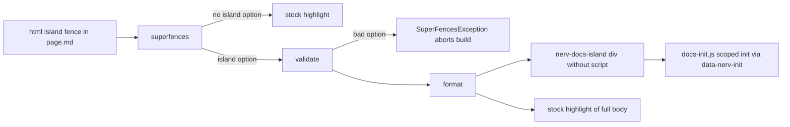

# Task: Single-source catalog islands (issue #14)

* Task ID: issue-14-single-source-islands
* Complexity: Level 3
* Type: feature (docs build tooling + catalog migration)

Add a `pymdownx.superfences` custom fence (`html` + bare `island` option) whose build-time formatter emits the live `.nerv-docs-island` (scripts stripped, chrome from options) followed by the stock-highlighted copy of the same body. Install it into the docs venv as an editable package. Migrate all 133 island+fence pairs on 29 pages. Document the authoring contract in `docs/service-manual.md`.

## Pinned Info

### Build-time data flow

Pinned because every step (formatter, config, migration, verification) is a piece of this one pipeline.



## Component Analysis

### Affected Components
- `pyproject.toml` / `uv.lock`: virtual docs toolchain → becomes an editable package (`uv_build`, `module-root = "scripts"`); lock line `virtual` → `editable`.
- `scripts/nervouscsstem_docs/` (new): `__init__.py` (empty) + `island_fence.py` with `validate()` and `format()`.
- `properdocs.yml`: Mermaid custom fence only → adds `html` custom fence (`class: nerv-docs-island`, validator + format).
- `test/test_island_fence.py` (new): stdlib `unittest` cases driving a real `markdown.Markdown` with superfences.
- `docs/components/**/*.md` (29 pages): hand-duplicated island + fence → one ```` ```html island … ```` fence; Spec paragraph moves after the fence.
- `docs/javascripts/docs-init.js`: unchanged (still reads `data-nerv-init` on `.nerv-docs-island`).
- `docs/stylesheets/docs-islands.css`: unchanged.
- `docs/service-manual.md`: "Catalog live examples" gains the fence contract; drops the "live demo markup may still carry `data-nerv-init`" line.
- `memory-bank/techContext.md`, `memory-bank/systemPatterns.md`: surgical updates.

### Cross-Module Dependencies
- `properdocs.yml` → `nervouscsstem_docs.island_fence` (YAML `!!python/name:`, resolved at config parse).
- `island_fence.format` → `md.preprocessors['fenced_code_block'].highlight` (superfences internals; same call the stock fence makes, so the Pygments block counter advances identically).
- Built island `data-nerv-init` → `docs-init.js` kind switch.
- CI `uv sync --group docs --frozen` → editable install of the package (no workflow edits).

### Boundary Changes
- Docs authoring contract: new fence form (documented in service manual). No product CSS/JS or npm package change.
- Python project gains a build backend; not published.

## Open Questions

- [x] How does properdocs import the formatter? → Resolved: editable install of the root docs project via `uv_build`, package under `scripts/` (see `memory-bank/active/creative/creative-formatter-import-path.md`)
- [x] Fence syntax and option contract? → Resolved: ```` ```html island init="…" state="…" ````; unknown/valueless/malformed options raise (see `memory-bank/active/creative/creative-fence-syntax.md`)
- [x] Where does the Spec paragraph go? → Resolved: after the fence (see `memory-bank/active/creative/creative-spec-placement.md`)
- [x] Python test runner? → Resolved: stdlib `unittest` under `uv run` (see `memory-bank/active/creative/creative-python-test-runner.md`)

## Test Plan (TDD)

### Behaviors to Verify

- Plain fence: ```` ```html ```` with no options → output identical to stock superfences without the custom fence registered; no island.
- Island fence: ```` ```html island ```` body `B` → `<div class="nerv-docs-island">\nB\n</div>` followed by exactly the stock highlight of `B`.
- Script stripping: body with markup + `<script>…</script>` → island has markup only; highlight contains the script.
- Script variants: `<script type="module">`, uppercase `<SCRIPT>`, multi-line, two scripts → all removed from island.
- Init option: `init="bar-meters"` → island has `data-nerv-init="bar-meters"`; highlight has no `data-nerv-init`.
- State option: `state="alert"` → island class `nerv-docs-island nerv-state-alert`; highlight has no `nerv-state-alert`.
- Both options → class and attribute together.
- Island class comes from the fence config `class:` value.
- Unknown option with `island` (e.g. `inti="radar"`) → `SuperFencesException`.
- Valueless `init` / `state` → `SuperFencesException`.
- Malformed value (`state="Alert"`, `init="a b"`, `init='x"y'`-style) → `SuperFencesException`.
- Copy parity: highlight emitted by the island fence equals a plain ```` ```html ```` fence of the same body rendered in the same document.

### Test Infrastructure

- Framework: Python stdlib `unittest` (new for this repo; JS stays `node --test`).
- Test location: `test/`
- Conventions: JS tests are `test/*.test.mjs` listed in `package.json`; Python test is `test/test_island_fence.py`, discovered by `uv run python -m unittest discover -s test -v`.
- New test files: `test/test_island_fence.py`

### Integration Tests

- Strict docs build (`npm run docs:build`) is the integration test for `properdocs.yml` ↔ package import ↔ formatter ↔ pages. No new automated test.
- One-off before/after `site/` comparison (verification, not committed):
    1. `site-before`: build of `e24adae` pages (captured before any change).
    2. `site-reordered`: old island form with each Spec paragraph moved after its fence (same migration script, reorder-only mode).
    3. `site-after`: migrated pages.
    - Check A (`before` vs `reordered`): every HTML file's sorted line multiset is equal → the only change is block order.
    - Check B (`reordered` vs `after`): every HTML file equal after stripping leading line indentation; every `<div class="highlight">…</div>` equal byte-for-byte; island count and `data-nerv-init` / `nerv-state-*` counts equal per page.
    - Leading-indent normalization is visually sound: the only `white-space: pre` in `src/` is on JS-injected `.nerv-data-bg-inner` and single-line `.nerv-type-boot` text.

## Implementation Plan

### ✅ 1. Capture baseline site — verification setup

- Files: none committed (`/tmp/i14-site-before`)

1. `npm run docs:build` on the untouched tree; copy `site/` to `/tmp/i14-site-before`.

### ✅ 2. Package the docs tooling — executable (build config)

- Files: `pyproject.toml`, `uv.lock`, `scripts/nervouscsstem_docs/__init__.py`
- Creative ref: `creative-formatter-import-path.md`
- Verified by the strict docs build importing the module (Step 4) and by the unit tests importing it; no dedicated test (build config, not product behavior).

1. Add `[build-system]` (`uv_build>=0.8.22,<0.9`) and `[tool.uv.build-backend] module-root = "scripts"`; update the header comment.
2. Create empty `scripts/nervouscsstem_docs/__init__.py`.
3. `uv lock --no-config --default-index https://pypi.org/simple`; confirm the lock diff is only `virtual` → `editable`; `uv sync --group docs`.

### ✅ 3. Island fence formatter — executable

- Files: `scripts/nervouscsstem_docs/island_fence.py`, `test/test_island_fence.py`
- Creative ref: `creative-fence-syntax.md`, `creative-python-test-runner.md`

1. Stub tests: `test/test_island_fence.py` with one `unittest.TestCase` and empty methods for every behavior in the Test Plan, each with a docstring.
2. Stub interface: `island_fence.py` with module docstring (fence contract) and `validate(language, inputs, options, attrs, md) -> bool` / `format(src, language, class_name, options, md, **kwargs) -> str` raising `NotImplementedError`, full docstrings.
3. Write tests and run red: build `markdown.Markdown(extensions=["pymdownx.superfences"], extension_configs=…)` with the Mermaid-free config (`name: html`, `class: nerv-docs-island`, validator, format); assert on `convert()` output; exception cases use `assertRaises(SuperFencesException)`. Run `uv run python -m unittest discover -s test -v` → all fail.
4. Write code and run green: `validate` returns `False` without `island`; raises on unknown keys, valueless or malformed `init`/`state`; copies `init`/`state` into `options`. `format` strips `<script\b…</script>` (DOTALL, IGNORECASE) plus its line, `rstrip`s, wraps in `<div class="{class_name}[ nerv-state-{state}]"[ data-nerv-init="{init}"]>\n…\n</div>\n`, then appends `md.preprocessors['fenced_code_block'].highlight(src=src, language=language, options={}, md=md, **kwargs)`. Run → green.

### ✅ 4. Register the fence — executable (config)

- Files: `properdocs.yml`

1. Add the `html` custom fence after Mermaid.
2. `npm run docs:build` → strict pass; diff `site/` against `/tmp/i14-site-before` → identical HTML (no page uses `island` yet), proving registration is a no-op for plain fences.

### ✅ 5. Migrate catalog pages — content (verified by site diff, no tests: catalog content)

- Files: `docs/components/**/*.md` (29 pages)
- Creative ref: `creative-spec-placement.md`

1. One-off script (`/tmp`, not committed): for each `<div class="nerv-docs-island…">…</div>` + following `html` fence, assert dedented island inner == fence minus `<script>`; derive `init` / `state` from the island tag; emit reorder-only variant or single-source variant (```` ```html island[ init="…"][ state="…"] ```` + fence body, then the Spec paragraph).
2. Reorder-only variant → build → `/tmp/i14-site-reordered`; restore pages (`git checkout -- docs/components`).
3. Single-source variant → build → `site/`; run Checks A and B; record per-page results in `progress.md`.
4. Confirm no `nerv-docs-island` string remains in `docs/components/**/*.md` and scanlines is still a plain fence.

### ✅ 6. Service manual — prose/policy

- Files: `docs/service-manual.md`
- No tests: prose/policy artifact

1. In "Catalog live examples", document: write one ```` ```html island ```` fence; `init="<kind>"` → scoped init via `docs-init.js`; `state="<name>"` tints the island; `<script>` stays in the copy and is stripped from the island; scanlines stays a plain `html` fence; bad options fail the build; formatter lives in `scripts/nervouscsstem_docs/`, tests via `uv run python -m unittest discover -s test -v`.
2. Replace the "Live demo markup may still carry `data-nerv-init`" sentence.

### ✅ 7. Memory bank persistent files — prose/policy

- Files: `memory-bank/systemPatterns.md`, `memory-bank/techContext.md`
- No tests: prose/policy artifact

1. `systemPatterns.md`: replace the island+fence sentence and "Generating both from one source is issue #14" with the fence-option contract.
2. `techContext.md`: note the editable docs package and the Python test command.

### ✅ 8. Full verification — verification

1. `npm test`, `npm run lint`, `npm run docs:build`, `uv run python -m unittest discover -s test -v`; read all output.
2. Clean-checkout import check: fresh `git worktree`/clone into `/tmp`, `uv sync --group docs --frozen`, `npm ci`, `npm run docs:build`.

## Technology Validation

- New: `uv_build` build backend (PEP 517, fetched at sync). PoC in a scratch copy: relock diff was one line; fresh `--frozen` sync installed `nervouscsstem_docs.pth`; `properdocs build --strict` imported `nervouscsstem_docs.island_fence` and rendered.
- PoC of the fence: custom `html` fence with an `island`-gated validator left plain fences stock and produced a highlight block byte-identical to stock.

## Challenges & Mitigations

- Calling superfences' `highlight()` from a custom formatter relies on internals (`md.preprocessors['fenced_code_block']`): the copy-parity test fails loudly if a pymdownx upgrade changes this; `uv.lock` pins the version.
- Migration regex could mis-pair an island with the wrong fence: the script asserts island == fence-minus-script for every pair before writing, and Check B compares every page.
- Spec reorder is a visible layout change: isolated as Check A (pure reorder) and flagged for visual QA.
- Stripping `<script>` by regex on author-controlled markup: acceptable (trusted input); tests cover attributes, case, multi-line, multiple scripts.

## Pre-Mortem

- The formatter works locally but CI cannot import it (stale lock, `--frozen` mismatch): Step 8.2 clean-checkout build plus PR CI watch.
- Output "equivalent" by my normalization but visibly different: normalization restricted to leading indentation; `<pre>` blocks compared byte-for-byte; only JS-injected content uses `white-space: pre`. Manual visual QA flagged anyway.
- Sibling #8 lands first with an old-form page: out of scope per operator; the rebase converts it, and the service manual documents the target form.

## Status

- [x] Component analysis complete
- [x] Open questions resolved
- [x] Test planning complete (TDD)
- [x] Implementation plan complete
- [x] Technology validation complete
- [x] Pre-Mortem complete
- [x] Preflight (PASS WITH ADVISORY)
- [x] Build
- [x] QA (PASS; see `.qa-validation-status`)

## QA Results

PASS. No blocking findings. Advisories: formatter tests are outside `npm test` / CI (planned); commit 56caa5b carries an automatic SumMem nap of two main notes; the `init=`/`state=`-without-`island` guard is an unplanned but tested and documented addition.
