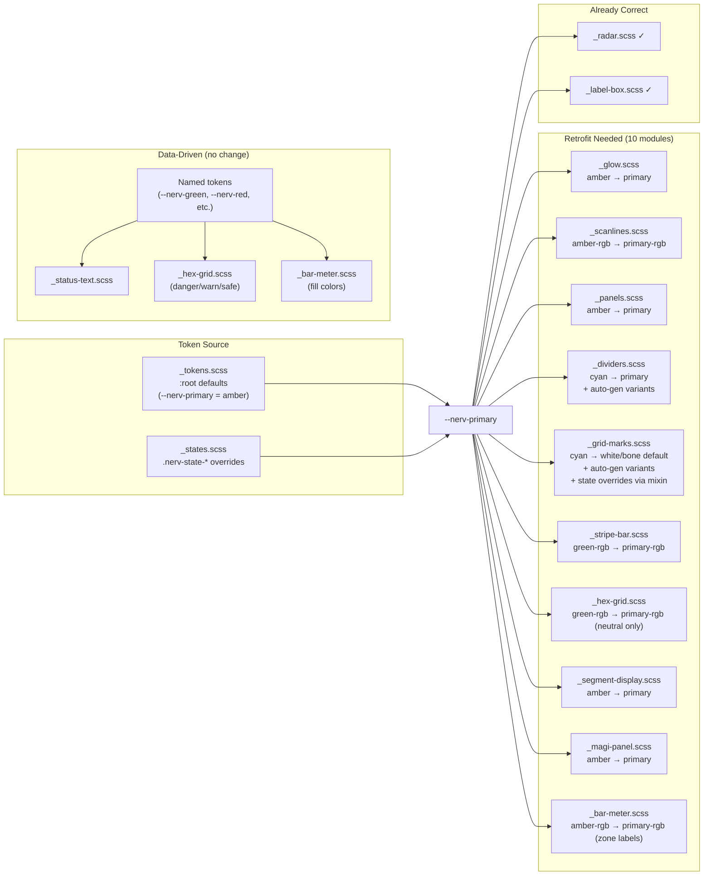

# Task: Phase 6 — Alert State Cascade & Integration

* Task ID: nerv-phase6-states
* Complexity: Level 3
* Type: Feature (capstone integration)

Implement the alert state cascade system: five escalation states (Nominal → Active → Caution → Alert → Critical) controlled by a single root class change, cascading token overrides across all existing design system modules. Includes new `_states.scss` module, `NERV.setState()` JS API, and `ref-alert-cascade.html` reference page. Requires retrofitting 10 existing modules to use `--nerv-primary` for ambiance-driven properties.

## Pinned Info

### Module Retrofit Map

Shows which modules need retrofitting to use `--nerv-primary` and which are already correct or intentionally data-driven.

### Escalation State Table

Quick reference for state token values during implementation.

| State | Root Class | `--nerv-primary` | `--nerv-bg` | `--nerv-animation-speed` | Special Effects |
|-------|-----------|-------------------|-------------|--------------------------|-----------------|
| Nominal | `.nerv-state-nominal` | `--nerv-green` | `--nerv-void` | `1` | None — calm |
| Active | `.nerv-state-active` | `--nerv-amber` | `--nerv-void` | `1` | Data elements flicker |
| Caution | `.nerv-state-caution` | `--nerv-amber-dark` | `--nerv-void` | `1.5` | Hex grid brighter, glow intensifies |
| Alert | `.nerv-state-alert` | `--nerv-red` | `--nerv-void` | `2` | Vignette red edge bleed, status text blinks |
| Critical | `.nerv-state-critical` | `--nerv-red` | `--nerv-red-deep` | `3` | Full glitch, screen flash, max speed stripes |

## Component Analysis

### Affected Components

- **`_tokens.scss`**: Defines `:root` defaults. No changes needed — already defines `--nerv-primary`, `--nerv-primary-rgb`, `--nerv-bg`, `--nerv-bg-rgb`, `--nerv-animation-speed`, `--nerv-glow-spread`, `--nerv-glow-intensity`, `--nerv-scanline-opacity`. All needed tokens exist.
- **`_glow.scss`**: Glow mixins use `--nerv-amber`/`--nerv-amber-rgb` → must retrofit to `--nerv-primary`/`--nerv-primary-rgb` for `.nerv-glow` and `.nerv-glow-text`. `.nerv-glow-drop` already uses `--nerv-primary`.
- **`_scanlines.scss`**: Bright band color uses `--nerv-amber-rgb` → retrofit to `--nerv-primary-rgb`. Animation duration already uses `--nerv-animation-speed` (no change needed).
- **`_panels.scss`**: Default `--nerv-panel-color` falls back to `--nerv-amber` → retrofit to `--nerv-primary`. Same for RGB companion.
- **`_dividers.scss`**: Default divider uses `--nerv-cyan`/`--nerv-cyan-rgb` → retrofit to `--nerv-primary`/`--nerv-primary-rgb`. Replace manual `.nerv-divider-amber` with auto-generated `.nerv-divider-{name}` variants from `$nerv-colors` (matching `_stripe-bar.scss` and `_glow.scss` pattern). Needs to `@use 'tokens'` and `@use 'glow'`.
- **`_stripe-bar.scss`**: Default `--nerv-stripe-color-rgb` falls back to `--nerv-green-rgb` → retrofit to `--nerv-primary-rgb`. Named color variants stay.
- **`_hex-grid.scss`**: Default neutral cell uses `--nerv-green-rgb` → retrofit to `--nerv-primary-rgb`. Danger/warn/safe states remain data-driven (named tokens, no change).
- **`_segment-display.scss`**: Uses `--nerv-amber`/`--nerv-amber-rgb` → retrofit to `--nerv-primary`/`--nerv-primary-rgb`.
- **`_magi-panel.scss`**: Default `--nerv-magi-color` falls back to `--nerv-amber` → retrofit to `--nerv-primary`. Same for RGB companion.
- **`_bar-meter.scss`**: Zone label color uses `--nerv-amber-rgb` → retrofit to `--nerv-primary-rgb`. Fill colors (`--nerv-bar-from`, `--nerv-bar-to` defaulting to `--nerv-cyan`/`--nerv-blue`) are data-driven — no change.
- **`_radar.scss`**: Already uses `--nerv-primary-rgb` — no change needed.
- **`_label-box.scss`**: Already uses `--nerv-primary`/`--nerv-primary-rgb` — no change needed.
- **`_status-text.scss`**: Uses named tokens (`--nerv-green`, `--nerv-amber`, `--nerv-red`) for severity indication — data-driven, no change.
- **`_grid-marks.scss`**: Uses compile-time SCSS variable for SVG data URI. Default changes from cyan to white/bone — white grid marks pick up overlay colors (scanlines, glow) naturally. Add `@each` loop to auto-generate `.nerv-grid-marks-{name}` color variants from `$nerv-colors` (matching the pattern in `_stripe-bar.scss` and `_glow.scss`). State-specific grid marks colors applied in `_states.scss` via `@use 'grid-marks'` + mixin calls inside state selectors (the only way to change SVG data URI colors at "runtime").
- **`_flicker.scss`**: No color usage, only animation timing. Already uses `--nerv-animation-speed`. No change needed.
- **`_glitch.scss`**: Uses `--nerv-cyan`/`--nerv-red` for chromatic aberration effect — these are data-driven visual artifacts, not ambiance. No change.
- **`_states.scss` (NEW)**: Five state classes with token overrides and state-specific compound selectors.
- **`src/nerv.scss`**: Add `@forward 'states'` as the last entry in the forward chain.
- **`src/nerv.js`**: Add `NERV.setState(state)` method for programmatic state transitions. Add screen flash DOM injection for Critical state.
- **`ref/ref-alert-cascade.html` (NEW)**: Reference page 6 with interactive state controls.

### Cross-Module Dependencies

- `_states.scss` → `_tokens.scss`: Overrides token values; must be `@forward`ed last so its selectors cascade after all token definitions.
- `_states.scss` → `_grid-marks.scss`: `@use 'grid-marks'` to call `nerv-grid-marks-bg()` mixin inside state selectors for per-state grid marks coloring.
- `_states.scss` → all modules: State-specific compound selectors (e.g., `.nerv-state-active .nerv-type-data`) reference classes from other modules.
- `nerv.js` setState → `_states.scss`: JS applies/removes state classes that activate CSS rulesets.
- All retrofitted modules → `_tokens.scss`: After retrofit, modules consume `--nerv-primary` which is defined in tokens and overridden in states.
- `_dividers.scss` → `_tokens.scss`: Now `@use 'tokens'` for `$nerv-colors` iteration (variant auto-generation).

### Boundary Changes

- **`nerv.js` public API**: New method `NERV.setState(state)` added.
- **Module defaults change**: 10 modules switch their default color from a specific named token to `--nerv-primary` (or white/bone for grid marks). The key change is that in Nominal state, ambiance-driven elements will be green instead of amber.
- **Divider default color**: Changes from cyan to `--nerv-primary` (amber by default). Manual `.nerv-divider-amber` replaced by auto-generated `.nerv-divider-{name}` variants. Existing ref pages will show amber dividers instead of cyan.
- **Grid marks default color**: Changes from cyan to white/bone. Grid marks become near-invisible on dark backgrounds alone but pick up overlay tints. Explicit color variants available via `.nerv-grid-marks-{name}`.
- **Grid marks state cascade**: Unlike other modules (which cascade via CSS custom properties), grid marks cascade via mixin calls in `_states.scss` state selectors that regenerate the SVG data URI per state.

## Open Questions

None — implementation approach is clear. The "ambiance follows `--nerv-primary`, data follows named tokens" rule from the planning spec unambiguously determines which modules need retrofitting. Technical approaches for all effects (token overrides, compound selectors, screen flash via JS) are well-defined.

Design decisions made during planning:
- Grid marks default to white/bone (picks up overlay colors naturally); explicit state colors via mixin calls in `_states.scss`; color variants auto-generated from `$nerv-colors`
- Dividers auto-generate `.nerv-divider-{name}` variants from `$nerv-colors` (replacing manual `.nerv-divider-amber`), matching the pattern in `_stripe-bar.scss` and `_glow.scss`
- Glitch chromatic aberration stays cyan/red (data-like visual artifact, not ambiance)
- Bar meter fill colors stay data-driven; only zone labels follow ambiance
- Screen flash implemented via JS (temporary overlay div) rather than CSS pseudo-element to avoid conflicts
- Short UI feedback transitions (`0.1s`, `0.06s`) in bar-meter and label-box are NOT scaled by `--nerv-animation-speed` (they're instant feedback, not decorative animation)

## Test Plan (TDD)

### Behaviors to Verify

**State class existence & structure:**
1. `.nerv-state-nominal` selector exists in compiled CSS
2. `.nerv-state-active` selector exists
3. `.nerv-state-caution` selector exists
4. `.nerv-state-alert` selector exists
5. `.nerv-state-critical` selector exists

**Token overrides per state:**
6. Nominal: `--nerv-primary` → green, `--nerv-animation-speed: 1`
7. Active: `--nerv-primary` → amber, `--nerv-animation-speed: 1`
8. Caution: `--nerv-primary` → amber-dark, `--nerv-animation-speed: 1.5`
9. Alert: `--nerv-primary` → red, `--nerv-animation-speed: 2`
10. Critical: `--nerv-primary` → red, `--nerv-bg` → red-deep, `--nerv-animation-speed: 3`

**State-specific selectors:**
11. `.nerv-state-active .nerv-type-data` triggers flicker
12. `.nerv-state-alert .nerv-status-text` blinks
13. `.nerv-state-critical .nerv-status-text` gets glitch
14. Alert/Critical vignette red edge bleed selector exists

**Accessibility:**
15. `prefers-reduced-motion` inside state classes suppresses animations

**Retrofit verification:**
16. `.nerv-glow` / `.nerv-glow-text` use `--nerv-primary-rgb` (not `--nerv-amber-rgb`)
17. `.nerv-scanlines` band uses `--nerv-primary-rgb` (not `--nerv-amber-rgb`)
18. `.nerv-panel` defaults to `--nerv-primary` (not `--nerv-amber`)
19. `.nerv-divider` defaults to `--nerv-primary` (not `--nerv-cyan`)
20. `.nerv-stripe` defaults to `--nerv-primary-rgb` (not `--nerv-green-rgb`)
21. Hex neutral cell uses `--nerv-primary-rgb` (not `--nerv-green-rgb`)
22. `.nerv-segment-display` uses `--nerv-primary` (not `--nerv-amber`)
23. `.nerv-magi-panel` defaults to `--nerv-primary` (not `--nerv-amber`)
24. Bar meter zone label uses `--nerv-primary-rgb` (not `--nerv-amber-rgb`)

**Variant generation:**
25. `.nerv-divider-{name}` classes auto-generated for each glow-flagged color in `$nerv-colors`
26. `.nerv-grid-marks-{name}` classes auto-generated for each glow-flagged color in `$nerv-colors`
27. Default `.nerv-grid-marks` uses white/bone color (not cyan)

**JavaScript API:**
28. `NERV.setState` function exists in `nerv.js`
29. `setState` accepts state name parameter
30. `setState` references all five state class names

**State-specific grid marks (via mixin in _states.scss):**
31. `.nerv-state-nominal .nerv-grid-marks` gets green grid marks SVG
32. `.nerv-state-alert .nerv-grid-marks` gets red grid marks SVG
33. `.nerv-state-critical .nerv-grid-marks` gets red grid marks SVG

**Edge cases:**
34. Hex data states (danger/warn/safe) still use named tokens after retrofit
35. Status text severity still uses named tokens after retrofit
36. Bar meter fill colors still use data tokens after retrofit

**Regression:**
37. All Phase 1–5 test suites pass

### Test Infrastructure

- Framework: `node:test` + `node:assert/strict` (built-in Node.js test runner)
- Test location: `test/`
- Conventions: `*.test.mjs`, `describe`/`it` blocks, `assert.match(css, /regex/)` for CSS checks, `before()` for build + file read
- New test file: `test/states.test.mjs`
- Modified test files: Existing tests that assert specific named tokens (e.g., `--nerv-amber` in panels) will need updating to match `--nerv-primary`

### Integration Tests

- **State cascade integration**: Verify that state class token overrides are consumed correctly by retrofitted modules (tested via CSS output patterns — compound selectors in `_states.scss` reference classes from other modules)
- **JS ↔ CSS integration**: Verify that `NERV.setState()` references the same class names as `_states.scss` defines
- **Regression suite**: Run all Phase 1–5 tests to confirm retrofit doesn't break existing behavior

## Implementation Plan

### Step 1: Stub test file and new module

- Files: `test/states.test.mjs`, `src/_states.scss`
- Changes: Create empty test file with `describe`/`it` stubs for all 37 behaviors. Create empty `_states.scss` with comment header only.

### Step 2: Implement retrofit verification tests

- Files: `test/states.test.mjs`
- Changes: Fill in test implementations for behaviors 16–27, 34–36 (retrofit checks, variant generation, data preservation). These verify modules use `--nerv-primary`, grid marks/dividers have auto-generated variants, and data modules still use named tokens. Tests will fail (modules not yet retrofitted).

### Step 3: Retrofit existing modules

- Files: `src/_glow.scss`, `src/_scanlines.scss`, `src/_panels.scss`, `src/_dividers.scss`, `src/_grid-marks.scss`, `src/_stripe-bar.scss`, `src/_hex-grid.scss`, `src/_segment-display.scss`, `src/_magi-panel.scss`, `src/_bar-meter.scss`
- Changes:
  - For most modules: replace specific named token references with `--nerv-primary` / `--nerv-primary-rgb` for ambiance-driven properties. Preserve named tokens for data-driven properties.
  - `_grid-marks.scss`: Change default from cyan to white/bone. Add `@each` loop over `$nerv-colors` to generate `.nerv-grid-marks-{name}` color variants via existing mixin.
  - `_dividers.scss`: Change default from cyan to `--nerv-primary`. Replace manual `.nerv-divider-amber` with `@each` loop over `$nerv-colors` to auto-generate `.nerv-divider-{name}` variants (with glow in matching color).
- Run tests: retrofit tests pass, regression tests checked.

### Step 4: Update existing tests for retrofit

- Files: `test/foundation.test.mjs`, `test/panels.test.mjs`, `test/effects.test.mjs`, `test/patterns.test.mjs`, `test/components.test.mjs`
- Changes: Update any assertions that check for specific named token values that were changed during retrofit (e.g., `--nerv-amber` → `--nerv-primary` in panel tests).

### Step 5: Implement state class tests

- Files: `test/states.test.mjs`
- Changes: Fill in test implementations for behaviors 1–15 and 31–33 (state class existence, token overrides, state-specific selectors, state-specific grid marks, accessibility). Tests will fail (module not yet implemented).

### Step 6: Implement `_states.scss`

- Files: `src/_states.scss`, `src/nerv.scss`
- Changes: Define five `.nerv-state-*` classes with token overrides. Add state-specific compound selectors. Add state-specific grid marks color overrides via `@use 'grid-marks'` + mixin calls. Add `prefers-reduced-motion` media queries. Add `@forward 'states'` to `nerv.scss` as last entry.
- Run tests: state class tests pass.

### Step 7: Implement JS API tests

- Files: `test/states.test.mjs`
- Changes: Fill in test implementations for behaviors 28–30 (setState API). Tests will fail.

### Step 8: Implement `NERV.setState()`

- Files: `src/nerv.js`
- Changes: Add `setState(state)` method that removes all `.nerv-state-*` classes from root, applies new one. Include screen flash logic for Critical state (inject temporary overlay, animate, remove). Handle reflow forcing for animation retrigger.
- Run tests: JS tests pass.

### Step 9: Create reference page

- Files: `ref/ref-alert-cascade.html`
- Changes: Reproduce `ref-components.html` layout. Add control row with five state buttons (NOMINAL, ACTIVE, CAUTION, ALERT, CRITICAL) outside themed area. Each button calls `NERV.setState()`. Control row styled plainly.

### Step 10: Full regression and verification

- Run full test suite (`npm test`), build (`npm run build`), lint (`npm run lint`).
- Visual verification of `ref-alert-cascade.html`.

## Technology Validation

No new technology — validation not required. All implementation uses existing SCSS/CSS/vanilla JS stack.

## Challenges & Mitigations

- **Existing test breakage from retrofit**: Modules changing from `--nerv-amber` to `--nerv-primary` may break existing test assertions. Mitigation: Step 4 explicitly updates existing tests after retrofit.
- **Divider color change**: Default divider changes from cyan to amber (via `--nerv-primary`). May affect appearance of earlier ref pages. Mitigation: Acceptable during initial development; earlier ref pages are test fixtures, not consumer deliverables.
- **Screen flash retrigger**: CSS animations run once and don't retrigger when re-entering the same state. Mitigation: `setState()` removes class, forces reflow via `void element.offsetHeight`, then re-adds class. This ensures one-shot animations fire on each state entry.
- **Grid marks use compile-time SVG colors**: SVG data URIs can't consume CSS custom properties. Mitigation: `_states.scss` uses `@use 'grid-marks'` and calls the `nerv-grid-marks-bg()` mixin inside state selectors to regenerate the SVG data URI per state. This generates more CSS (one SVG data URI per state) but keeps the cascade working. Default white/bone grid marks also pick up overlay colors passively for a softer ambient effect.
- **Specificity of state overrides**: State classes (`.nerv-state-*`, specificity 0,1,0) override `:root` token definitions (specificity 0,0,1). This works correctly via CSS cascade rules regardless of source order, but `_states.scss` is forwarded last as a safety measure.

## Status

- [x] Component analysis complete
- [x] Open questions resolved
- [x] Test planning complete (TDD)
- [x] Implementation plan complete
- [x] Technology validation complete
- [ ] Preflight
- [ ] Build
- [ ] QA
