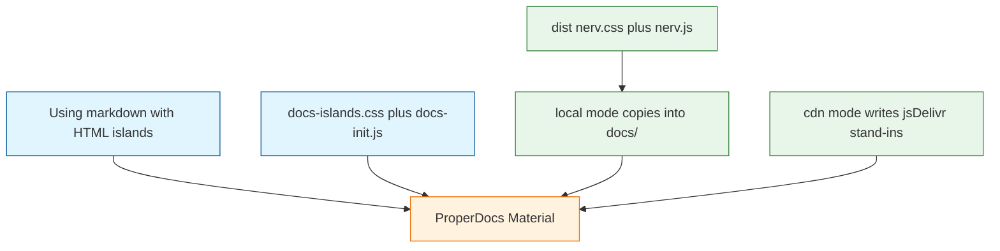

# Task: nerv-v01-m4-properdocs-dual-load-site

* Task ID: nerv-v01-m4-properdocs-dual-load-site
* Complexity: Level 3
* Type: feature

Add a ProperDocs GitHub Pages site from existing `docs/` plus Using pages with live examples embedded on the page (preview island, spec, code). Released pages load CSS/JS from the CDN. Local serve/build uses `dist/` and errors if those files are missing. CSS islands must not require `nerv.js`. At least one page uses scoped `NERV` init. Ship the pattern, not a page per component. Scope is parent-brief requirements 8–12, acceptance criteria 3–5, and use-cases 3–4. Do not add a skill, extra-files, or vendored fonts.

## Pinned Info

### Embedded examples vs dual-load

Examples live in markdown. Asset URLs are a Node step that fills `docs/stylesheets/nerv.css` and `docs/javascripts/nerv.js`. Docs pages never call `NERV.init()`.

## Component Analysis

### Affected Components

- **Using pages (`docs/css.md`, `docs/components/panels.md`, `docs/components/bar-meters.md`)**: none today → teaching pages with `.nerv-docs-island` preview, spec, and fenced code
- **Docs example chrome**: none today → `docs/stylesheets/docs-islands.css` and `docs/javascripts/docs-init.js` (scoped `NERV` calls only)
- **Dual-load module (`scripts/resolve-docs-assets.mjs`)**: none today → local copy-from-dist-or-throw into gitignored `docs/stylesheets/nerv.css` and `docs/javascripts/nerv.js`; CDN writes jsDelivr stand-ins at those same paths
- **ProperDocs site**: none today → `properdocs.yml` with `docs_dir: docs`, Material, `--strict`, `md_in_html`, `extra_css` / `extra_javascript`
- **Existing `docs/` markdown**: authoring SoT → add `index.md`; fix `service-manual.md` link that points outside `docs_dir`
- **GitHub Actions**: only `release-please.yaml` → Pages deploy after npm publish; PR docs build in local mode
- **`package.json` / README / `techContext.md`**: publish contract unchanged → docs scripts, Pages URL, uv/ProperDocs pointer
- **`ref/` and `src/`**: fixtures and source → no edits (`NERV.init` stays as-is)

### Cross-Module Dependencies

- Dual-load module → `dist/` (local) and `package.json` version (CDN stand-ins)
- ProperDocs `extra_css` / `extra_javascript` → those generated nerv files plus committed island chrome
- `docs-init.js` → `window.NERV` after `nerv.js` loads; islands opt in with `data-nerv-init`
- PR docs build → `npm run build` then local mode
- Release Pages → CDN mode after npm publish so jsDelivr has the version

### Boundary Changes

- New public site: `https://texarkanine.github.io/nervouscsstem/`
- Docs consume the published CSS/JS; they do not change the npm tarball
- No change to `NERV.init()` or other design-system APIs

## Open Questions

- [x] How do the two live example pages load `nerv.css` / `nerv.js` as standalone HTML? → Superseded. Operator rejected standalone HTML.
- [x] How are live NERV examples embedded in the ProperDocs Material site while dual-loading CSS/JS and keeping docs chrome intact? → Resolved: inline HTML islands plus `extra_css` / `extra_javascript`. Local copies `dist/` into `docs/`; CDN writes jsDelivr stand-ins. Never call `NERV.init()` on docs pages. (see `memory-bank/active/creative/creative-embedded-docs-examples.md`)

## Test Plan (TDD)

### Behaviors to Verify

- Local mode, `dist/nerv.css` or `dist/nerv.js` missing → resolver throws and writes nothing
- Local mode, both dist files present → copies them to `docs/stylesheets/nerv.css` and `docs/javascripts/nerv.js`
- CDN mode → `docs/stylesheets/nerv.css` contains an `@import` of `https://cdn.jsdelivr.net/npm/nervouscsstem@<package.json version>/dist/nerv.css` (loads without JS)
- CDN mode → `docs/javascripts/nerv.js` loads that same version’s `dist/nerv.js` from jsDelivr
- CDN mode does not require `dist/` to exist
- Resolver does not modify `ref/` or `src/`

### Test Infrastructure

- Framework: Node.js built-in test runner (`node:test`), same as `test/publish-contract.test.mjs`
- Test location: `test/`
- Conventions: `test/*.mjs`, explicit paths in `package.json` `"test"` (no glob)
- New test files: `test/docs-assets.test.mjs`

### Integration Tests

- None that spawn ProperDocs. Do not add workflow YAML change-detectors. `npm run docs:build` / `docs:serve` wrap the tested module.

## Implementation Plan

### 1. Dual-load asset resolution — executable

- Files: `scripts/resolve-docs-assets.mjs`, `test/docs-assets.test.mjs`, `package.json` (add the test file to `"test"`), `.gitignore`
- Creative ref: `memory-bank/active/creative/creative-embedded-docs-examples.md`

1. Stub tests: `test/docs-assets.test.mjs` empty cases for local-missing, local copy, CDN `@import` / JS stub, and no `ref/`/`src/` writes
2. Stub interface: `scripts/resolve-docs-assets.mjs` exports `resolveDocsAssets({ mode, root })` and a CLI `--mode local|cdn`
3. Write tests and run red: temp fixture trees for module I/O
4. Write code and run green: local copy-or-throw into `docs/stylesheets/nerv.css` and `docs/javascripts/nerv.js`; CDN stand-ins at the same paths; gitignore those two generated files

### 2. ProperDocs site and Using pages — prose/policy

- Files: `properdocs.yml`, `pyproject.toml`, `uv.lock`, `.gitignore`, `docs/index.md`, `docs/css.md`, `docs/components/panels.md`, `docs/components/bar-meters.md`, `docs/stylesheets/docs-islands.css`, `docs/javascripts/docs-init.js`, `docs/service-manual.md`, `package.json` (docs scripts)
- No tests: prose/policy artifact
- Creative ref: `memory-bank/active/creative/creative-embedded-docs-examples.md`

1. Add `pyproject.toml` with a `docs` dependency group: `properdocs ~= 1.6`, `mkdocs-material ~= 9.5`. No awesome-pages, llms-source, or custom hooks. Commit `uv.lock`.
2. Add `properdocs.yml`: `docs_dir: docs`, `theme.name: material`, `strict: true`, `site_url: https://texarkanine.github.io/nervouscsstem/`, `repo_url` / `edit_uri: edit/main/docs/`, `md_in_html`, mermaid via `pymdownx.superfences`, `extra_css` / `extra_javascript` as in the creative notes, nav for Home, existing visual-language docs, Using (CSS, Panels, Bar meters), Service manual.
3. Gitignore `site/` and `.venv`.
4. Island chrome: `.nerv-docs-island` is a dark contained preview. `docs-init.js` on `DOMContentLoaded` calls `NERV.initBarMeters(island)` (and later kinds) only for `.nerv-docs-island[data-nerv-init]`. It must not call `NERV.init` or `injectScanlines`.
5. Author `docs/index.md`, `docs/css.md` (tokens/type CSS-only islands), `docs/components/panels.md` (`.nerv-panel` variants, no `data-nerv-init`), `docs/components/bar-meters.md` (`data-nerv-init="bar-meters"`, `data-bars` / `data-fill`). Each example: island, short spec, fenced HTML. Change `docs/service-manual.md`'s `../.gitattributes` link to the GitHub blob URL so `--strict` passes.
6. `package.json` scripts: `docs:serve` = `npm run build && node scripts/resolve-docs-assets.mjs --mode local && uv run properdocs serve`; `docs:build` = local resolve + `uv run properdocs build --strict`. Release CI runs `--mode cdn` then `properdocs build --strict`.

### 3. GitHub Pages and PR docs build — prose/policy

- Files: `.github/workflows/docs.yaml`, `.github/workflows/reusable-docs-build.yml`, `.github/workflows/release-please.yaml` (add a Pages job only)
- No tests: prose/policy artifact

1. PR / `workflow_dispatch` docs build: checkout with `lfs: true`; Node 24 + `npm ci` + `npm run build`; `uv sync --group docs --frozen`; `--mode local`; `uv run properdocs build --strict`.
2. Release Pages: a job on `release-please.yaml` with `needs: publish-npm` so CDN rewrite cannot race the tarball. Give that job `permissions: pages: write`, `id-token: write`, and `contents: read` (the workflow-level map does not include `pages: write`; do not add it to every job). Checkout with `lfs: true`; `uv sync --group docs --frozen`; `--mode cdn`; `properdocs build --strict`; `actions/upload-pages-artifact` + `actions/deploy-pages`; `environment: github-pages`.
3. Do not add extra-files or skill install. Do not redesign the existing publish steps.

### 4. README and techContext pointers — prose/policy

- Files: `README.md`, `memory-bank/techContext.md`
- No tests: prose/policy artifact

1. Under Documentation, add the GitHub Pages URL and that Using pages carry live examples. Keep `docs/` as the authoring source of truth. Do not move SumMem’s block in `AGENTS.md`.
2. Surgical `techContext.md` pointer: docs site is ProperDocs + uv (`uv sync --group docs`), dual-load via `scripts/resolve-docs-assets.mjs`.

## Technology Validation

Prior spike (`/tmp/pd-poc`, ProperDocs 1.6.7 + Material 9.7): `theme.name` must be `material`; this repo’s `docs/` builds except `../.gitattributes`; no `index.md` means no `/`.

This replan adds: `extra_css` / `extra_javascript` are relative to `docs_dir` ([MkDocs configuration](https://www.mkdocs.org/user-guide/configuration/#extra_css)); `md_in_html` is the Material-documented way to put HTML islands in markdown ([Python Markdown extensions](https://squidfunk.github.io/mkdocs-material/setup/extensions/python-markdown/)). No further spike. Writing `pyproject.toml` is implementation.

## Challenges & Mitigations

- `NERV.init()` paints scanlines on the whole docs viewport: `docs-init.js` must not call it (work step 2.4); islands use scoped methods
- jsDelivr lag after a new version: Pages job `needs: publish-npm`
- GitHub Actions without `lfs: true` would publish pointer files: always checkout LFS on docs builds
- GitHub Pages not enabled: operator turns on Pages (Actions source) once
- `--strict` vs repo-root links: blob URL work step
- Local mode inferred from “is dist present?”: mode is an explicit flag
- Cargo-culting SLOBAC `docs_dir` into a skill: invariant 1; this milestone points at `docs/`
- Generated `nerv.css` / `nerv.js` under `docs/` accidentally packed: they are not in `package.json` `files`; still gitignore them

## Pre-Mortem

- Implementer ships standalone `docs/examples/*.html` as the teaching surface: already covered by Creative; Using pages are markdown
- Implementer TDD’s Actions YAML: units 2–3 are prose/policy
- Implementer uses `@latest` jsDelivr: plan requires `package.json` version
- Implementer documents every component: work step 2.5 names three Using pages
- Implementer skips `index.md` and Pages `/` 404s: work step 2.5
- Implementer calls `NERV.init()` from a code sample on the bar-meters page: already covered by Challenge 1 / work step 2.4; the fenced sample shows `NERV.initBarMeters` / markup, not `NERV.init()`

## Status

- [x] Component analysis complete
- [x] Open questions resolved
- [x] Test planning complete (TDD)
- [x] Implementation plan complete
- [x] Technology validation complete
- [x] Pre-Mortem complete
- [ ] Preflight
- [ ] Build
- [ ] QA
