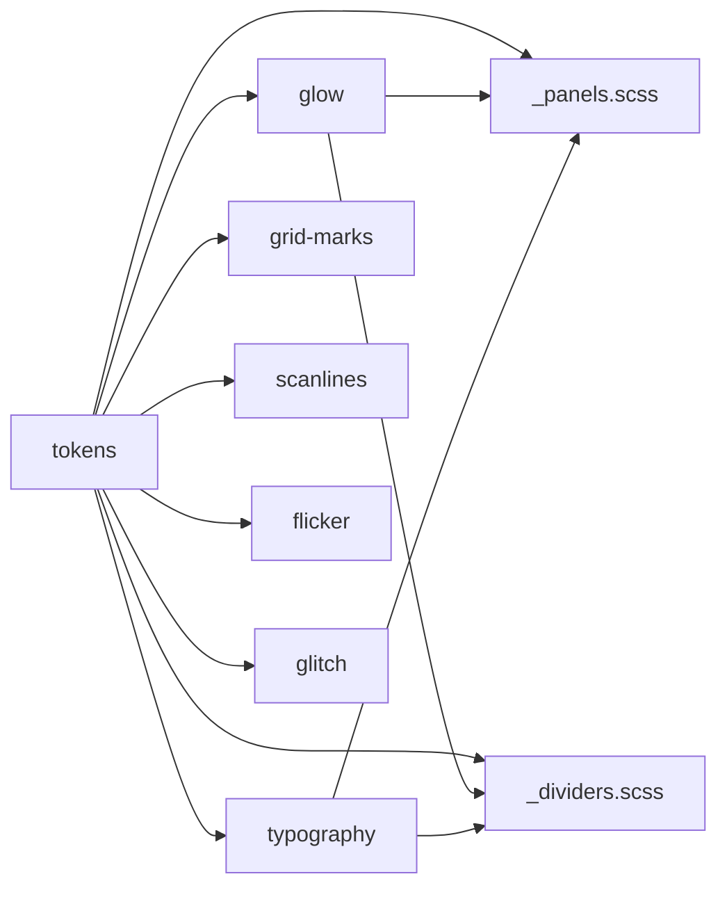

# Task: nerv-phase3-structural

* Task ID: nerv-phase3-structural
* Complexity: Level 3
* Type: feature

Implement Phase 3 (Structural Layer) of the NERV design system: panel containers, divider rules, and registration-mark crosshair grid. These are the spatial composition primitives that give the interface its partitioned instrument-panel structure. Verified by `ref/ref-panels.html`.

## Pinned Info

### Module Dependency Graph

Forward order in `nerv.scss` follows the dependency graph. Phase 3 modules sit between Effects and (future) Components:

## Component Analysis

### Affected Components
- `src/_panels.scss` (NEW): Four panel container variants — basic, titled, double-border, inset. Uses `@mixin nerv-panel-base` for shared properties, each variant extends it. Exposes `--nerv-panel-color` / `--nerv-panel-color-rgb` custom properties (default: amber) for per-panel color overrides.
- `src/_dividers.scss` (NEW): Horizontal/vertical zone-separator rules in cyan (default) and amber. Glow via box-shadow.
- `src/_grid-marks.scss` (NEW): Registration mark crosshair grid as SVG data URI tiled background. Grid density via `background-size`, position via `background-position`. Internal `@mixin nerv-grid-marks-bg($rgb)` for generating data URIs in any color; default class uses cyan.
- `src/nerv.scss` (MODIFIED): Add `@forward 'panels'`, `@forward 'dividers'`, `@forward 'grid-marks'` after effects layer.
- `ref/ref-panels.html` (NEW): Reference page 3 — 2×2 panel grid with dividers, grid marks, axis labels, scanline overlay.
- `test/panels.test.mjs` (NEW): Automated checks against compiled CSS for all Phase 3 selectors and properties.
- `package.json` (MODIFIED): Add `test/panels.test.mjs` to the `test` script.

### Cross-Module Dependencies
- `_panels.scss` → `_tokens.scss`: consumes `--nerv-amber`, `--nerv-amber-rgb`, `--nerv-border-width`, `--nerv-bg` via CSS custom properties
- `_panels.scss` → `_glow.scss`: uses `nerv-glow` mixin for border glow (via `@use 'glow'`)
- `_dividers.scss` → `_tokens.scss`: consumes `--nerv-cyan`, `--nerv-cyan-rgb`, `--nerv-amber`, `--nerv-amber-rgb`
- `_dividers.scss` → `_glow.scss`: uses `nerv-glow` mixin for divider glow (via `@use 'glow'`)
- `_grid-marks.scss` → `_tokens.scss`: consumes color values for SVG data URI (via `@use 'tokens'` and SCSS interpolation)
- `ref/ref-panels.html` → all Phase 1 + 2 + 3 modules (cumulative regression)

### Boundary Changes
- None — all changes are additive new classes. No modifications to existing selector APIs, token contracts, or mixin signatures.

## Open Questions

None — implementation approach is clear. The SVG data URI approach for grid-marks is recommended by PHASE3.md with solid reasoning (vector crispness, `background-size` control, single shape tiling). The gradient fallback option exists if needed during build but is unlikely.

## Test Plan (TDD)

### Behaviors to Verify

**Build integration:**
- Build succeeds: `npm run build` compiles with 3 new @forward partials → `dist/nerv.css` exists and is non-empty

**Panels:**
- `.nerv-panel` class exists in compiled CSS with `border` property
- `.nerv-panel` uses `position: relative`
- `.nerv-panel-titled` class exists with `::before` pseudo-element
- `.nerv-panel-double` class exists with `outline` property (double-border technique)
- `.nerv-panel-inset` class exists with `box-shadow` containing `inset`

**Dividers:**
- `.nerv-divider` class exists in compiled CSS
- `.nerv-divider-vertical` class exists
- `.nerv-divider-amber` class exists
- Dividers have `box-shadow` for glow effect

**Grid marks:**
- `.nerv-grid-marks` class exists with `background-image`
- Grid marks background uses SVG data URI (`data:image/svg+xml`)

**Accessibility:**
- `prefers-contrast: more` media query increases border width for panels (via `--nerv-border-width` token — already handled by `_tokens.scss`, but panels must consume it)

**Regression:**
- All Phase 1 (foundation) tests pass
- All Phase 2 (effects) tests pass

### Test Infrastructure

- Framework: Node.js built-in test runner (`node --test`)
- Test location: `test/`
- Conventions: `*.test.mjs`, ES module imports, `describe`/`it`/`before` pattern, regex matching against compiled CSS string
- New test files: `test/panels.test.mjs`

### Integration Tests

- Full build integration: `npm run build` succeeds with all 9 @forward partials
- Regression: existing foundation and effects tests still pass

## Implementation Plan

1. **Stub test file** `test/panels.test.mjs`
    - Files: `test/panels.test.mjs`
    - Changes: Create file with empty `describe`/`it` blocks for all behaviors listed above

2. **Stub SCSS modules** with signatures and doc comments
    - Files: `src/_panels.scss`, `src/_dividers.scss`, `src/_grid-marks.scss`
    - Changes: Create files with `///` doc comments, `@use` imports, empty class selectors (no implementations yet)

3. **Update entry point** `src/nerv.scss`
    - Files: `src/nerv.scss`
    - Changes: Add `@forward 'panels'`, `@forward 'dividers'`, `@forward 'grid-marks'` after the glitch forward

4. **Update test script** in `package.json`
    - Files: `package.json`
    - Changes: Add `test/panels.test.mjs` to the `test` script command

5. **Implement tests** — fill out all `it` blocks
    - Files: `test/panels.test.mjs`
    - Changes: Implement regex-based assertions against compiled CSS

6. **Run tests** — all new tests should fail (TDD red phase)
    - Verify: `npm run test` shows new tests failing, existing tests passing

7. **Implement `_panels.scss`** — panel base mixin + 4 variants
    - Files: `src/_panels.scss`
    - Changes: Define `--nerv-panel-color` / `--nerv-panel-color-rgb` custom properties (default amber). `@mixin nerv-panel-base` with position/border/padding/glow using panel color vars; `.nerv-panel`, `.nerv-panel-titled` (::before title bar), `.nerv-panel-double` (outline technique), `.nerv-panel-inset` (manually composed box-shadow with both inset + glow layers)

8. **Implement `_dividers.scss`** — horizontal/vertical dividers with glow
    - Files: `src/_dividers.scss`
    - Changes: `.nerv-divider` (horizontal, cyan), `.nerv-divider-vertical`, `.nerv-divider-amber`, box-shadow glow on all

9. **Implement `_grid-marks.scss`** — SVG data URI crosshair grid
    - Files: `src/_grid-marks.scss`
    - Changes: Internal `@mixin nerv-grid-marks-bg($rgb)` generates SVG data URI with `rgb()` color (avoids URL encoding). `.nerv-grid-marks` uses the mixin with cyan RGB, `background-repeat: repeat`, `background-size` for grid density, `pointer-events: none`

10. **Run tests** — all tests should pass (TDD green phase)
    - Verify: `npm run test` all pass, `npm run build` succeeds, `npm run lint` passes

11. **Create `ref/ref-panels.html`** — reference page
    - Files: `ref/ref-panels.html`
    - Changes: 2×2 CSS Grid layout, four panel variants, dividers, grid-marks background, axis labels as static HTML, scanline overlay

12. **Final verification** — build, lint, full test suite
    - Verify: `npm run build && npm run lint && npm run test`

## Technology Validation

No new technology — validation not required. SVG data URIs in CSS `background-image` are a well-established technique already sanctioned by the project's design constraints.

## Challenges & Mitigations

- **SVG data URI color injection**: SCSS string interpolation into the SVG data URI must produce valid URL-encoded SVG. Mitigation: use `rgb()` color notation with the existing RGB string from `$nerv-colors` — avoids `#`/`%23` encoding entirely.
- **Box-shadow composition in `.nerv-panel-inset`**: The `nerv-glow` mixin sets `box-shadow`, and the inset variant also needs `box-shadow: inset ...`. Both shadows must be combined in a single declaration. Mitigation: manually compose the combined box-shadow for the inset variant instead of using the mixin.
- **Grid-marks z-ordering**: The crosshair grid must appear behind panels but above the body background. Mitigation: apply `.nerv-grid-marks` to a wrapper element or use `z-index` layering, with `pointer-events: none` so it doesn't block interaction.
- **Double-border technique**: `outline` + negative `outline-offset` may not receive glow via `box-shadow` (box-shadow follows the border, not the outline). Mitigation: use `::after` pseudo-element for the second border if outline doesn't produce the desired visual.
- **Stylelint `selector-class-pattern`**: All new selectors must match `^nerv-`. Already planned — all classes use `.nerv-` prefix.

## Status

- [x] Component analysis complete
- [x] Open questions resolved
- [x] Test planning complete (TDD)
- [x] Implementation plan complete
- [x] Technology validation complete
- [x] Preflight
- [x] Build
- [ ] QA
