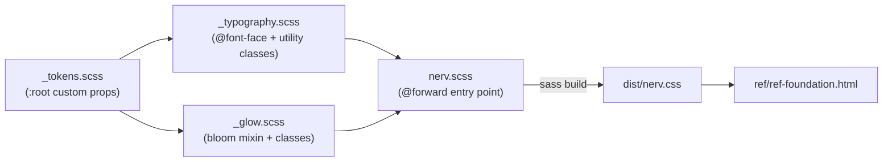

# Task: NERV Design System — Phase 1: Foundation Layer

* Task ID: nerv-phase1-foundation
* Complexity: Level 3
* Type: feature

Implement the foundational layer of the NERV Design System: project scaffolding with Dart Sass, design tokens as CSS custom properties, typography system with CDN-loaded fonts and utility classes, and phosphor bloom glow effects. Verified by `ref/ref-foundation.html`.

## Pinned Info

### Module Dependency Flow

The @forward order in `nerv.scss` and the test execution order both follow this graph.

### Token Architecture (from systemPatterns.md)

Ambiance tokens (`--nerv-primary`, `--nerv-bg`) are overridden by alert states in Phase 6. Data tokens (`--nerv-green`, `--nerv-red`, etc.) are stable and never overridden. This distinction must be preserved from the start.

## Component Analysis

### Affected Components

All components are new (greenfield). The project currently has only `LICENSE`, `planning/`, `memory-bank/`, and `.cursor/`.

- **`package.json`**: New. Project metadata, `sass` dev dependency, `build`/`build:min`/`watch`/`test` npm scripts.
- **`.gitignore`**: New. Ignores `node_modules/`, `dist/`.
- **`src/nerv.scss`**: New. Main SCSS entry point — `@forward`s `_tokens`, `_typography`, `_glow` in dependency order.
- **`src/_tokens.scss`**: New. All design tokens as CSS custom properties on `:root`. 10 named colors + RGB companions + 2 meta-tokens + 5 utility tokens. `prefers-contrast` override for `--nerv-border-width`.
- **`src/_typography.scss`**: New. `@font-face` declarations for 4 font families (Google Fonts CDN + jsDelivr). 5 utility classes (`.nerv-type-display`, `.nerv-type-hud`, `.nerv-type-data`, `.nerv-type-segment`, `.nerv-type-mixed`).
- **`src/_glow.scss`**: New. `@mixin nerv-glow($color-var, $color-rgb-var)` generates box-shadow and text-shadow stacks. Classes: `.nerv-glow`, `.nerv-glow-red`, `.nerv-glow-green`, `.nerv-glow-cyan`, `.nerv-glow-text`, plus color variants of `.nerv-glow-text`. `filter: drop-shadow()` utility for non-rectangular elements.
- **`ref/ref-foundation.html`**: New. Visual test fixture — black void background, all typography classes, all color tokens as glowing labels, ghost-segment seven-segment display.
- **`test/foundation.test.mjs`**: New. Automated validation of compiled CSS using Node.js built-in test runner.

### Cross-Module Dependencies

- `_typography.scss` → `_tokens.scss`: May reference color tokens for default text colors
- `_glow.scss` → `_tokens.scss`: References `-rgb` companion tokens for `rgba()` in box-shadow stacks, `--nerv-glow-spread` for blur radius
- `nerv.scss` → all partials: `@forward` chain in strict dependency order (tokens → typography → glow)
- `ref-foundation.html` → `dist/nerv.css`: links compiled output
- `test/foundation.test.mjs` → `dist/nerv.css`: reads compiled output for assertions

### Boundary Changes

None — all new code, no existing interfaces to change.

## Open Questions

None — implementation approach is clear. All design decisions were resolved during L4 planning (SCSS tooling, font stack, font loading strategy, directory structure, token values).

## Preflight Innovation: SCSS Color Map

**Applied during preflight.** Introduce a SCSS `$nerv-colors` map in `_tokens.scss` as the single source of truth for the color system. Each map entry defines the color name, hex value, and whether it gets a glow variant. An `@each` loop generates `:root` custom properties and `-rgb` companions automatically. `_glow.scss` imports this map via `@use 'tokens'` and uses it with the glow mixin in another `@each` loop to auto-generate `.nerv-glow-*` and `.nerv-glow-text-*` classes. This eliminates manual duplication between tokens and glow, and makes adding new colors trivial (add to map → get token + RGB companion + glow class automatically).

## Test Plan (TDD)

### Behaviors to Verify

**Build:**
- Build succeeds: `npm run build` exits 0 and produces `dist/nerv.css`
- Minified build succeeds: `npm run build:min` exits 0 and produces `dist/nerv.min.css`

**Tokens (_tokens.scss):**
- All 10 named color tokens present on `:root` with correct values (`--nerv-void`, `--nerv-amber`, `--nerv-amber-dark`, `--nerv-orange`, `--nerv-red`, `--nerv-red-deep`, `--nerv-green`, `--nerv-cyan`, `--nerv-blue`, `--nerv-steel`)
- RGB companion token present for each color (`--nerv-amber-rgb`, etc.)
- Meta-tokens present with correct defaults: `--nerv-primary: var(--nerv-amber)`, `--nerv-bg: var(--nerv-void)`
- Utility tokens present: `--nerv-glow-spread`, `--nerv-scanline-opacity`, `--nerv-flicker-duration`, `--nerv-animation-speed`, `--nerv-border-width`
- `prefers-contrast` media query overrides `--nerv-border-width`

**Typography (_typography.scss):**
- `@font-face` declaration for Shippori Mincho B1
- `@font-face` declaration for Barlow Condensed
- `@font-face` declaration for IBM Plex Mono
- `@font-face` declaration for DSEG7 Classic
- `.nerv-type-display` class exists with `font-family` including 'Shippori Mincho B1'
- `.nerv-type-hud` class exists with `font-family` including 'Barlow Condensed', `text-transform: uppercase`, `letter-spacing`
- `.nerv-type-data` class exists with `font-family` including 'IBM Plex Mono', `font-variant-numeric: tabular-nums`
- `.nerv-type-segment` class exists with `font-family` including 'DSEG7 Classic'
- `.nerv-type-mixed` class exists with appropriate font-family stack

**Glow (_glow.scss):**
- `.nerv-glow` class has `box-shadow` with multiple layers
- `.nerv-glow-red`, `.nerv-glow-green`, `.nerv-glow-cyan` variants present
- `.nerv-glow-text` class has `text-shadow` with multiple layers
- Color variants of `.nerv-glow-text` present
- `.nerv-glow-drop` class has `filter` with `drop-shadow()`
- `prefers-contrast` media query reduces or removes glow effects

**Selector discipline:**
- No bare element selectors in compiled output (all selectors are `.nerv-*`, `:root`, or `@font-face`/`@media`)

### Test Infrastructure

- Framework: Node.js built-in test runner (`node --test`, available since Node 18; project uses Node 22)
- Test location: `test/foundation.test.mjs`
- Conventions: ESM modules, `describe`/`it` from `node:test`, `assert` from `node:assert`
- New test files: `test/foundation.test.mjs`
- npm script: `"test": "node --test test/"` in package.json
- Test approach: Run SCSS build, read compiled `dist/nerv.css`, assert expected content via string/regex matching

### Integration Tests

- Full build pipeline: `npm run build` → read `dist/nerv.css` → validate tokens + typography + glow all present in correct order
- Reference page loadability: verify `ref/ref-foundation.html` exists and contains `<link>` to `../dist/nerv.css`

## Implementation Plan

### Step 1: Project Scaffolding

- Files: `package.json`, `.gitignore`
- Changes:
    - `package.json`: name `nervouscsstem`, private, sass as devDependency, scripts for `build`, `build:min`, `watch`, `test`
    - `.gitignore`: `node_modules/`, `dist/`
- Post: `npm install`

### Step 2: Directory Structure & Stubs

- Create: `src/`, `ref/`, `fonts/`, `test/`
- Stub files (empty implementations with doc comments):
    - `src/nerv.scss` — entry point, empty `@forward` list
    - `src/_tokens.scss` — empty, doc comment describing purpose
    - `src/_typography.scss` — empty, doc comment describing purpose
    - `src/_glow.scss` — empty, doc comment describing purpose

### Step 3: Test Infrastructure & Test Cases

- Files: `test/foundation.test.mjs`
- Changes:
    - Import `node:test` and `node:assert`
    - Helper: build SCSS via `child_process.execSync('npm run build')`
    - Helper: read `dist/nerv.css` into string
    - Write ALL test cases (build, tokens, typography, glow, selectors) — all initially failing
- Run: `npm test` → confirm all tests fail (TDD red phase)

### Step 4: Implement _tokens.scss (TDD green)

- Files: `src/_tokens.scss`
- Changes:
    - Define SCSS `$nerv-colors` map: each entry has name, hex value, RGB triplet, and glow-variant flag
    - `:root` block generated via `@each` loop over `$nerv-colors` → `--nerv-{name}` and `--nerv-{name}-rgb` properties
    - Meta-tokens `--nerv-primary` and `--nerv-bg` with defaults (hand-written, not map-driven)
    - Utility tokens (`--nerv-glow-spread`, `--nerv-scanline-opacity`, `--nerv-flicker-duration`, `--nerv-animation-speed`, `--nerv-border-width`)
    - `@media (prefers-contrast: more)` override for `--nerv-border-width`
- Update: `src/nerv.scss` → `@forward 'tokens'`
- Run: `npm test` → token tests pass

### Step 5: Implement _typography.scss (TDD green)

- Files: `src/_typography.scss`
- Changes:
    - `@font-face` for Shippori Mincho B1 (Google Fonts CDN, woff2)
    - `@font-face` for Barlow Condensed (Google Fonts CDN, woff2)
    - `@font-face` for IBM Plex Mono (Google Fonts CDN, woff2)
    - `@font-face` for DSEG7 Classic (jsDelivr CDN, woff2 + woff fallback)
    - `.nerv-type-display`: Shippori Mincho B1 font stack
    - `.nerv-type-hud`: Barlow Condensed, uppercase, letter-spacing
    - `.nerv-type-data`: IBM Plex Mono, tabular-nums
    - `.nerv-type-segment`: DSEG7 Classic font stack
    - `.nerv-type-mixed`: Composite font stack using unicode-range to pair Shippori Mincho B1 for CJK with Barlow Condensed for Latin
- Update: `src/nerv.scss` → add `@forward 'typography'`
- Run: `npm test` → typography tests pass

### Step 6: Implement _glow.scss (TDD green)

- Files: `src/_glow.scss`
- Changes:
    - `@use 'tokens'` to access `$nerv-colors` map
    - `@mixin nerv-glow($color-var, $color-rgb-var)`: generates multi-layer `box-shadow` at increasing blur radii with decreasing opacity
    - `@mixin nerv-glow-text($color-var, $color-rgb-var)`: generates text-shadow version (directional 1px offsets + blurred layer)
    - `@each` loop over `tokens.$nerv-colors` (filtered by glow-variant flag): auto-generates `.nerv-glow-{name}` and `.nerv-glow-text-{name}` classes
    - `.nerv-glow` as alias for `.nerv-glow-amber` (default)
    - `.nerv-glow-text` as alias for `.nerv-glow-text-amber` (default)
    - `.nerv-glow-drop`: `filter: drop-shadow()` utility for non-rectangular elements
    - `@media (prefers-contrast: more)`: reduce or suppress glow shadows for element clarity
- Update: `src/nerv.scss` → add `@forward 'glow'`
- Run: `npm test` → glow tests pass

### Step 7: Reference Page

- Files: `ref/ref-foundation.html`
- Changes:
    - HTML5 document linking `../dist/nerv.css`
    - Black void background (`--nerv-void`)
    - One instance of each `.nerv-type-*` class with sample text
    - Mixed JP/EN: `活動限界 ACTIVE TIME REMAINING`
    - Each color as glowing text label
    - One `.nerv-glow-text` per color
    - Ghost-segment seven-segment display (`00:03:25:08` with dimmed `88:88:88:88`)
    - No layout, no borders, no structure — floating text on void

### Step 8: Final Verification

- Run: `npm run build` (expanded) and `npm run build:min` (compressed)
- Run: `npm test` — full test suite
- Visual inspection of `ref/ref-foundation.html` in browser

## Technology Validation

- **Dart Sass**: New dev dependency. Verify: `npm install` succeeds, `npx sass --version` returns version string, `npm run build` compiles SCSS to CSS.
- **Node.js built-in test runner**: Available in Node 22 (confirmed). No additional dependency needed. Verify: `node --test test/` runs without errors.
- **DSEG7 Classic font**: CDN URL verified at `https://cdn.jsdelivr.net/npm/@fontsource/dseg7-classic@5.2.5/files/dseg7-classic-latin-400-normal.woff2` (5.07 KB, woff2 format).
- **Google Fonts**: Shippori Mincho B1, Barlow Condensed, IBM Plex Mono available via `fonts.googleapis.com/css2` API. Direct woff2 URLs from fonts.gstatic.com will be extracted and baked into `_typography.scss`.

## Challenges & Mitigations

- **Google Fonts direct URLs**: fonts.gstatic.com URLs can change without notice. **Mitigation**: Document exact URLs used; consider migration to Fontsource (jsDelivr) for all 4 fonts in future if stability becomes an issue. URLs are concentrated in `_typography.scss` for easy replacement.
- **Mixed JP/EN text** (`.nerv-type-mixed`): Requires `unicode-range` in `@font-face` to separate CJK and Latin rendering. **Mitigation**: This is an established CSS technique. Will define a composite font family with separate `@font-face` rules for CJK vs Latin unicode ranges.
- **No prior test infrastructure**: Greenfield project has no tests. **Mitigation**: Node.js built-in test runner (zero dependencies) + CSS string matching provides lightweight automated validation alongside visual reference pages.
- **SCSS @forward module resolution**: Dart Sass `@forward` requires specific syntax and load paths. **Mitigation**: Keep all partials in flat `src/` directory; use bare names (e.g., `@forward 'tokens'` resolves to `_tokens.scss`).
- **High-contrast glow reduction**: `systemPatterns.md` specifies "reduce reliance on glow/shadow" under `prefers-contrast`. **Mitigation**: Add `prefers-contrast` media query in `_glow.scss` that reduces glow spread/opacity, in addition to the `--nerv-border-width` increase in `_tokens.scss`.

## Status

- [x] Component analysis complete
- [x] Open questions resolved (none identified)
- [x] Test planning complete (TDD)
- [x] Implementation plan complete
- [x] Technology validation complete
- [ ] Preflight
- [ ] Build
- [ ] QA
