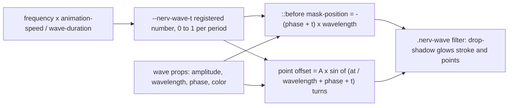

# Task: Sine wave sync graph with plotted points

* Task ID: sine-wave-graph
* Complexity: Level 3
* Type: feature (new CSS component)

A CSS-only `.nerv-wave-graph` heavy: a box of independently configured scrolling sine traces (`.nerv-wave`) with dots (`.nerv-wave-point`) that ride their trace. One registered `--nerv-wave-t` clock per wave drives both the SVG-mask stroke and the `sin()` point offset. Vertical variant, direction modifier, per-color data modifiers, alert-cascade speed, reduced-motion freeze, high-contrast stroke. Catalog page under `docs/components/css/heavies/`, a fixture section in `ref/ref-patterns.html`, tests in a new `test/wave-graph.test.mjs`.

## Pinned Info

### One clock per wave

Everything a consumer sets flows through one animated number. Pinned because every implementation step (stroke, point, vertical, reduced motion, cascade speed) is a consumer of this graph; if a step bypasses `--nerv-wave-t`, stroke and points can drift apart.

## Component Analysis

### Affected Components

- `src/_tokens.scss` — `:root` tokens → add `--nerv-wave-duration: 1s`.
- `src/_wave-graph.scss` (new) — the component: `@property`, keyframes, graph box, wave, `::before` stroke, point, vertical, reverse, color modifiers, reduced-motion and contrast blocks. Uses `tokens.$nerv-colors` and `glow.nerv-glow-drop`.
- `src/nerv.scss` — `@forward` order → add `wave-graph` after `radar` (same layer: heavy instrument); update the header comment.
- `test/wave-graph.test.mjs` (new) + `package.json` `test` script → register the file.
- `docs/components/css/heavies/wave-graph.md` (new) — catalog page, today's island + verbatim fence convention. No JS page (no hook).
- `docs/components/css/index.md` — Heavies blurb names radar; mention the wave graph.
- `docs/img/wave-graph.png` (new, LFS via `docs/img/**`) — copy of library still `3RBI9q8.png` (the issue's reference), shown atop the page like radar/reticles.
- `ref/ref-patterns.html` — add a wave-graph fixture section next to radar.
- `memory-bank/systemPatterns.md` — at reflect: registered-clock pattern + filter-before-mask gotcha.

### Cross-Module Dependencies

- `_wave-graph.scss` → `_tokens.scss`: `$nerv-colors` map (modifier generation), `--nerv-primary`, `--nerv-animation-speed`, `--nerv-wave-duration`, `--nerv-glow-*`, `--nerv-bg`.
- `_wave-graph.scss` → `_glow.scss`: `nerv-glow-drop` mixin for the wave filter.
- `_states.scss` → `.nerv-wave` indirectly: states override `--nerv-animation-speed` and `--nerv-primary`; the wave consumes both. No edits to states.
- Docs page → existing chrome: `.nerv-panel`, `.nerv-grid-marks`, `.nerv-reticle-*`, `.nerv-segment-display`.

### Boundary Changes

- New public CSS surface (classes and custom properties in `creative-wave-api.md`). Additive; no existing class changes. New `:root` token `--nerv-wave-duration`. New registered property `--nerv-wave-t` (global `@property` name, `.nerv-` prefixed).

### Invariants & Constraints

- Stroke and points must read the same `--nerv-wave-t`; no second animation on either.
- `.nerv-wave-graph` must not set `background`, `border`, or use its pseudo-elements, so grid marks and reticles compose onto it.
- Glow filter must sit on `.nerv-wave`, never on the masked `::before`.
- All selectors `.nerv-` prefixed; stylelint clean.
- Period follows the token convention: `calc(var(--nerv-wave-duration) / (var(--nerv-wave-frequency) * var(--nerv-animation-speed)))`.
- Reduced motion: no motion; points on the line at phase. High contrast: heavier stroke, reduced glow, visible points.
- No JS, no canvas, no image files in the product (the docs reference still is documentation, LFS, repo-only).
- Docs never call `NERV.init()`; fence = island inner HTML verbatim.

## Open Questions

- [x] Rendering and point-tracking technique → Resolved: one registered `--nerv-wave-t` clock; SVG sine mask stroke; `sin()` points. Proven ≤1px in Chromium and Firefox (see `memory-bank/active/creative/creative-wave-rendering.md`).
- [x] Consumer API shape → Resolved: unitless fractions of the box (amplitude, wavelength, point position), phase in turns, ambiance default color with data-color modifiers, `-vertical` on the graph, `-reverse` on the wave (see `memory-bank/active/creative/creative-wave-api.md`).
- [x] Ref fixture warranted? → Resolved: yes, one section in `ref/ref-patterns.html` beside radar (same layer: animated heavy instrument). The docs page is the teaching surface, but a standalone fixture loads `dist/` directly with no Material chrome, which is where reduced-motion, contrast emulation, and alert-state speed are easiest to QA by hand. Not a new page: ref pages are per layer.

## Test Plan (TDD)

### Behaviors to Verify

Stroke geometry (real behavior, computed from the shipped data URIs):
- B1: horizontal stroke path, evaluated as cubic Béziers over one tile, traces `-sin(2π·u/4)` (SVG y-down) within 0.2% of amplitude.
- B2: vertical stroke path traces the transposed sine within the same tolerance.
- B3: both paths extend past both tile edges (seamless tiling) and the viewBox leaves ≥1 amplitude of headroom (unclipped peaks).
- B4: stroke SVG uses `preserveAspectRatio='none'` and `vector-effect='non-scaling-stroke'` (uniform thickness under stretch).
- B5: high-contrast stroke URIs are heavier than the default ones (stroke-width strictly greater), both orientations.

Motion contract:
- B6: `@property --nerv-wave-t` registered as `<number>`, `inherits: true`, initial 0 (unregistered custom properties do not interpolate).
- B7: keyframes animate `--nerv-wave-t` from 0 to 1, linear, infinite.
- B8: wave period uses `--nerv-wave-duration`, `--nerv-wave-frequency`, and `--nerv-animation-speed` (speed rises through the cascade).
- B9: `--nerv-wave-duration` is a `:root` token.
- B10: stroke `mask-position` and point offset both reference `--nerv-wave-t`, `--nerv-wave-phase`, `--nerv-wave-wavelength` (one clock); point uses `sin(` with `--nerv-wave-point-at` and `--nerv-wave-amplitude`.
- B11: `.nerv-wave-reverse` reverses the clock (`animation-direction: reverse`).

API surface:
- B12: `.nerv-wave` declares defaults for amplitude, wavelength, frequency, phase; `--nerv-wave-color` defaults to `var(--nerv-primary)`.
- B13: `.nerv-wave-{name}` exists for every glow-flagged color in `$nerv-colors` and pins `var(--nerv-{name})`; none for `void`/`white`.
- B14: `.nerv-wave-graph-vertical` swaps axes: vertical stroke uses `repeat-y`; vertical point positions with `left` from `sin(`.
- B15: `.nerv-wave-graph` composes: no `background`/`border` declarations and no `::before`/`::after` rules.
- B16: glow filter is on `.nerv-wave`, not on `.nerv-wave::before`.

Accessibility:
- B17: `prefers-reduced-motion: reduce` sets `animation: none` on `.nerv-wave`.
- B18: `prefers-contrast: more` block targets `.nerv-wave` (heavier stroke) and `.nerv-wave-point` (separation ring).

Edge cases (verified in the browser harness, not unit-testable without a browser):
- Frequency `0` freezes at phase; zero amplitude still draws a flat line; fractional wavelengths stay aligned far from the origin; points on the line at every sampled time; vertical variant accuracy; cascade speed-up.

### Test Infrastructure

- Framework: Node built-in `node:test` + `node:assert/strict`, run via `npm test` (explicit file list in `package.json`).
- Test location: `test/`.
- Conventions: each file builds with `execSync('npm run build')`, reads `dist/nerv.css`, asserts on compiled CSS with regex / block slicing; `describe` per component.
- New test files: `test/wave-graph.test.mjs` (added to the `test` script).

### Integration Tests

- Cascade integration (B8): the period expression consumes `--nerv-animation-speed`, which `_states.scss` already overrides and `states.test.mjs` already covers.
- Browser integration (manual/harness, recorded in progress): Chromium + Firefox measurement of point-vs-stroke error on the built `dist/nerv.css`, horizontal and vertical, plus screenshots for the PR.

## Implementation Plan

### 1. Token — executable ✅

- Files: `src/_tokens.scss`, `test/wave-graph.test.mjs`, `package.json`

1. Stub tests: create `test/wave-graph.test.mjs` with build/read boilerplate and empty `describe`/`it` for B1–B18; add the file to the `package.json` `test` script.
2. Stub interface: none for the token (a declaration).
3. Write tests and run red: implement B9 (and all other tests, see step 2.3); run `node --test test/wave-graph.test.mjs` → all red.
4. Write code and run green: add `--nerv-wave-duration: 1s;` to `:root` → B9 green.

### 2. Wave graph partial — executable ✅

- Files: `src/_wave-graph.scss` (new), `src/nerv.scss`
- Creative ref: `creative-wave-rendering.md`, `creative-wave-api.md`

1. Stub tests: (done in 1.1).
2. Stub interface: create `src/_wave-graph.scss` with the header doc comment (classes, custom properties, tokens consumed, timing why) and empty rule blocks for `.nerv-wave-graph`, `.nerv-wave`, `.nerv-wave::before`, `.nerv-wave-point`; `@forward 'wave-graph'` after `radar` in `nerv.scss` and update its header order comment.
3. Write tests and run red: implement B1–B8, B10–B18 (B1–B3 parse `d` and `viewBox` out of the compiled data URIs and evaluate cubic Béziers numerically); run → red.
4. Write code and run green, in order:
   - Sass helpers: `$_quarter` control points; a function building the horizontal and vertical `d` strings; a mixin emitting `mask-image` for (orientation, stroke-width). Data URI style follows `_grid-marks.scss`.
   - `@property --nerv-wave-t`; `@keyframes nerv-wave-travel` → B6, B7.
   - `.nerv-wave-graph` (position relative, overflow hidden, aspect-ratio, point-size default) → B15.
   - `.nerv-wave` (defaults, absolute inset 0, `container-type: size`, glow filter via `glow.nerv-glow-drop(--nerv-wave-color)`, animation) → B8, B12, B16.
   - `.nerv-wave::before` stroke (mask horizontal) → B1, B3, B4, B10.
   - `.nerv-wave-point` → B10.
   - `.nerv-wave-reverse` → B11. Color modifiers `@each` → B13.
   - `.nerv-wave-graph-vertical` overrides → B2, B14.
   - Reduced motion, contrast blocks → B5, B17, B18.
   - `npm test` (whole suite) and `npm run lint` green.

### 3. Browser verification — executable (harness, not shipped) ✅

- Files: `/tmp/nerv-wave-proto/*` (outside repo)

1. Point the harness at the built `dist/nerv.css` with the real class API (horizontal, vertical, reverse, a `nerv-state-critical` wrapper).
2. Measure point-vs-stroke error in Chromium and Firefox at several paused times; require ≤1.5px.
3. Screenshot reference-look and vertical frames for the PR; record numbers in `progress.md`.

### 4. Catalog page — prose/policy ✅

- Files: `docs/components/css/heavies/wave-graph.md`, `docs/img/wave-graph.jpg`, `docs/components/css/index.md`
- No tests: prose/policy artifact
- Creative ref: `creative-wave-api.md`

1. Copy the library still `docs/img/3RBI9q8.png` (NGE-1 00:19:59, the issue's reference) to `docs/img/wave-graph.png` (LFS-tracked by `docs/img/**`), matching radar/reticles named copies.
2. Write the page: lead (what CSS does; no JS hook), reference still, then examples, each name → `.nerv-docs-island` → `html` fence of the island's inner HTML verbatim, with a **Spec:** paragraph: single wave; sync graph (four phases, composed with panel / grid marks / reticle ticks / segment timer); frequency pair; plotted points; vertical; colors and reverse; alert speed (`nerv-state-critical` on the island wrapper, out of the fence).
3. Mention the wave graph in the Heavies blurb of `docs/components/css/index.md`.
4. `npm run docs:build` (strict) green; view the page in a browser.

### 5. Ref fixture — prose/policy ✅

- Files: `ref/ref-patterns.html`
- No tests: prose/policy artifact (visual fixture)

1. Add a wave-graph section beside radar: the four-phase sync graph with points and a vertical graph, following the page's existing layout classes.
2. View it in a browser.

## Technology Validation

No new dependencies. Browser features (`@property`, `sin()`, unprefixed `mask`, `vector-effect` in SVG images, container query units) were validated in the throwaway harness in Chromium 1243 and Firefox 1543 (see creative-wave-rendering). Playwright lives only in `/tmp/nerv-wave-proto`, not in the repo.

## Challenges & Mitigations

- Data URI escaping in Sass (quotes, `<`, `#`): follow `_grid-marks.scss` (`%3C`, single quotes, `white` color keyword instead of `#fff`).
- Parsing Bézier paths in tests: keep the path grammar simple (absolute `M` + `C` only, comma-separated pairs) so the test parser is a few lines.
- Stylelint on `@property`, `mask-*`, `sin()`, `cqw`: standard config should accept them; if a rule trips, fix the CSS rather than disabling rules unless the rule is wrong for valid modern CSS.
- Main-thread animation cost: documented limit (a handful of waves). No mitigation needed at that scale.
- `container-type: size` on `.nerv-wave` requires the wave box to have definite size; guaranteed by `position: absolute; inset: 0` inside a sized graph. The graph needs a definite height: `aspect-ratio` default covers it; docs say to set height or keep aspect ratio.
- Docs island CSS may constrain width; check the demo at the Material content width.

## Pre-Mortem

- **Tests only lock shapes and miss the real failure (points off the line):** plan already responds: B1–B3 compute geometry from the shipped path, and step 3 re-measures the built CSS in two engines.
- **The look disappoints next to the reference (thin, flat, not NERV):** step 3 screenshots the composed sync-graph demo against the reference before docs are written; tune stroke weight, glow, and default amplitude there, not after QA.
- **Docs build or island CSS breaks the component (e.g. Material styles leak into `span`, or the island has no definite height):** step 4 views the built page in a browser, not just `docs:build`.
- **The sibling #14 worker changes the island convention:** accepted by operator; use today's form, rebase later.
- **Safari untested (WebKit can't run here):** state the support floor from documentation and flag Safari for manual QA in the PR.

## Status

- [x] Component analysis complete
- [x] Open questions resolved
- [x] Test planning complete (TDD)
- [x] Implementation plan complete
- [x] Technology validation complete
- [x] Pre-Mortem complete
- [x] Preflight
- [x] Build
- [ ] QA
