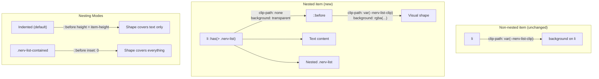

# Task: M5 — List Nesting Overhaul

* Task ID: nerv-phase7-m5
* Complexity: Level 3
* Type: refactor + feature

Overhaul list nesting in `_list.scss` — fix contained sublists and indented non-contained sublists for all shape/rotation combinations including angled variants.

## Pinned Info

### Nesting Architecture

How the `::before` shape-delegation pattern works for nested items. This is the load-bearing design decision for the entire milestone.

### Shape × Nesting Interaction

Each shape has a different visual mechanism. All converge on `::before` for nested items.

| Shape | Non-nested mechanism | Nested `::before` mechanism |
|-------|---------------------|---------------------------|
| Hex (default) | `clip-path: polygon()` on `li` | `clip-path: var(--nerv-list-clip)` on `::before` |
| Rect | `clip-path: none` on `li` | `clip-path: none` on `::before` (just background) |
| Arrow | `clip-path: polygon()` on `li` | `clip-path: var(--nerv-list-clip)` on `::before` |
| Arrow-reverse | `clip-path: polygon()` on `li` | `clip-path: var(--nerv-list-clip)` on `::before` |
| Para | `transform: skewX()` on `::before` | Same `::before`, height adjusted |

## Status

- [x] Component analysis complete
- [x] Open questions resolved (none identified — approach is clear)
- [x] Test planning complete (TDD)
- [x] Implementation plan complete
- [x] Technology validation complete
- [x] Preflight — PASS. Advisory: `--nerv-list-clip` doubles as public API for custom shapes (document in doc comment).
- [x] Build — PASS. All 8 steps complete, 161/161 tests passing.
- [x] QA — PASS. Two DRY fixes applied (merged rotation counter-rotation selectors, removed duplicated contained margins). 161/161 tests still passing.
