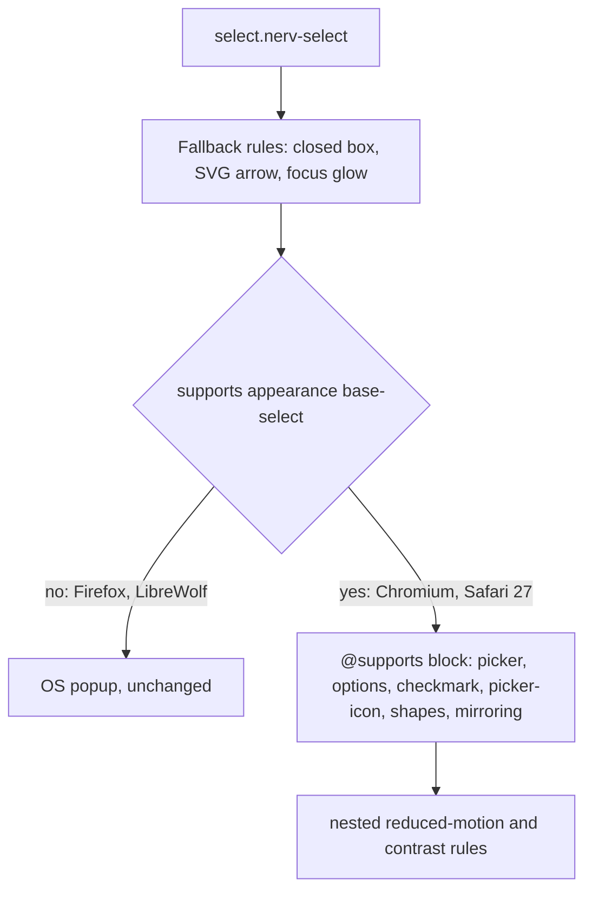

# Task: Customizable `.nerv-select` via `appearance: base-select`

* Task ID: issue-3-custom-select
* Complexity: Level 3
* Type: feature (CSS enhancement)

Extend `.nerv-select` so browsers with customizable select (Chrome/Edge 135+, Safari 27) render a fully NERV-styled open picker. Add per-option data-color boxes with `.nerv-list`-style shapes, and a closed button that mirrors the selected option's color. No JavaScript. Browsers without `base-select` keep today's closed box plus the OS popup.

## Pinned Info

### Rendering paths

Which rules a given browser applies. Pinned because every step must preserve the fallback path.

## Component Analysis

### Affected Components

- `src/_form.scss`: owns `.nerv-select` closed-box styling. Add section 3b, one `@supports (appearance: base-select)` block. Add `.nerv-option-{color}` and the `:has()` mirroring inside the existing color `@each`, or a second `@each` inside the supports block. Update the header doc comment.
- `test/components.test.mjs`: has the form tests (B7/B8/B16). Add a "Customizable select" describe block.
- `ref/ref-forms.html`: visual fixture. Add a "Customizable Select" section: plain, alert-level (rect and hex), solid, selectedcontent button, under `.nerv-state-critical`.
- `docs/components/css/structure/forms.md`: add examples and browser-support prose in the island+fence form.

### Cross-Module Dependencies

- `_form.scss` → `_tokens.scss`: `$nerv-colors` glow-flagged entries generate the option classes.
- Docs and ref load compiled `dist/nerv.css`; no JS.

### Boundary Changes

- New public classes: `.nerv-option-{amber,amber-dark,orange,red,red-deep,green,cyan,blue,steel}`, `.nerv-select-hex`, `.nerv-select-arrow`, `.nerv-select-arrow-reverse`, `.nerv-select-solid`. Additive; `.nerv-select` behavior outside `@supports` is unchanged.

### Invariants & Constraints

- Fallback `.nerv-select` / `.nerv-select:focus` declarations stay identical to main.
- Every rule that mentions `::picker(`, `::picker-icon`, `::checkmark`, `:open`, `selectedcontent` or `base-select` lives inside `@supports (appearance: base-select)`.
- Every selector in the new block contains `.nerv-select` or `.nerv-option-`; there is no bare `select`/`option` rule.
- Option fills use named data tokens; picker chrome uses `--nerv-form-color` (defaults to `--nerv-primary`).
- Compound states (checked+hover, checked+focus) set `background` in one declaration each.
- No JS changes; `nerv.js` untouched.

## Open Questions

- [x] Per-option color/shape class API → Resolved: `.nerv-option-{color}` plus select-level `.nerv-select-{hex,arrow,arrow-reverse,solid}`, rect default, no level aliases (see `memory-bank/active/creative/creative-select-option-api.md`)
- [x] Closed-button color mirroring → Resolved: generated `.nerv-select:has(option.nerv-option-{c}:checked)` rules; `<selectedcontent>` is only for showing rich content (same creative doc)

## Test Plan (TDD)

### Behaviors to Verify

- B1 Build output → contains an `@supports (appearance: base-select)` block.
- B2 That block → sets `appearance: base-select` on `.nerv-select` and `.nerv-select::picker(select)`.
- B3 Containment → every occurrence of `::picker(`, `::picker-icon`, `::checkmark`, `:open`, `selectedcontent`, `base-select` in the CSS is inside a base-select `@supports` block.
- B4 Fallback unchanged → the top-level `.nerv-select {…}` and `.nerv-select:focus {…}` blocks equal the main-branch declarations (appearance none, SVG arrow, padding-right 2.2em, focus shadow).
- B5 Scoping → every selector in the supports block contains `.nerv-select` or `.nerv-option-`.
- B6 Option colors → `.nerv-option-red` (and each glow-flagged color) sets `--nerv-option-color` / `--nerv-option-color-rgb` to that data token.
- B7 Mirroring → `.nerv-select:has(option.nerv-option-red:checked)` sets `--nerv-form-color: var(--nerv-red)`.
- B8 Shapes → `.nerv-select-hex option` sets `clip-path` polygon; `-arrow` / `-arrow-reverse` likewise; `.nerv-select-solid` sets opaque option background.
- B9 Reduced motion → inside the supports block, a `prefers-reduced-motion: reduce` rule sets `transition: none` on the picker and picker icon.
- B10 High contrast → inside the supports block, a `prefers-contrast: more` rule removes picker glow (box-shadow none) and option `clip-path`.
- Edge: plain option (no class) hover/checked works with no custom markup (visual; Playwright proof, not unit test).
- Edge: Firefox renders rich markup (button/selectedcontent) without breaking the closed box (Playwright proof).

### Test Infrastructure

- Framework: Node built-in `node:test` + `node:assert/strict`, compiled CSS string assertions.
- Test location: `test/`
- Conventions: `describe` per feature, behaviors labelled; build once at top via `npm run build`.
- New test files: none (extend `test/components.test.mjs`, already in the `npm test` list).

### Integration Tests

- Browser proof (Playwright, /tmp scratch, not in repo): Chromium opens the picker on `ref/ref-forms.html` and screenshots it; Firefox confirms `appearance` stays `none` with SVG arrow computed.

## Implementation Plan

### 1. Base-select styling in `_form.scss` — executable

- Files: `src/_form.scss`, `test/components.test.mjs`
- Creative ref: `creative-select-option-api.md`

1. Stub tests: add `describe('Customizable select (base-select)')` with empty `it` for B1–B10 plus helper `supportsBlocks(css)` (brace-matching extractor) stub.
2. Stub interface: add the section 3b comment header and empty `@supports (appearance: base-select) {}` in `_form.scss`; document the new classes in the file header.
3. Write tests and run red: implement the helper and assertions B1–B10; `npm test` shows the new cases failing (B4 passes, as a guard).
4. Write code and run green: fill the supports block: appearance, picker panel, picker-icon triangle and `:open` rotation, option base/hover/focus/checked with compound unions, `::checkmark`, `@each` option colors plus mirroring, shapes, solid, button/selectedcontent inheritance, `@starting-style` open transition, nested reduced-motion and contrast rules. Run `npm test` and `npm run lint` (no new errors beyond the 10 pre-existing).

### 2. Ref fixture section — prose/policy

- Files: `ref/ref-forms.html`
- No tests: visual fixture

1. Add a "Customizable Select" row: plain select, alert-level select (rect), alert-level hex, solid, rich button with `<selectedcontent>`, and a `.nerv-state-critical` wrapper copy.
2. Verify in Playwright Chromium (open picker) and Firefox (fallback).

### 3. Docs — prose/policy

- Files: `docs/components/css/structure/forms.md`
- No tests: prose/policy artifact

1. Extend the Select section: support statement (Chrome/Edge 135+, Safari 27 get the picker; Firefox/LibreWolf get the closed box plus OS popup), a plain-select island, an alert-level island plus fence, a class table.
2. `npm run docs:build` strict passes.

### 4. Browser proof and screenshots — prose/policy

- Files: none in repo (scripts under /tmp/pw-issue3)
- No tests: evidence artifacts

1. Screenshot the shot list; record a GIF with ffmpeg (< 3 MB).
2. After the PR opens, push to the `pr-assets` orphan branch under `pr-<N>/` from a /tmp clone.

## Technology Validation

No new dependencies. The platform feature was spiked in Chromium 153 (supported) and Firefox 155 (not supported); results are in `progress.md`. Sass passes `@supports` / `::picker()` through (to be confirmed at step 1.4 build).

## Challenges & Mitigations

- Dart Sass or stylelint may reject `::picker(select)`, `::checkmark` or `@starting-style`: check the build right after stubbing. If stylelint flags unknown pseudo-elements, add a targeted `ignorePseudoElements` config entry, not a disable comment.
- `clip-path` shapes hide focus rings: focus is shown with fill intensity; contrast mode drops clip-path.
- The `:has()` mirroring also recolors the picker chrome: accepted and documented.
- `transition-behavior: allow-discrete` / `@starting-style` may misbehave with the picker's top-layer popover: verify in Chromium. If it misbehaves, drop the animation (it is decoration).

## Pre-Mortem

- The fallback silently regressed because a shared rule (e.g. `.nerv-select` in the contrast/motion lists) was edited: B4 locks the fallback blocks, and step 2.2 checks Firefox.
- The plain `<option>` look is poor because effort went to the showcase: the ref row leads with the plain select, and it is screenshotted first.
- Mirroring via `<selectedcontent>` was promised but does not work: already reframed. The docs state plainly that `:has()` does the mirroring and `<selectedcontent>` only carries content.

## Status

- [x] Component analysis complete
- [x] Open questions resolved
- [x] Test planning complete (TDD)
- [x] Implementation plan complete
- [x] Technology validation complete
- [x] Pre-Mortem complete
- [x] Preflight
- [x] Build
- [x] QA (PASS, advisories: colored :checked fill overridden by option[class*] rule; amber fallback arrow)
