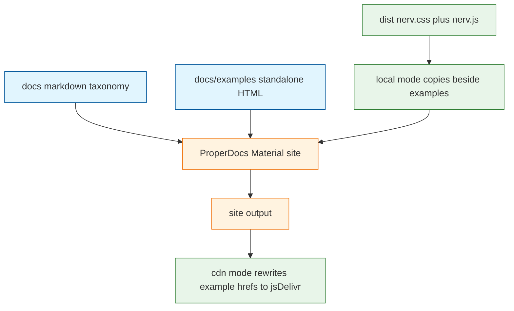

# Task: nerv-v01-m4-properdocs-dual-load-site

* Task ID: nerv-v01-m4-properdocs-dual-load-site
* Complexity: Level 3
* Type: feature

Add a ProperDocs GitHub Pages site from existing `docs/` plus CSS-only and JS example pages that load CDN assets on release and `dist/` locally, erroring if local bundles are missing. Scope is parent-brief requirements 8–12, acceptance criteria 3–5, and use-cases 3–4. Do not add a skill, do not add release-please extra-files, and do not vendor fonts.

## Pinned Info

### Dual-load vs docs chrome

ProperDocs renders the taxonomy markdown. Example pages are standalone HTML. Asset URLs are a Node step around the SSG, not theme `extra_css`.

## Component Analysis

### Affected Components

- **Example pages (`docs/examples/`)**: none today → CSS-only and JS live demos; committed HTML uses relative `nerv.css` / `nerv.js`
- **Dual-load module (`scripts/resolve-docs-assets.mjs`)**: none today → local copy-from-dist-or-throw; CDN rewrite of `site/examples/`
- **ProperDocs site**: none today → `properdocs.yml` with `docs_dir: docs`, Material theme, `--strict`
- **Docs toolchain (`pyproject.toml` / `uv.lock`)**: none today → SLOBAC-shaped `docs` dependency group
- **Existing `docs/` markdown**: authoring SoT → add `index.md`; fix `service-manual.md` link that points outside `docs_dir`
- **GitHub Actions**: only `release-please.yaml` → add Pages deploy on release and a PR docs build
- **`package.json` / README**: publish contract unchanged → add docs scripts and a Pages URL
- **`ref/` and `src/`**: design-system fixtures and source → no edits

### Cross-Module Dependencies

- Dual-load module → `dist/` (local mode only) and `package.json` version (CDN URLs)
- ProperDocs → `docs/` including generated copies of `nerv.css` / `nerv.js` under `docs/examples/` (gitignored)
- Pages workflow → CDN mode after ProperDocs build; npm publish on the same release so jsDelivr has the version
- PR docs build → `npm run build` then local mode so missing-dist is a real CI failure

### Boundary Changes

- New public site: `https://texarkanine.github.io/nervouscsstem/`
- Example pages are part of that site, not the npm tarball (`package.json` `files` stays `dist/nerv.css` and `dist/nerv.js`)
- No change to the published package API

## Open Questions

- [x] How do the two live example pages load `nerv.css` / `nerv.js` (CDN on the released site, on-disk `dist/` locally with a hard error if those files are missing) while existing `docs/` stay a Material ProperDocs site? → Resolved: Node dual-load module + standalone HTML; local copies `dist/` beside examples; CDN rewrites `site/examples/` to jsDelivr. Site-wide `extra_css` and runtime JS loaders are rejected (AC4 / overlay). (see `memory-bank/active/creative/creative-dual-load-example-hosting.md`)

## Test Plan (TDD)

### Behaviors to Verify

- Local mode, `dist/nerv.css` or `dist/nerv.js` missing → resolver throws and copies nothing
- Local mode, both dist files present → copies them to `docs/examples/nerv.css` and `docs/examples/nerv.js`; example HTML still uses relative `nerv.css` / `nerv.js` (not jsDelivr)
- CDN mode, given a `site/examples/` tree with those relative URLs → rewrites to `https://cdn.jsdelivr.net/npm/nervouscsstem@<package.json version>/dist/nerv.css` and `.../nerv.js`
- CDN mode does not require `dist/` to exist
- CDN mode with missing `site/examples/` → throws
- Shipped CSS-only page: has a stylesheet to `nerv.css` and no `nerv.js` script, before and after CDN rewrite
- Shipped JS page: has both the stylesheet and a `nerv.js` script, and calls `NERV.init()`
- Resolver does not modify `ref/` or `src/`

### Test Infrastructure

- Framework: Node.js built-in test runner (`node:test`), same as `test/publish-contract.test.mjs`
- Test location: `test/`
- Conventions: `test/*.mjs`, explicit paths in `package.json` `"test"` (no glob)
- New test files: `test/docs-assets.test.mjs`

### Integration Tests

- None beyond the resolver tests. Do not spawn ProperDocs from `node:test`. Do not add workflow YAML change-detectors. Local `npm run docs:build` / `docs:serve` are script wiring around the tested module.

## Implementation Plan

### 1. Dual-load asset resolution — executable

- Files: `scripts/resolve-docs-assets.mjs`, `test/docs-assets.test.mjs`, `docs/examples/css-only.html`, `docs/examples/js.html`, `package.json` (add the test file to `"test"`)
- Creative ref: `memory-bank/active/creative/creative-dual-load-example-hosting.md`

1. Stub tests: `test/docs-assets.test.mjs` empty cases for local-missing, local copy, cdn rewrite, css-only has no `nerv.js`, js page has `NERV.init`, no `ref/`/`src/` writes
2. Stub interface: `scripts/resolve-docs-assets.mjs` exports `resolveDocsAssets({ mode, root, siteDir })` and a CLI `--mode local|cdn` (`--site` for cdn)
3. Write tests and run red: temp fixture trees for module I/O; plus assertions on the real `docs/examples/*.html` once those files exist in the green step
4. Write code and run green: implement copy-or-throw (local) and jsDelivr rewrite (cdn); author the two standalone example pages (`.nerv-panel` is enough; CSS-only has no script tags; JS page loads `nerv.js` and calls `NERV.init()`); gitignore `docs/examples/nerv.css` and `docs/examples/nerv.js`

### 2. ProperDocs site — prose/policy

- Files: `properdocs.yml`, `pyproject.toml`, `uv.lock`, `.gitignore`, `docs/index.md`, `docs/service-manual.md`, `package.json` (docs scripts)
- No tests: prose/policy artifact
- Creative ref: `memory-bank/active/creative/creative-dual-load-example-hosting.md`

1. Add `pyproject.toml` with a `docs` dependency group: `properdocs ~= 1.6`, `mkdocs-material ~= 9.5`. No awesome-pages, llms-source, or custom hooks. Commit `uv.lock`.
2. Add `properdocs.yml`: `docs_dir: docs`, `theme.name: material`, `strict: true`, `site_url: https://texarkanine.github.io/nervouscsstem/`, `repo_url` / `edit_uri: edit/main/docs/`, nav for index + existing four markdown files + the two examples, mermaid via `pymdownx.superfences` so `service-manual.md` diagrams render.
3. Gitignore `site/` and `.venv`.
4. Add `docs/index.md` landing that links to the existing docs and both examples. Change `docs/service-manual.md`'s `../.gitattributes` link to the GitHub blob URL so `--strict` passes.
5. `package.json` scripts: `docs:serve` = `npm run build && node scripts/resolve-docs-assets.mjs --mode local && uv run properdocs serve`; `docs:build` = local resolve + `uv run properdocs build --strict`. CDN rewrite is a CI-only step after build, not a local default.

### 3. GitHub Pages and PR docs build — prose/policy

- Files: `.github/workflows/docs.yaml`, `.github/workflows/reusable-docs-build.yml`, optionally a thin PR caller (SLOBAC's `ci.yml` `docs-build` job)
- No tests: prose/policy artifact

1. Copy SLOBAC's Pages shape: deploy on `release` published and `workflow_dispatch`; `actions/upload-pages-artifact` + `actions/deploy-pages`; `environment: github-pages`.
2. Docs build job: checkout with `lfs: true`; `astral-sh/setup-uv`; `uv sync --group docs --frozen`; for PR/local-contract builds, `actions/setup-node` (Node 24, same as release-please) + `npm ci` + `npm run build` + `--mode local`; for the release Pages job, ProperDocs build then `--mode cdn --site site` (do not require dist for the example URLs).
3. Do not add extra-files, skill install, or changes to `release-please.yaml`.

### 4. README pointer — prose/policy

- Files: `README.md`
- No tests: prose/policy artifact

1. Under Documentation, add the GitHub Pages URL. Keep `docs/` as the authoring source of truth. Do not move SumMem's block in `AGENTS.md`.

## Technology Validation

Validated outside the repo at `/tmp/pd-poc` with `uv 0.8.22`, `properdocs==1.6.7`, `mkdocs-material==9.7.0`:

- `theme.name` must be `material`. The implicit `mkdocs` theme aborts (`properdocs-theme-mkdocs` is not installed).
- Extra HTML under `docs/examples/` is copied to `site/` byte-for-byte; `nav` may point at it.
- Pointing `docs_dir` at this repo's `docs/` builds the four markdown files and copies `docs/img` as real PNGs when LFS files are present.
- `--strict` fails on `docs/service-manual.md` → `../.gitattributes`. No other strict warnings on the current tree.
- Without `index.md`, there is no `site/index.html` home page.

No further spike required. Adding `pyproject.toml` / `uv.lock` to this repo is implementation, not a new unknown.

## Challenges & Mitigations

- jsDelivr lag after a brand-new version: deploy Pages on `release` published (after the M2 publish job has run on that release). Accept a short CDN miss; do not invent a second host.
- GitHub Actions without `lfs: true` would publish pointer files for `docs/img/**`: always checkout LFS on docs builds.
- GitHub Pages not enabled on the repo: operator turns on Pages (Actions source) once; the workflow cannot do that.
- `--strict` vs repo-root links: already a work step (blob URL).
- Local mode inferred from "is dist present?" would violate AC5: mode is an explicit flag only.
- Cargo-culting SLOBAC `docs_dir` into a skill: forbidden by invariant 1; this milestone points at `docs/`.
- Copying example `nerv.css` into a path npm pack would include: copies live under `docs/examples/`, which is not in `package.json` `files`.

## Pre-Mortem

- Implementer wraps the CSS-only demo in Material markdown so "JS disabled" still loads theme JS: already covered by Creative / Challenge; work unit 1 authors standalone HTML
- Implementer TDD's Actions YAML because the site is "executable": already covered — units 2–3 are prose/policy; operator rule is test shipped pages via the resolver, not CI config
- Implementer uses `@latest` jsDelivr so Pages drifts from the Git tag: plan requires `package.json` version
- Implementer rewrites committed `docs/examples/*.html` to jsDelivr and commits it: CDN mode writes `site/` only
- Implementer skips `index.md` and Pages `/` 404s: work step 2.4
- Implementer changes `ref/` to share examples: component analysis says no `ref/` / `src/` edits; tests assert that

## Status

- [x] Component analysis complete
- [x] Open questions resolved
- [x] Test planning complete (TDD)
- [x] Implementation plan complete
- [x] Technology validation complete
- [x] Pre-Mortem complete
- [ ] Preflight
- [ ] Build
- [ ] QA
