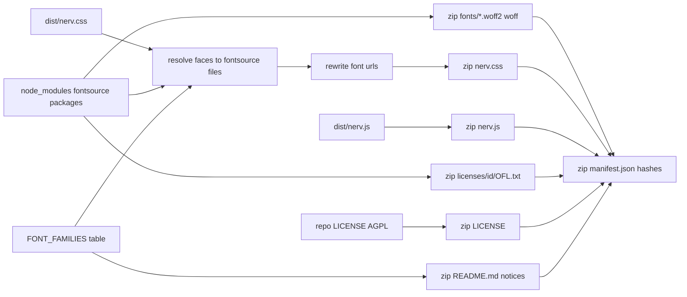

# Task: Offline font-and-JS bundle

* Task ID: offline-bundle
* Complexity: Level 3
* Type: feature

An npm script (`npm run build:offline`) builds `dist/nervouscsstem-offline.zip` from the compiled `dist/nerv.css`, `dist/nerv.js`, the repo `LICENSE`, and font files and OFL licenses from pinned `@fontsource/*` devDependencies. The bundled `nerv.css` differs from `dist/nerv.css` only in its font `url()`s, which point at `fonts/<file>` inside the zip. `release-please.yaml` builds the zip before `npm publish` and attaches it to the GitHub Release next to `nerv.css` / `nerv.js`. The npm tarball and CDN default are unchanged. Implements [issue #7](https://github.com/Texarkanine/nervouscsstem/issues/7).

## Pinned Info

### Bundle data flow

Where every byte in the zip comes from. Pinned because every implementation step and test maps onto one of these edges.



### Zip layout

```
nervouscsstem-offline/
  README.md                 generated: usage, license split, per-family upstream copyright + Reserved Font Names
  LICENSE                   repo AGPL-3.0 text, verbatim
  manifest.json             provenance: package, generator version, every file's sha256, per-family font provenance
  nerv.css                  dist/nerv.css with font url()s rewritten to fonts/<file>
  nerv.js                   dist/nerv.js, verbatim
  fonts/<fontsource file>   the 22 files the CSS loads (21 woff2 + DSEG7 woff fallback)
  licenses/<id>/OFL.txt     fontsource LICENSE, verbatim, one per family
```

## Component Analysis

### Affected Components

- `package.json`: scripts + devDependencies → add `build:offline`; add exact-pinned devDependencies `@fontsource/barlow-condensed@5.3.0`, `@fontsource-variable/antonio@5.3.0`, `@fontsource/ibm-plex-mono@5.3.0`, `@fontsource/dseg7-classic@5.2.5`, `@fontsource/shippori-mincho-b1@5.3.0`, `@fontsource/vt323@5.3.0`, `fflate@0.8.3`; add `test/offline-bundle.test.mjs` to the explicit `npm test` list. `files` unchanged.
- `scripts/build-offline-bundle.mjs` (new): generator. Exports `FONT_FAMILIES`, `ALIAS_FAMILIES`, `resolveFontUrls`, `buildOfflineBundle`; CLI writes `dist/nervouscsstem-offline.zip`.
- `test/offline-bundle.test.mjs` (new): consumer-facing checks on the zip plus generator failure modes.
- `test/publish-contract.test.mjs`: builds the zip too and asserts `npm pack` excludes it.
- `.github/workflows/release-please.yaml`: `publish-npm` builds the zip before `npm publish` and uploads it with the CSS/JS.
- `.github/workflows/reusable-docs-build.yml`: PR build also builds the zip (preflight advisory 3).
- `README.md`: new "Offline bundle" section.
- `docs/service-manual.md`: maintainer note on bumping font pins when `_typography.scss` URLs change.
- `memory-bank/techContext.md`: build/test facts for the bundle.
- `src/_typography.scss`, `src/nerv.js`: unchanged.

### Cross-Module Dependencies

- Generator → `dist/nerv.css`, `dist/nerv.js` (needs `npm run build` first; throws if missing, same as `resolve-docs-assets.mjs` local mode).
- Generator → `node_modules/<fontsource pkg>/{package.json,unicode.json,metadata.json,files/*,LICENSE}`.
- Generator → `fflate` `zipSync`; tests → `fflate` `unzipSync`.
- Release workflow → `npm run build:offline` → uploads `dist/nervouscsstem-offline.zip`.

### Boundary Changes

- New public artifact: GitHub Release asset `nervouscsstem-offline.zip` with the layout above. `manifest.json` shape is new consumer-facing data.
- npm tarball contract unchanged (still exactly `dist/nerv.css`, `dist/nerv.js` + package metadata).

### Invariants & Constraints

- Bundled `nerv.css` must equal `dist/nerv.css` with only font `url()` values changed.
- No remote fetch remains in bundled CSS: every `url()` is `data:` or a relative path to a zip entry; no `@import`.
- Each face's file must be the fontsource subset whose `unicode-range` equals the face's declared range (glyph coverage); alias faces reuse the primary face's file for the identical URL.
- Font bytes come only from the pinned fontsource packages; manifest versions equal installed versions.
- Fonts stay OFL-1.1 with their license text and copyright notice; CSS/JS stay AGPL-3.0-only; font files and Reserved Font Names unmodified.
- `npm pack` never includes the zip.
- `dist/nerv.css` keeps CDN URLs (default unchanged).
- Same inputs → identical zip bytes across machines and timezones.
- No `zip` CLI dependency.

## Open Questions

- [x] Zip writer without a `zip` CLI, reproducibly → Resolved: `fflate` exact-pinned devDependency, fixed local-field `mtime`, sorted entries (see `memory-bank/active/creative/creative-zip-writer.md`)
- [x] Mapping each CSS font URL to a fontsource file → Resolved: derive from the CSS by `unicode-range` equality against fontsource `unicode.json`, variable weight token for Antonio, direct parse for jsDelivr fontsource URLs, aliases by URL reuse (see `memory-bank/active/creative/creative-font-resolution.md`)

Decided inline (no creative needed; recorded for the operator):

- Shippori Mincho B1: pin the same 12 subsets the CSS loads (`[110]`–`[119]`, `latin`, `latin-ext`) from `@fontsource/shippori-mincho-b1@5.3.0`; not the full ~120-slice family. Rationale: the bundle follows the CSS exactly; the full family would add ~1200 files the CSS never references.
- Antonio 400/700 shared URL: follow the CSS. Probe proved it is the variable font, so one file for both weights is correct, not a bug.
- DSEG7 pinned at 5.2.5 to match the version already named in the CSS URL (bytes identical to 5.3.0).
- Plex Reserved Font Name: fontsource's LICENSE omits `Reserved Font Name "Plex"`; ship fontsource LICENSE verbatim and put each family's verbatim upstream OFL copyright line (which states the RFN) in `README.md` and `manifest.json`.
- Zip name is unversioned (`nervouscsstem-offline.zip`, matching the unversioned `nerv.css` / `nerv.js` assets); version lives in `manifest.json`. Single top-level folder `nervouscsstem-offline/`.

## Test Plan (TDD)

### Behaviors to Verify

Bundle contents (built once from the real repo in `before`):

- B1 Layout: build → every zip entry sits under `nervouscsstem-offline/`, and `nerv.css`, `nerv.js`, `LICENSE`, `README.md`, `manifest.json` exist.
- B2 No remote fetch: bundled `nerv.css` → every `url()` is `data:` or relative (no scheme, no `//`), and there is no `@import`.
- B3 URLs resolve: each relative `url()` in bundled `nerv.css` → names an existing zip entry (resolved relative to `nerv.css`).
- B4 CSS otherwise unchanged: blank every `url(...)` value in bundled and `dist/nerv.css` → texts equal.
- B5 No orphan fonts: every entry under `fonts/` → referenced by at least one `url()` in bundled `nerv.css`.
- B6 JS and AGPL verbatim: zip `nerv.js` bytes == `dist/nerv.js`; zip `LICENSE` bytes == repo `LICENSE`.
- B7 Manifest hashes: every zip entry except `manifest.json` → listed in manifest `files` with sha256 of its bytes; every listed path exists.
- B8 Manifest provenance: manifest `fonts` → one record per non-alias `font-family` declared by `@font-face` in `dist/nerv.css` (set equality, no hardcoded count), each with `package`, `version` equal to the installed `node_modules/<package>/package.json` version, `license: "OFL-1.1"`, https `oflUrl`, non-empty `copyright`, `licenseFile` present in zip; each record's font files hash-equal to `node_modules/<package>/files/<name>`. Manifest `generator.version` == `package.json` version.
- B9 License texts: each family's `licenses/<id>/OFL.txt` → contains `SIL OPEN FONT LICENSE Version 1.1` and is byte-equal to the package `LICENSE`.
- B10 Notices: zip `README.md` → contains each family's `copyright` string and each listed Reserved Font Name (`Plex`, `DSEG`).
- B11 Reproducible: build twice to two paths → identical bytes.

Generator failure modes (fixture roots in tmp, `node_modules` symlinked to the repo's):

- E1 Missing `dist/nerv.css` or `dist/nerv.js` → throws naming the missing file and `npm run build`.
- E2 Remote URL in an unknown family → throws naming the URL.
- E3 Known family whose `unicode-range` matches no fontsource subset → throws naming the family.
- E4 Alias face whose URL no primary face resolved → throws naming the URL.
- E5 Remote `url()` / `@import` left outside `@font-face` → throws.
- E6 jsDelivr fontsource URL whose version differs from the installed package → throws naming both versions.

npm tarball:

- P1 After `npm run build:offline`, `npm pack --dry-run` → contains no `.zip` and nothing but the existing contract files.

### Test Infrastructure

- Framework: Node built-in `node:test` + `node:assert/strict`, ESM `.test.mjs`
- Test location: `test/`
- Conventions: `describe`/`it`, `before` for builds, `ROOT = resolve(import.meta.dirname, '..')`, tmp fixture roots via `mkdtempSync` (see `test/docs-assets.test.mjs`); files must be listed explicitly in the `npm test` script.
- New test files: `test/offline-bundle.test.mjs`

### Integration Tests

- B1–B11 run the real generator over real `npm run build` output and real installed fontsource packages (integration across sass build, generator, fontsource, fflate).
- P1 runs real `npm pack --dry-run` after a real offline build.

## Implementation Plan

### 1. Dependencies and script wiring — executable (exercised by steps 2–4)

- Files: `package.json`, `package-lock.json`

1. `npm i -D -E @fontsource/barlow-condensed@5.3.0 @fontsource-variable/antonio@5.3.0 @fontsource/ibm-plex-mono@5.3.0 @fontsource/dseg7-classic@5.2.5 @fontsource/shippori-mincho-b1@5.3.0 @fontsource/vt323@5.3.0 fflate@0.8.3`.
2. Add `"build:offline": "npm run build && node scripts/build-offline-bundle.mjs"`.
3. Append `test/offline-bundle.test.mjs` to the `test` script list.
4. No behavior of its own; covered by B8 (installed versions) and P1.

### 2. Offline bundle generator — executable

- Files: `scripts/build-offline-bundle.mjs`, `test/offline-bundle.test.mjs`
- Creative ref: `creative-font-resolution.md`, `creative-zip-writer.md`

1. Stub tests: create `test/offline-bundle.test.mjs` with `describe('offline bundle contents')` holding empty `it`s B1–B11 and `describe('offline bundle generator failures')` holding empty `it`s E1–E6.
2. Stub interface in `scripts/build-offline-bundle.mjs` with JSDoc:
    - `export const FONT_FAMILIES` — six rows `{ family, package, variable, oflUrl, copyright, reservedFontNames }` (copyright = verbatim first line(s) of upstream OFL.txt).
    - `export const ALIAS_FAMILIES = ['NERV Mixed', 'NERV Cartouche']`.
    - `export const BUNDLE_DIR = 'nervouscsstem-offline'`, `export const DEFAULT_OUT = 'dist/nervouscsstem-offline.zip'`.
    - `export function resolveFontUrls({ css, root })` → `Map<remoteUrl, { family, package, version, file }>`; throws on unmappable URLs.
    - `export function buildOfflineBundle({ root, outFile })` → `{ outFile, manifest }`; writes the zip.
    - CLI `main()` guarded like `resolve-docs-assets.mjs`.
3. Write tests and run red: implement B1–B11 (one shared `before`: `npm run build`, `buildOfflineBundle` into a tmp `outFile`, `unzipSync`), E1–E6 (fixture roots: `package.json`, `LICENSE`, `dist/nerv.css` fixture text, `dist/nerv.js`, `node_modules` symlink to repo `node_modules`). Run `node --test test/offline-bundle.test.mjs`; all fail.
4. Write code and run green:
    - Parse `@font-face { … }` blocks: `font-family`, `font-style`, `font-weight`, optional `unicode-range` (DSEG7 has none), `src` `url()`s.
    - Preflight advisory 1: `url()` extraction must honor quotes — SVG `url("data:…")` values contain `)` and `http://www.w3.org/2000/svg`. Use one quote-aware tokenizer (`url\(\s*(?:"([^"]*)"|'([^']*)'|([^)"'\s]*))\s*\)`) shared by generator and tests; classify by prefix (`data:` / relative / absolute or `//`), never by substring.
    - Pass 1 (primary families): jsDelivr fontsource URL → parse package/version/file, check package matches the family row and version equals installed; otherwise match normalized `unicode-range` (strip whitespace, lowercase) against `unicode.json`, subset key without brackets, weight = `wght` if `variable` else declared weight, style, extension from URL → `<metadata.id>-<subset>-<weight>-<style>.<ext>`; assert file exists.
    - Pass 2 (alias families): URL must already be mapped.
    - Unknown family with a remote URL → throw.
    - Rewrite each mapped URL to `fonts/<file>`; then scan for any remaining non-`data:` absolute `url()` or `@import` → throw.
    - Assemble entries: `nerv.css`, `nerv.js`, `LICENSE`, `fonts/*`, `licenses/<id>/OFL.txt`, `README.md` (generated from `FONT_FAMILIES` + package version), then `manifest.json` (`name`, `version`, `license`, `generator { name, version }`, `fonts[]` per family with `package`, `version`, `license`, `oflUrl`, `copyright`, `reservedFontNames`, `licenseFile`, `files[]` `{ path, source, sha256 }`, `files[]` every entry `{ path, sha256 }`), stable key order.
    - `zipSync` with sorted paths, `level: 9`, `mtime: new Date(1980, 0, 1, 12, 0, 0)`; `mkdirSync` the out dir; write.
    - Run `node --test test/offline-bundle.test.mjs` until green.

### 3. npm tarball exclusion — executable

- Files: `test/publish-contract.test.mjs`

1. Stub tests: add empty `it('does not include the offline bundle zip')`.
2. Stub interface: none (uses `npm run build:offline` from step 1).
3. Write tests and run red: `before` also runs `npm run build:offline`; assert no packed path ends in `.zip` or contains `nervouscsstem-offline`. Red only if the zip leaks; `files` already protects, so confirm the test actually sees the zip on disk (assert `existsSync(dist/nervouscsstem-offline.zip)`) so it cannot pass vacuously.
4. Write code and run green: no production change expected; if it leaks, fix `files`.

### 4. Release workflow — prose/policy

- Files: `.github/workflows/release-please.yaml`
- No tests: prose/policy artifact (CI wiring, verified by review per repo norm)

1. In `publish-npm`, after "Build package", add "Build offline bundle" → `npm run build:offline` (before `npm publish`, so a failing bundle blocks npm publish; release-please has already created the tag and GitHub Release by then, same exposure `npm run build` already has).
2. Extend the upload step: `gh release upload "<tag>" dist/nerv.css dist/nerv.js dist/nervouscsstem-offline.zip`; rename the step to cover the zip.
3. Preflight advisory 3: in `.github/workflows/reusable-docs-build.yml`, after "Build CSS and JS", add "Build offline bundle" → `node scripts/build-offline-bundle.mjs`, so a CSS font change that breaks the bundle fails on the PR, not at release.

### 5. Documentation — prose/policy

- Files: `README.md`, `docs/service-manual.md`, `memory-bank/techContext.md`
- No tests: prose/policy artifact

1. `README.md`: "Offline bundle" section after "CDN": what the zip is, where to download (`releases/latest/download/nervouscsstem-offline.zip`), link `nerv.css` / `nerv.js` from the extracted folder, license split (AGPL CSS/JS, OFL-1.1 fonts, notices in the zip), `npm run build:offline` to build locally.
2. `docs/service-manual.md`: "Offline bundle fonts" — font bytes come from exact-pinned fontsource devDependencies; when `_typography.scss` URLs or ranges change, `npm run build:offline` fails loudly; bump the matching pin (and DSEG7 version in the CSS URL together); do not add gstatic hashes to the repo.
3. `memory-bank/techContext.md`: `build:offline`, zip location, fontsource/fflate devDeps, `test/offline-bundle.test.mjs`.

### 6. Full verification

1. `npm test`, `npm run lint`, `npm run docs:build`; read full output.
2. One-time cross-check: `python3 -m zipfile -t dist/nervouscsstem-offline.zip` and open an extracted `ref/`-style page offline if practical (manual QA note for the operator otherwise).

## Technology Validation

- New devDependencies: six `@fontsource*` packages (font data only) and `fflate@0.8.3` (MIT, zero deps).
- PoC done: fontsource tarballs unpacked and matched against all 22 CSS URLs (6 byte-identical, rest same upstream version, every `unicode-range` maps to exactly one subset); `fflate` `zipSync` produces identical SHA-256 under `TZ=UTC`, `America/Chicago`, `Asia/Tokyo` with `mtime: new Date(1980, 0, 1, 12)`, and Python `zipfile` validates it.

## Challenges & Mitigations

- fontsource `exports` hides `files/*` and `package.json` from `require.resolve`: read `node_modules/<pkg>/…` via `fs` from `root`.
- Timezone-dependent zip bytes: local-field `mtime` (validated by PoC); B11 guards determinism on one machine.
- Future CSS edits (new gstatic version, new face) break the bundle build: intended; the failure names the URL, and the service manual says how to re-pin. It surfaces in `npm test` (B-suite builds from the real CSS) before release.
- Release ordering: bundle builds before `npm publish`, so a bundle failure blocks npm publish; the GitHub Release already exists by then (pre-existing exposure shared with `npm run build`). PR docs build also builds the bundle so breakage surfaces before merge.
- `npm test` is not in PR CI (PR CI is the strict docs build only): out of scope to change; flag to operator for review.
- Fixture tests need fontsource data: symlink repo `node_modules` into the tmp root rather than copying.

## Pre-Mortem

- The bundle renders wrong offline even though tests pass (e.g., fontsource files are a different encoding than gstatic and some glyph is missing): mitigated by range-equality + same upstream version; add a manual QA item for the operator to open a page from the extracted zip with network disabled.
- Consumer can't find/use the zip: README section with the stable `releases/latest/download/` URL and a two-line HTML snippet.
- License reviewer objects that Plex's RFN is missing from the shipped license file: README + manifest carry the verbatim upstream copyright line with the RFN; flag in PR for review.
- Tests turn into change-detectors (asserting exact filenames or counts): tests assert relations (resolves, hashes match, equals source bytes, equals dist CSS modulo urls), never hardcoded file lists or counts; the family set is compared to what the CSS declares.

## Status

- [x] Component analysis complete
- [x] Open questions resolved
- [x] Test planning complete (TDD)
- [x] Implementation plan complete
- [x] Technology validation complete
- [x] Pre-Mortem complete
- [x] Preflight (PASS WITH ADVISORY; advisories 1–3 folded in, 4 `specimen.html` declined as scope creep → manual QA item)
- [x] Build (steps 1–6 done; 391/391 tests, docs strict build clean, lint unchanged from base)
- [ ] QA
