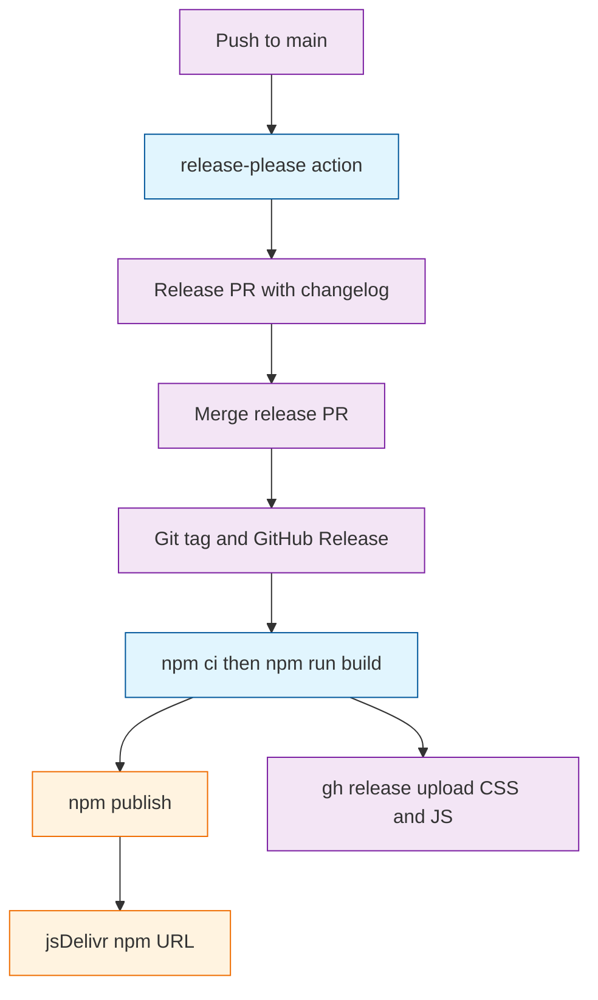

# Task: nerv-v01-m2-release-please-npm-gh-assets

* Task ID: nerv-v01-m2-release-please-npm-gh-assets
* Complexity: Level 3
* Type: intermediate feature

Wire release-please, npm trusted-publish, and GitHub Release attachments for `dist/nerv.css` and `dist/nerv.js`. Scope is parent-brief requirements 4–6 and acceptance criterion 2 only. Do not add a `SKILL.md` extra-file, ProperDocs, the skill, or the offline-bundle note.

The npm sibling is [inquirerjs-checkbox-search](https://github.com/Texarkanine/inquirerjs-checkbox-search) ([release-please-action](https://github.com/googleapis/release-please-action), [trusted publishers](https://docs.npmjs.com/trusted-publishers/)). SumMem is the extra-files shape M5 will extend; M2 must not add that array. CDN is [jsDelivr’s npm URL](https://www.jsdelivr.com/documentation#id-npm), not a file host we stand up.

## Pinned Info

### Merge-to-main release path

Shows how a push to `main` becomes a GitHub Release, an npm package, and the jsDelivr path M4 will load. Asset attach is the only step not already in the inquirerjs workflow.

## Component Analysis

### Affected Components

- **npm package metadata (`package.json`)**: currently `private: true`, version `0.1.0`, no `files`/`license`/`repository`/`publishConfig`. Becomes a public package: drop `private`, set version `0.0.1` so the first `feat:` on `main` yields `0.1.0` ([release-please bootstrap](https://github.com/googleapis/release-please/blob/main/docs/manifest-releaser.md); inquirerjs used the same 0.0.1 → 0.1.0 start), list exactly `dist/nerv.css` and `dist/nerv.js` in `files`, add license/repository/bugs/homepage/author/`publishConfig.access=public`, `style` → `dist/nerv.css`, `main` → `dist/nerv.js`. Amend the explicit `test` script file list when the new test file is added.
- **release-please config**: absent. Add `release-please-config.json` (`release-type: node`, same bump flags and doggo PR header as inquirerjs) and `.release-please-manifest.json` `{ ".": "0.0.1" }`. No `extra-files`.
- **GitHub Actions**: no `.github/` yet. Add `.github/workflows/release-please.yaml` copied from inquirerjs: App token (`vars.APP_ID` / `secrets.APP_PRIVATE_KEY` — same GitHub App as SumMem/stockroom, value `Iv23lire0pbPWSfNvsBU` on those repos), `googleapis/release-please-action@v5`, `publish-npm` on Node 24 with `environment: npmjs.org`. Skip inquirerjs codecov/`test:ci`/`.nvmrc` (this repo has none). Add `tag_name` job output and `gh release upload` of the two dist files ([action README](https://github.com/googleapis/release-please-action/blob/main/README.md)).
- **README**: none at repo root. Add a short package README: AGPL-3.0, how to load via npm and the jsDelivr path `https://cdn.jsdelivr.net/npm/nervouscsstem@<version>/dist/nerv.css` (and the matching `.js` URL). Point at `docs/` as the authoring SoT. Do not relocate `docs/`.
- **`dist/`**: stays gitignored. CI builds before publish and before `gh release upload`. Do not start committing compiled CSS.

### Cross-Module Dependencies

- `package.json` `files` → `npm pack` / `npm publish` tarball contents → jsDelivr file URLs
- `release-please-config.json` + manifest → release-please-action on `main` → version bump of `package.json` (node release-type) + CHANGELOG + GitHub Release
- `publish-npm` job → needs `release_created` and `tag_name` from the release-please job; needs built `dist/` for both npm and `gh release upload`
- GitHub App token → release PR can trigger other workflows later; `GITHUB_TOKEN` is enough for `gh release upload` (`contents: write`)
- M5 → will add only a `SKILL.md` extra-files entry to the config this milestone creates; must not be added here

### Boundary Changes

- Public npm package `nervouscsstem` (name confirmed unused on the registry, 404 today)
- GitHub Release assets `nerv.css` and `nerv.js` at the release tag
- `package.json` version becomes release-please-owned (start at `0.0.1`; do not bump by hand after that)
- No `SKILL.md` extra-file; no docs site; `AGENTS.md` SumMem block untouched

### Invariants and Constraints

- Must preserve `docs/` as authoring SoT
- Must reach public CSS/JS via npm → jsDelivr, not a bespoke CDN
- Must let release-please be the only version bumper
- Must create release-please here and leave `extra-files` out (M5 extends later)
- Must not modify the SumMem program or relocate the `AGENTS.md` activation block
- Must keep live-example constraints out of this milestone (no example pages here)
- `dist/` remains gitignored; artifacts are built in CI
- Workflow filename must stay `release-please.yaml` — npm trusted publisher matches that filename exactly
- `repository.url` must be `git+https://github.com/Texarkanine/nervouscsstem.git` so npm provenance can match the public repo ([trusted publishers](https://docs.npmjs.com/trusted-publishers/))
- Must test only what this repo ships to customers as product. Own CI is not that. TDD a pipeline only when it is brittle or critical; this one is neither. (Operator 2026-09-12; `.cursor-rules` is being updated to match.)
- Operator publishes **0.0.1** by hand (CLI 2FA) to create the npm package, then attaches the trusted publisher. The first automated GitHub Release / `npm publish` from CI is **0.1.0**. This branch keeps `package.json` and the manifest at `0.0.1` so that hand-publish is possible from the same tree. Do not put `0.1.0` in `package.json` on this PR.

## Open Questions

- [x] Must release-please/GitHub Actions wiring get a TDD unit? → Resolved (operator 2026-09-12): No. Test only what we ship to customers as product. Our CI does not get that cycle unless it is brittle or critical; this is not one of those times. The 2026-09-12 preflight FAIL (blocking) on unit 2 is discarded. Do not add YAML/JSON change-detectors to satisfy always-tdd’s “workflow it runs” reading while that wording is being fixed in `.cursor-rules`.

## Test Plan (TDD)

### Behaviors to Verify

- Build then pack: `npm run build` then `npm pack --dry-run --json` → tarball file list includes `dist/nerv.css` and `dist/nerv.js`
- Publishable: reading `package.json` → `private` is absent or `false`
- Provenance URL: `package.json` `repository.url` → contains `github.com/Texarkanine/nervouscsstem`
- Edge: `files` lists those two paths (so extra files sitting in `dist/`, e.g. a local `nerv.min.css`, are not required to be in the tarball)

No locally tested behaviors for `release-please-config.json`, `.release-please-manifest.json`, or `.github/workflows/release-please.yaml`. Those files are our pipeline, not the shipped product.

### Test Infrastructure

- Framework: Node.js built-in test runner (`node:test`) as in `test/foundation.test.mjs`
- Test location: `test/`
- Conventions: ESM `.test.mjs`, `describe`/`it` from `node:test`, `assert` from `node:assert/strict`, `ROOT` via `resolve(import.meta.dirname, '..')`, `execSync` for `npm run build`
- New test files: `test/publish-contract.test.mjs`
- The `package.json` `test` script enumerates files by name — add the new file to that list in the same unit that creates it

### Integration Tests

- `test/publish-contract.test.mjs` is the integration of build output + `files` + pack (no second suite)

## Implementation Plan

### 1. npm publish contract — executable

- Files: `package.json`, `test/publish-contract.test.mjs`
- Creative ref: none
- [x] Stub tests, stub interface, red tests, green metadata (`private` removed, version `0.0.1`, `files` lists `dist/nerv.css` and `dist/nerv.js`)

### 2. release-please and GitHub Actions wiring — prose/policy

- Files: `release-please-config.json`, `.release-please-manifest.json`, `.github/workflows/release-please.yaml`
- No tests: prose/policy artifact
- Operator 2026-09-12: own CI, not shipped product; not brittle or critical; prior preflight TDD FAIL on this unit is discarded
- Creative ref: none
- [x] Config (`release-type: node`, doggo header, no `extra-files`), manifest `0.0.1`, workflow from inquirerjs with `tag_name` + `publish-npm` + `gh release upload` of `dist/nerv.css` and `dist/nerv.js`

### 3. Package README and CDN path — prose/policy

- Files: `README.md`
- No tests: prose/policy artifact
- [x] Root README: AGPL-3.0, `npm i`, jsDelivr `@<version>/dist/nerv.css` and `.js`, `docs/` as SoT, release-please merge on `main` (no hand-tag)

## Technology Validation

No new npm or runtime dependencies — validation not required. Dart Sass and `node:test` stay as they are. GitHub Actions, release-please, and npm OIDC are copied from inquirerjs (already publishing in this org). The publish job stays on Node 24 because trusted publishing needs npm ≥ 11.5.1 ([npm trusted publishers](https://docs.npmjs.com/trusted-publishers/); inquirerjs changelog: Node 22 `npm install -g npm` is broken).

## Challenges and Mitigations

- **First npm publish cannot use OIDC until the package exists** ([npm/cli#8544](https://github.com/npm/cli/issues/8544)): Operator 2026-09-12: from this branch, `npm publish` **0.0.1** with CLI 2FA, then attach trusted publisher to workflow `release-please.yaml` + environment `npmjs.org`. After merge to `main`, release-please’s first release PR is **0.1.0** and that CI publish uses OIDC. Do not add an `NPM_TOKEN` fallback. Do not leave `package.json` at `0.1.0` on this PR or the hand-publish cannot be 0.0.1 from the same tree.
- **No release-please lockfile/demo amend workflow:** other repos force-push onto the RP branch when *committed* generated files change with the version bump. Here `dist/` is gitignored and built in the publish job. `release-type: node` already updates `package-lock.json` `version` and `packages[""].version` via [PackageLockJson](https://github.com/googleapis/release-please/blob/main/src/updaters/node/package-lock-json.ts). `npm ci` after the RP merge only needs those two strings to match `package.json`. Skip the amend job.
- **Repo has no Actions variables or environments today**: operator must set `APP_ID` (same app as the other Texarkanine repos) and `APP_PRIVATE_KEY`, and create GitHub environment `npmjs.org`, post-merge. Until then the workflow files are present but cannot run successfully
- **Niko checkpoint commits are `chore:`**: they will not open a release PR. The build’s product commit for this milestone must be `feat(...)` so that once `initialdev` reaches `main`, release-please sees a releasable commit
- **`dist/` is gitignored**: if CI skips `npm run build`, the tarball and Release assets are empty of CSS/JS. The publish job always builds; the pack test fails without a prior build
- **M5 extra-files**: do not add `SKILL.md` here even as a placeholder path
- **`private: true` today**: leaving it would make `npm publish` no-op; the pack-contract test forbids it
- **Work is on `initialdev`; workflow listens to `main` only**: correct, matching siblings. Wiring is complete when the files exist; the first live release is after merge to `main` plus operator bootstrap
- **Do not copy inquirerjs `prepublishOnly`**: it would re-run a quality gate this repo does not have (`test:ci`, attw). CI builds explicitly

## Pre-Mortem

- **First CI `npm publish` fails with ENEEDAUTH because 0.0.1 was not published and trusted publisher not attached before the 0.1.0 RP merges**: operator sequence is hand-publish 0.0.1, then attach publisher, then merge the 0.1.0 RP
- **Implementer puts 0.1.0 in package.json on this branch so the PR “looks like v0.1”**: then the operator cannot `npm publish` 0.0.1 from that tree. Keep 0.0.1; RP cuts 0.1.0
- **Implementer adds an RP-branch force-push to rebuild lockfile or dist**: dist is not committed; node strategy already patches the lockfile version fields. Already covered by the lockfile Challenge
- **Implementer uses `release-type: simple` like SumMem**: `package.json` would not be the version source. Plan pins `node` like inquirerjs
- **Implementer adds `extra-files` for dist or SKILL.md**: dist is generated and gitignored; SKILL.md is M5. Config step says no `extra-files`
- **Implementer commits `dist/` or drops it from `.gitignore`**: invariant says keep gitignore; CI builds
- **Release PR uses `GITHUB_TOKEN` and later CI never runs on that PR**: copy the App-token step from inquirerjs
- **Trusted publisher environment name omitted on npmjs.com while the job sets `environment: npmjs.org`**: OIDC mismatch. Workflow comment and Challenges name both sides
- **Change-detector tests on YAML/README**: not scheduled; only the pack contract is tested
- **Preflight re-blocks on CI TDD**: discarded by operator 2026-09-12; do not invent workflow tests to appease the old always-tdd reading
- **Changelog dumps the entire `initialdev` history as 0.1.0**: most Niko commits are `chore:` (invisible). The product `feat` is the intended trigger. Acceptable for a first release

## Status

- [x] Component analysis complete
- [x] Open questions resolved
- [x] Test planning complete (TDD)
- [x] Implementation plan complete
- [x] Technology validation complete
- [x] Pre-Mortem complete
- [x] Preflight
- [x] Build
- [x] QA — PASS: the implementation conforms to the approved M2 plan; no blocking semantic findings
- [x] Reflect
