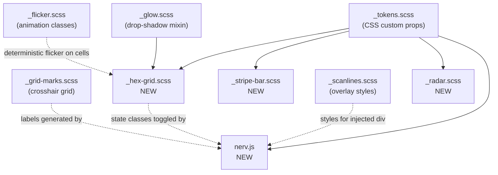

# Task: Phase 4 — Patterns & Geometry + Initial JS

* Task ID: nerv-phase4-patterns
* Complexity: Level 3
* Type: feature

Deliver three decorative/geometric SCSS modules (`_stripe-bar.scss`, `_hex-grid.scss`, `_radar.scss`), the initial `nerv.js` orchestration module (scanline injection, hex flicker, grid labels), the `ref-patterns.html` reference page, and build pipeline updates.

## Pinned Info

### Module Dependency Flow

The dependency flow for Phase 4 modules — all CSS consumed via tokens, JS orchestrates DOM.

## Component Analysis

### Affected Components
- `src/_tokens.scss` (MODIFIED): Add `--nerv-stripe-duration` and `--nerv-radar-duration` tokens (per token-driven durations pattern)
- `src/_stripe-bar.scss` (NEW): Animated diagonal chevron stripe patterns — `.nerv-stripe`, `.nerv-stripe-vertical`, `.nerv-stripe-red`, `.nerv-stripe-animated`
- `src/_hex-grid.scss` (NEW): Hexagonal cell grid with state-based coloring — `.nerv-hex-grid`, `.nerv-hex-row`, `.nerv-hex-cell`, `.nerv-hex-danger/warn/safe`
- `src/_radar.scss` (NEW): Concentric circle radar display — `.nerv-radar`, `.nerv-radar-sweep`
- `src/nerv.js` (NEW): Orchestration JS — `NERV.init()`, `NERV.injectScanlines()`, `NERV.initHexFlicker()`, `NERV.initGridLabels()`. Must respect `prefers-reduced-motion` for JS-driven animations.
- `src/nerv.scss` (MODIFIED): Add `@forward` for 3 new partials
- `package.json` (MODIFIED): Add `nerv.js` copy step to build scripts, add `test/patterns.test.mjs` to test command
- `ref/ref-patterns.html` (NEW): Reference page 4 — geometric patterns with active JS
- `test/patterns.test.mjs` (NEW): Test suite for Phase 4 CSS output + JS API surface

### Cross-Module Dependencies
- `_tokens.scss`: new tokens `--nerv-stripe-duration`, `--nerv-radar-duration` (following `--nerv-flicker-duration` / `--nerv-glitch-duration` convention)
- `_stripe-bar.scss` → `_tokens.scss`: consumes `--nerv-green`, `--nerv-green-rgb`, `--nerv-red`, `--nerv-red-rgb`, `--nerv-stripe-duration`, `--nerv-animation-speed`
- `_hex-grid.scss` → `_tokens.scss`: consumes `--nerv-red`, `--nerv-amber`, `--nerv-green` + RGB companions for glow
- `_hex-grid.scss` → `_glow.scss`: hex cells use `filter: drop-shadow()` per-state (shape-following glow)
- `_radar.scss` → `_tokens.scss`: consumes `--nerv-primary`, `--nerv-primary-rgb`, `--nerv-radar-duration`, `--nerv-animation-speed`
- `nerv.js` → `_scanlines.scss`: injects `
` — relies on existing CSS styles
- `nerv.js` → `_hex-grid.scss`: toggles `.nerv-hex-danger/warn/safe` state classes on cells
- `nerv.js` → `_grid-marks.scss`: generates axis label elements alongside grid containers

### Boundary Changes
- New public JS API: `NERV` global / ES module export with `.init()`, `.injectScanlines()`, `.initHexFlicker(container)`, `.initGridLabels(container)`
- New CSS classes: `.nerv-stripe[-*]`, `.nerv-hex-grid`, `.nerv-hex-row`, `.nerv-hex-cell`, `.nerv-hex-danger/warn/safe`, `.nerv-radar`, `.nerv-radar-sweep`
- Build output: `dist/nerv.js` added alongside `dist/nerv.css`

## Open Questions

None — implementation approach is clear. The Phase 4 planning document (`planning/PHASE4.md`) specifies techniques, class names, and JS API in detail. The UMD-lite module format decision is explicitly documented as low-risk.

## Test Plan (TDD)

### Behaviors to Verify

**Build & Integration:**
1. `npm run build` exits 0, produces `dist/nerv.css` (non-empty) and `dist/nerv.js`
2. `npm run build:min` still succeeds

**New Tokens:**
3. `--nerv-stripe-duration` token exists on `:root`
4. `--nerv-radar-duration` token exists on `:root`

**Stripe Bar CSS:**
5. `.nerv-stripe` class exists with `repeating-linear-gradient`
6. `.nerv-stripe-vertical` class exists
7. `.nerv-stripe-red` class exists
8. `.nerv-stripe-animated` class exists with animation referencing `--nerv-stripe-duration`
9. `@keyframes` for stripe animation exists
10. `prefers-reduced-motion` suppresses stripe animation

**Hex Grid CSS:**
11. `.nerv-hex-grid` class exists
12. `.nerv-hex-row` class exists
13. `.nerv-hex-cell` class exists with `clip-path`
14. `.nerv-hex-cell::before` pseudo-element exists (inner border)
15. `.nerv-hex-danger` uses `--nerv-red` token
16. `.nerv-hex-warn` uses `--nerv-amber` token
17. `.nerv-hex-safe` uses `--nerv-green` token
18. State classes apply `filter: drop-shadow` for glow

**Radar CSS:**
19. `.nerv-radar` class exists with `radial-gradient`
20. `.nerv-radar` uses `aspect-ratio: 1` and `border-radius: 50%`
21. `.nerv-radar` has pseudo-elements for radial division lines
22. `.nerv-radar-sweep` class exists with `conic-gradient`
23. `@keyframes` for radar sweep exists
24. Radar sweep duration references `--nerv-radar-duration`
25. `prefers-reduced-motion` suppresses radar sweep

**nerv.js API Surface:**
26. `dist/nerv.js` exists after build
27. Module exports `NERV` object
28. `NERV.init` is a function
29. `NERV.injectScanlines` is a function
30. `NERV.initHexFlicker` is a function
31. `NERV.initGridLabels` is a function

**Regression — Phase 1–3:**
32. Foundation tokens still present (`--nerv-amber`, `--nerv-primary`, `.nerv-glow`)
33. Effects selectors still present (`.nerv-scanlines`, `.nerv-flicker`, `.nerv-glitch`)
34. Structural selectors still present (`.nerv-panel`, `.nerv-divider`, `.nerv-grid-marks`)

### Test Infrastructure

- Framework: `node:test` with `node:assert/strict`
- Test location: `test/`
- Conventions: build CSS first in `before()`, read `dist/nerv.css`, assert selectors/patterns
- New test file: `test/patterns.test.mjs`
- JS tests: ESM import of `src/nerv.js` to check API surface (DOM-dependent behaviors verified via reference page)

### Integration Tests

- Build integration: verify all Phase 1–4 partials compile together without SCSS errors
- JS module: verify import works in Node.js ESM context and exports expected API
- Regression: Phase 1–3 selectors still present in compiled output

## Implementation Plan

### Phase A: Stubs & Test Infrastructure

1. **Add duration tokens to `_tokens.scss`** *(preflight amendment)*
    - Files: `src/_tokens.scss`
    - Changes: Add `--nerv-stripe-duration` and `--nerv-radar-duration` to `:root` block, following existing `--nerv-flicker-duration` / `--nerv-glitch-duration` convention
2. **Stub SCSS partials**
    - Files: `src/_stripe-bar.scss`, `src/_hex-grid.scss`, `src/_radar.scss`
    - Changes: Create files with module doc comments and empty/minimal rulesets
3. **Stub nerv.js**
    - Files: `src/nerv.js`
    - Changes: Create file with UMD-lite wrapper, empty function stubs for `init`, `injectScanlines`, `initHexFlicker`, `initGridLabels`
4. **Update entry point**
    - Files: `src/nerv.scss`
    - Changes: Add `@forward 'stripe-bar'`, `@forward 'hex-grid'`, `@forward 'radar'` after existing forwards
5. **Update build pipeline**
    - Files: `package.json`
    - Changes: Add `&& cp src/nerv.js dist/nerv.js` to `build` script, add `test/patterns.test.mjs` to `test` command
6. **Write tests**
    - Files: `test/patterns.test.mjs`
    - Changes: Full test suite covering all 34 behaviors above
7. **Run tests** — verify new tests fail (TDD red phase); build should succeed with stubs

### Phase B: SCSS Implementation

8. **Implement `_stripe-bar.scss`**
    - Files: `src/_stripe-bar.scss`
    - Changes: `repeating-linear-gradient(-45deg, ...)` pattern, `.nerv-stripe-vertical` (rotated), `.nerv-stripe-red` color variant, `.nerv-stripe-animated` with `@keyframes nerv-stripe-scroll` using `calc(var(--nerv-stripe-duration) / var(--nerv-animation-speed))`, `prefers-reduced-motion` suppression
    - Run stripe-related tests
9. **Implement `_hex-grid.scss`**
    - Files: `src/_hex-grid.scss`
    - Changes: `.nerv-hex-grid` container, `.nerv-hex-row` with odd-row offset (`margin-left`), `.nerv-hex-cell` with `clip-path: polygon(25% 0%, 75% 0%, 100% 50%, 75% 100%, 25% 100%, 0% 50%)`, `::before` inner border via inset clip-path, state classes with per-state color tokens and `filter: drop-shadow()`
    - Run hex-related tests
10. **Implement `_radar.scss`**
    - Files: `src/_radar.scss`
    - Changes: `.nerv-radar` with `radial-gradient` hard stops for concentric rings, `aspect-ratio: 1`, `border-radius: 50%`, `::before`/`::after` pseudo-elements for radial division lines, `.nerv-radar-sweep` with `conic-gradient` + `@keyframes nerv-radar-sweep` using `calc(var(--nerv-radar-duration) / var(--nerv-animation-speed))`, `prefers-reduced-motion` suppression
    - Run radar-related tests

### Phase C: JavaScript Implementation

11. **Implement `nerv.js`**
    - Files: `src/nerv.js`
    - Changes:
      - `NERV.init()`: calls sub-initializers, listens for DOMContentLoaded if needed
      - `NERV.injectScanlines()`: creates `
`, appends to `<body>`
      - `NERV.initHexFlicker(container)`: queries `.nerv-hex-cell` within container, random-interval `setTimeout` cycling through state classes. **Must check `prefers-reduced-motion` and skip if active** *(preflight amendment)*
      - `NERV.initGridLabels(container)`: generates axis label `` elements along grid container edges
      - UMD-lite: `export { NERV }` + `window.NERV = NERV` guard
    - Run JS API surface tests

### Phase D: Reference Page & Verification

12. **Create `ref/ref-patterns.html`**
    - Files: `ref/ref-patterns.html`
    - Changes: Full reference page per Phase 4 spec — stripe bars (green + red animated, vertical), radar center, hex grid right side, grid marks background, scanline overlay via JS injection (no manual div), `<script src="../dist/nerv.js">` + `NERV.init()`
13. **Full regression test run**
    - Run complete test suite: `npm run test`
    - Run lint: `npm run lint`
    - Verify build: `npm run build && npm run build:min`

## Technology Validation

- `nerv.js` is vanilla JS requiring no new dependencies or build tools
- The `cp` command in the build script works on Linux/WSL/macOS (project's development environment)
- ESM module import in Node.js test runner: supported natively (`.mjs` extension, matching existing test convention)
- No new npm packages required

## Challenges & Mitigations

- **Hex grid honeycomb alignment**: Alternating row offset must be exactly half a cell width. Mitigation: use a CSS custom property for cell width and derive offset as `calc(var(--cell-width) / 2)` to keep values in sync.
- **Radar hard-stop radial gradient**: Many gradient stops needed for 5+ rings. Mitigation: use SCSS `@for` loop to generate gradient stops programmatically, keeping the source clean.
- **nerv.js DOM testing in Node.js**: No DOM available. Mitigation: test API surface only (function existence, export structure); DOM behavior verified visually via reference page + browser testing.
- **Cross-platform build script**: `cp` command not available on vanilla Windows. Mitigation: project targets WSL/Linux/macOS; this matches existing development environment.

## Status

- [x] Component analysis complete
- [x] Open questions resolved
- [x] Test planning complete (TDD)
- [x] Implementation plan complete
- [x] Technology validation complete
- [x] Preflight
- [x] Build
- [ ] QA
