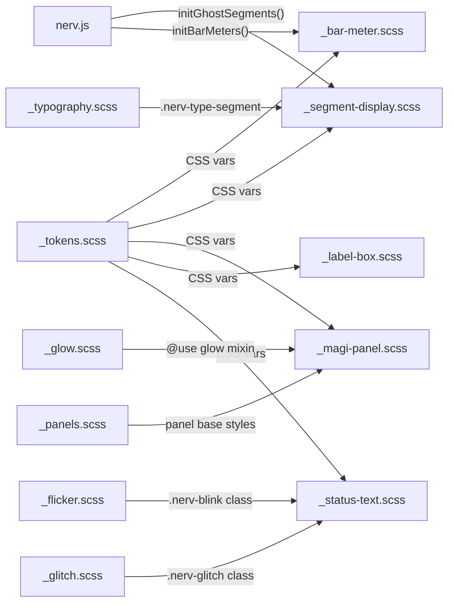

# Task: Phase 5 — Functional UI Components

* Task ID: nerv-phase5-components
* Complexity: Level 3
* Type: Feature (L4 sub-run — Phase 5 of nerv-design-system)

Deliver five functional UI components that sit inside Phase 3's structural containers and compose with Phase 2's effects: bar meters, seven-segment displays, MAGI decision panels, skewed label-box buttons, and status text overlays. Extend `nerv.js` with ghost-segment and bar-meter initialization. Build `ref/ref-components.html` as the Phase 5 reference page.

## Pinned Info

### Module Dependency Flow

All five new SCSS partials consume tokens via CSS custom properties (not `@use`), matching the pattern established in Phases 2–4. Only `_magi-panel.scss` uses `@use 'glow'` (for MAGI box glow). The JS functions are orchestration-only: reading DOM attributes and toggling classes.

## Component Analysis

### Affected Components

- **`src/_bar-meter.scss`** (NEW): Discrete colored bar meter — flex row of small blocks with HSL color gradient via SCSS `@for` loop, zone markers via `::after`, fill level via `data-fill` / `.active` class
- **`src/_segment-display.scss`** (NEW): Seven-segment readout — DSEG7 font, ghost-segment `::before` with `content: attr(data-ghost)`, amber LED glow via `text-shadow`
- **`src/_magi-panel.scss`** (NEW): MAGI consensus display — CSS Grid layout, three `.nerv-magi-system` boxes + one `.nerv-magi-output` box, connecting lines via pseudo-elements, uses `_glow.scss` mixin and `_panels.scss` styles
- **`src/_label-box.scss`** (NEW): Skewed parallelogram buttons — `skewX(-15deg)` with counter-skew on inner text, active state with background fill + glow
- **`src/_status-text.scss`** (NEW): Status text overlays — large bordered labels with severity variants (nominal/caution/danger/critical), composes with `.nerv-blink` and `.nerv-glitch` for animation
- **`src/nerv.js`** (MODIFIED): Add `NERV.initGhostSegments(container?)` and `NERV.initBarMeters(container?)`, call both from `NERV.init()`
- **`src/nerv.scss`** (MODIFIED): Add 5 `@forward` statements for new partials
- **`ref/ref-components.html`** (NEW): Four-zone 12-column grid reference page
- **`test/components.test.mjs`** (NEW): Phase 5 test suite

### Cross-Module Dependencies

- `_bar-meter.scss` → `_tokens.scss`: named data tokens for HSL color gradient (cyan → blue → purple)
- `_segment-display.scss` → `_tokens.scss`: `--nerv-amber-rgb` for ghost dimming and glow; `_typography.scss`: `.nerv-type-segment` font class
- `_magi-panel.scss` → `_glow.scss`: `@use 'glow'` for box glow mixin; `_panels.scss`: reuses `.nerv-panel-titled` concept for system boxes; `_tokens.scss`: color tokens
- `_label-box.scss` → `_tokens.scss`: color tokens for border/background
- `_status-text.scss` → `_tokens.scss`: severity color tokens; composes with Phase 2 classes `.nerv-blink` and `.nerv-glitch` (consumers add both classes)
- `nerv.js` → DOM: reads `.nerv-segment-display` text content, reads `.nerv-bar-meter[data-fill]` attribute

### Boundary Changes

- **`nerv.js` public API**: adds `NERV.initGhostSegments(container?)` and `NERV.initBarMeters(container?)` — backward-compatible additions, no breaking changes
- **`nerv.scss`**: adds 5 `@forward` statements — purely additive

### Invariants & Constraints

- All selectors use `.nerv-` prefix (enforced by stylelint `selector-class-pattern: ^nerv-`)
- All colors via CSS custom properties from `_tokens.scss` — no hardcoded hex in new modules
- Bar meter colors use **named data tokens** (stable across alert states), not ambiance tokens
- `prefers-reduced-motion` suppresses all new animations (status text blink/glitch are handled by Phase 2 classes)
- `prefers-contrast` increases `--nerv-border-width` — new modules must use this token for borders
- No images, no canvas — SVG data URIs in CSS only if needed
- JS is orchestration only — DOM attribute setting, class toggling

## Open Questions

None — implementation approach is clear. The PHASE5.md design doc provides explicit technique descriptions, class names, and DOM structure for every component. All patterns follow established conventions from Phases 1–4.

## Test Plan (TDD)

### Behaviors to Verify

**Build integration:**
1. `npm run build` exits 0, `dist/nerv.css` is non-empty
2. `npm run build:min` still succeeds

**Bar meter (`_bar-meter.scss`):**
3. `.nerv-bar-meter` class exists with `display: flex`
4. `.nerv-bar-meter-bar` child class exists
5. Bar color gradient: nth-child selectors present for HSL color stepping
6. Bar meter uses gap for discrete bar spacing

**Segment display (`_segment-display.scss`):**
7. `.nerv-segment-display` class exists
8. `.nerv-segment-display::before` exists with `content: attr(data-ghost)`
9. Segment display references `text-shadow` for LED glow
10. Segment display references DSEG7 font (via `--nerv-type-segment` or font-family)

**MAGI panel (`_magi-panel.scss`):**
11. `.nerv-magi-panel` class exists with CSS Grid (`display: grid`)
12. `.nerv-magi-system` class exists
13. `.nerv-magi-output` class exists
14. MAGI system boxes use panel-like border styling with glow

**Label box (`_label-box.scss`):**
15. `.nerv-label-box` class exists with `skewX`
16. `.nerv-label-box-active` class exists with background fill
17. `.nerv-label-box-group` row container exists with `display: flex`

**Status text (`_status-text.scss`):**
18. `.nerv-status-text` base class exists
19. `.nerv-status-nominal` class exists referencing `--nerv-green`
20. `.nerv-status-caution` class exists referencing `--nerv-amber`
21. `.nerv-status-danger` class exists referencing `--nerv-red`
22. `.nerv-status-critical` class exists referencing `--nerv-red`

**JavaScript (`nerv.js`):**
23. `NERV.initGhostSegments` is a function
24. `NERV.initBarMeters` is a function
25. `NERV.init` still exists (backward compatible)

**Regressions — Phase 1–4:**
26. Foundation tokens still present (`--nerv-amber`, `--nerv-primary`, `.nerv-glow`)
27. Effects selectors still present (`.nerv-scanlines`, `.nerv-flicker`, `.nerv-glitch`)
28. Structural selectors still present (`.nerv-panel`, `.nerv-divider`, `.nerv-grid-marks`)
29. Phase 4 selectors still present (`.nerv-stripe`, `.nerv-hex-grid`, `.nerv-radar`)

### Test Infrastructure

- Framework: Node.js built-in test runner (`node --test`)
- Test location: `test/`
- Conventions: one test file per phase, `describe()` blocks group by component, `it()` tests match selectors/properties in compiled CSS string, JS API tested via dynamic import
- New test file: `test/components.test.mjs`

### Integration Tests

- Build integration: compilation of all 5 new partials together via `nerv.scss`
- JS API: `initGhostSegments` and `initBarMeters` exported and callable
- Regression: Phase 1–4 selectors survive addition of Phase 5 modules

## Implementation Plan

### Step 1: Test file stub + interface stubs (TDD prep)

- Files: `test/components.test.mjs`, `src/_bar-meter.scss`, `src/_segment-display.scss`, `src/_magi-panel.scss`, `src/_label-box.scss`, `src/_status-text.scss`
- Changes:
  - Create `test/components.test.mjs` with all `describe`/`it` blocks — empty implementations
  - Create 5 SCSS partials as empty files with doc comments and no rules
  - Stub `NERV.initGhostSegments` and `NERV.initBarMeters` in `nerv.js` as empty functions
  - Update `nerv.scss` to `@forward` the 5 new partials
  - Update `package.json` test script to include `test/components.test.mjs`

### Step 2: Implement tests

- Files: `test/components.test.mjs`
- Changes: Fill out all test implementations (CSS string matching, JS API import verification)
- Run tests: all new tests should **fail** (empty SCSS, empty JS stubs)

### Step 3: Implement `_bar-meter.scss`

- Files: `src/_bar-meter.scss`
- Changes:
  - `.nerv-bar-meter`: flex container with `gap: 2–3px`, `align-items: stretch`
  - `.nerv-bar-meter-bar`: `flex: 1; min-width: 4px; height` for individual bar segments
  - SCSS `@for` loop: generates `nth-child` selectors with HSL hue stepping (cyan → blue → purple) using named data tokens
  - `.nerv-bar-meter-bar:not(.active)` or threshold-based deactivation styles (transparent background for inactive bars)
  - Zone marker `::after` pseudo-elements at threshold positions
- Run tests: bar meter tests should pass

### Step 4: Implement `_segment-display.scss`

- Files: `src/_segment-display.scss`
- Changes:
  - `.nerv-segment-display`: container positioning, font setup via `.nerv-type-segment` pattern, letter-spacing
  - `::before` pseudo-element: `content: attr(data-ghost)`, dimmed color (`rgba(var(--nerv-amber-rgb), 0.08)`), positioned absolutely behind actual content
  - `text-shadow` for amber LED glow
- Run tests: segment display tests should pass

### Step 5: Implement `_magi-panel.scss`

- Files: `src/_magi-panel.scss`
- Changes:
  - `.nerv-magi-panel`: CSS Grid layout (`grid-template-columns: repeat(3, 1fr)`, `grid-template-rows: auto auto`)
  - `.nerv-magi-system`: bordered box with panel color, glow mixin, connecting line pseudo-elements
  - `.nerv-magi-output`: spanning all 3 columns, bordered result box
  - Connecting lines via `::before`/`::after` pseudo-elements using `border-top`/`border-left`
- Run tests: MAGI panel tests should pass

### Step 6: Implement `_label-box.scss`

- Files: `src/_label-box.scss`
- Changes:
  - `.nerv-label-box`: `display: inline-block`, `transform: skewX(-15deg)`, border, padding
  - Inner text counter-skew: `> *` or `> span` with `transform: skewX(15deg)`
  - `.nerv-label-box-active`: background fill, color inversion, `box-shadow` glow
  - `.nerv-label-box-group`: `display: flex`, row container with gap
- Run tests: label box tests should pass

### Step 7: Implement `_status-text.scss`

- Files: `src/_status-text.scss`
- Changes:
  - `.nerv-status-text`: large font, bordered label, padding
  - `.nerv-status-nominal`: `background: var(--nerv-green)`, `color: var(--nerv-void)`, no animation
  - `.nerv-status-caution`: `background: var(--nerv-amber)`, `color: var(--nerv-void)`
  - `.nerv-status-danger`: `background: var(--nerv-red)`, `color: var(--nerv-void)` (consumers add `.nerv-blink`)
  - `.nerv-status-critical`: `background: var(--nerv-red)`, `color: var(--nerv-void)` (consumers add `.nerv-glitch`)
- Run tests: status text tests should pass

### Step 8: Implement `nerv.js` additions

- Files: `src/nerv.js`
- Changes:
  - `NERV.initGhostSegments(container?)`: finds `.nerv-segment-display` elements, reads text content format, generates all-8s ghost string, sets `data-ghost` attribute
  - `NERV.initBarMeters(container?)`: finds `.nerv-bar-meter[data-fill]` elements, reads percentage, adds/removes `.active` class on child `.nerv-bar-meter-bar` elements
  - Update `NERV.init()` run function to call both new initializers
- Run tests: JS API tests should pass

### Step 9: Build `ref/ref-components.html`

- Files: `ref/ref-components.html`
- Changes: Four-zone 12-column grid layout:
  - Zone A (top-left, 4 cols): MAGI panel
  - Zone B (top-right, 8 cols): 3 bar meter rows at different fill levels
  - Zone C (bottom-left, 6 cols): segment display countdown + label box row
  - Zone D (bottom-right, 6 cols): status text cycling demo (inline script)
  - Scanline overlay, grid marks, ghost segments, bar meter fills all active
  - Inline `<script>` for Zone D status cycling (demo behavior)

### Step 10: Full verification

- Run full build: `npm run build && npm run build:min`
- Run lint: `npm run lint`
- Run full test suite: `npm test`
- Visual verification: open `ref/ref-components.html` in browser

## Technology Validation

No new technology — validation not required. All implementation uses existing SCSS patterns, CSS custom properties, and vanilla JS established in Phases 1–4. The DSEG7 font is already loaded in `_typography.scss`.

## Challenges & Mitigations

- **Bar meter SCSS loop count**: The `@for` loop generating `nth-child` color selectors needs a max bar count. Default to 50 — covers most display widths. Validate against reference page's actual bar count.
- **Ghost segment format matching**: `initGhostSegments()` must handle colons, decimal points, and spaces in the source text (e.g., "888:88:88"). Mitigation: replace digits with `8`, preserve other characters.
- **MAGI connecting lines**: CSS pseudo-element positioning for connecting lines between system boxes and output box is finicky. Mitigation: use absolute positioning with calculated offsets relative to the grid gaps.
- **Label box skew + text alignment**: Counter-skew on inner text can affect line-height/baseline. Mitigation: test with various text lengths in the reference page.
- **Stylelint compliance**: All new selectors must pass `selector-class-pattern: ^nerv-`. The `@for` loop generates selectors programmatically — verify they compile to compliant CSS.

## Status

- [x] Component analysis complete
- [x] Open questions resolved (none identified)
- [x] Test planning complete (TDD)
- [x] Implementation plan complete
- [x] Technology validation complete
- [ ] Preflight
- [ ] Build
- [ ] QA
