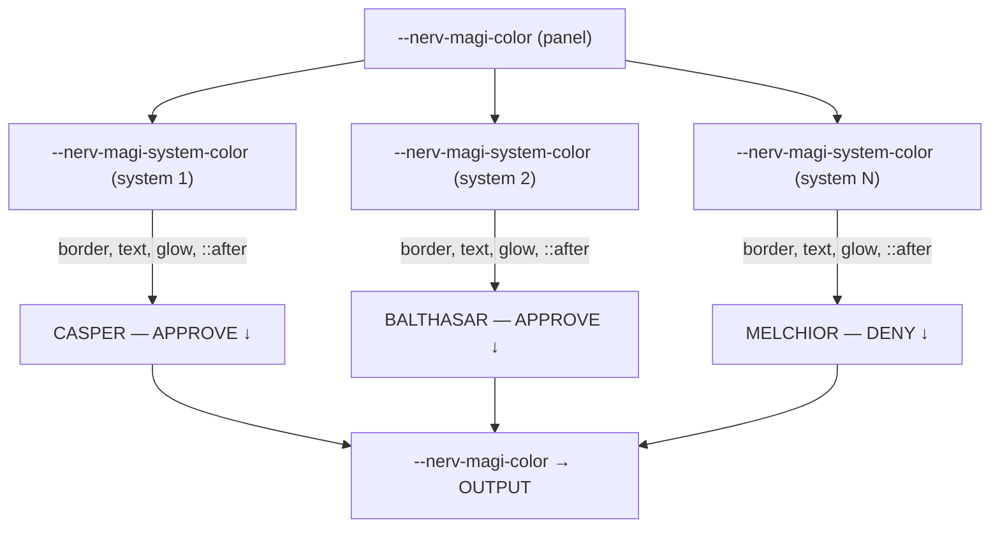

# Task: Phase 5 Enhancements — Component Flexibility

* Task ID: nerv-phase5-enhance
* Complexity: Level 3
* Type: Enhancement (L4 sub-run — Phase 5 revision of nerv-design-system)

Enhance label boxes with hover/press/toggle interactivity, MAGI panels with per-system-box coloring and N-to-1 flexible layout, and bar meters with token-based customizable color gradients via CSS `color-mix()`. Add `--nerv-white` token for gradient endpoints.

## Pinned Info

### Color Gradient Strategy

The bar meter color system shifts from compile-time HSL values to runtime `color-mix()` interpolation between two CSS custom properties. This allows consumers to set any `--nerv-*` token as the start/end color.

```
Consumer HTML:
  <div class="nerv-bar-meter"
       style="--nerv-bar-from: var(--nerv-green); --nerv-bar-to: var(--nerv-red);"
       data-fill="75">

Compiled CSS (per bar):
  .nerv-bar-meter-bar:nth-child(25) { --nerv-bar-pct: 48.98%; }

Active bar color:
  background-color: color-mix(in srgb, var(--nerv-bar-from), var(--nerv-bar-to) var(--nerv-bar-pct, 0%));
```

### MAGI Per-System Color Cascade

Each `.nerv-magi-system` box defines `--nerv-magi-system-color` (defaulting to the panel's `--nerv-magi-color`). Border, text, glow, and connecting line all reference the per-system property, so a single override colors everything including the edge.



## Component Analysis

### Affected Components

- **`src/_label-box.scss`** (MODIFIED): Add `:hover` and `:active` pseudo-class states for interactive feedback. Hover adds subtle glow/border brightness. Active (press) adds compressed/intensified feel.
- **`src/_magi-panel.scss`** (MODIFIED): Add per-system-box `--nerv-magi-system-color` / `--nerv-magi-system-color-rgb` custom properties. Change all `.nerv-magi-system` visual references from panel-level to system-level color. Connecting line inherits per-system color.
- **`src/_bar-meter.scss`** (MODIFIED): Replace SCSS `@for` HSL hue loop with percentage-only loop. Add `--nerv-bar-from` / `--nerv-bar-to` custom properties. Use `color-mix(in srgb, ...)` for active bar background color.
- **`src/_tokens.scss`** (MODIFIED): Add `'white': (#ffffff, '255, 255, 255', false)` to `$nerv-colors` map.
- **`src/nerv.js`** (MODIFIED): Add `NERV.initLabelBoxGroups(container?)` for click-to-toggle radio behavior. Add `NERV.initMagiPanels(container?)` to set grid columns based on system count. Enhance `initBarMeters()` to set `--nerv-bar-pct` per bar for exact gradients beyond the SCSS 50-bar limit.
- **`ref/ref-components.html`** (MODIFIED): Update to demo all enhancements — hover/click on label boxes, per-system MAGI colors, varied bar meter color ranges.
- **`test/components.test.mjs`** (MODIFIED): Add new test cases, modify existing bar meter color tests for new `color-mix()` approach.

### Cross-Module Dependencies

- `_bar-meter.scss` → `_tokens.scss`: now uses `--nerv-bar-from` / `--nerv-bar-to` referencing named tokens via `color-mix()` instead of hardcoded HSL
- `_magi-panel.scss` → `_glow.scss`: glow mixin now receives per-system-box color variable names
- `nerv.js` → DOM: new `initLabelBoxGroups()` reads `.nerv-label-box-group` containers and attaches click handlers; `initMagiPanels()` reads `.nerv-magi-system` child count and sets grid style

### Boundary Changes

- **`nerv.js` public API**: adds `NERV.initLabelBoxGroups(container?)` and `NERV.initMagiPanels(container?)` — backward-compatible additions
- **`_bar-meter.scss` compiled CSS**: `color-mix()` replaces per-bar `hsl()` values — visual change (token-based colors vs hardcoded HSL), behavioral improvement (customizable)
- **`_magi-panel.scss`**: grid columns no longer hardcoded to 3 when JS runs — backward-compatible (JS defaults to child count, which for existing markup is 3)
- **`_label-box.scss`**: new `:hover` / `:active` states — purely additive CSS

### Invariants & Constraints

- All selectors use `.nerv-` prefix (enforced by stylelint `selector-class-pattern: ^nerv-`)
- All colors via CSS custom properties from `_tokens.scss` — `color-mix()` uses resolved token values, no hardcoded hex in new code
- `prefers-reduced-motion` suppresses label box hover transitions
- `prefers-contrast` increases `--nerv-border-width` — label box hover must respect
- JS is orchestration only — click handlers, grid column setting, percentage computation
- `color-mix()` browser support: baseline since 2023 (Chrome 111+, Firefox 113+, Safari 16.2+) — acceptable for this project's modern-CSS target

## Open Questions

None — the user provided explicit direction on all three enhancements. No design ambiguity exists.

## Test Plan (TDD)

### Behaviors to Verify

**Token additions:**
1. `--nerv-white` token present in `:root` output
2. `--nerv-white-rgb` token present in `:root` output

**Label box enhancements:**
3. `.nerv-label-box:hover` styles exist in compiled CSS
4. `.nerv-label-box:active` styles exist in compiled CSS
5. `NERV.initLabelBoxGroups` is a function

**MAGI panel enhancements:**
6. `--nerv-magi-system-color` custom property declared on `.nerv-magi-system`
7. `.nerv-magi-system::after` references `--nerv-magi-system-color` (not `--nerv-magi-color`)
8. `NERV.initMagiPanels` is a function

**Bar meter enhancements:**
9. `--nerv-bar-from` custom property declared on `.nerv-bar-meter`
10. `--nerv-bar-to` custom property declared on `.nerv-bar-meter`
11. `.nerv-bar-active` uses `color-mix` for background color
12. SCSS loop generates `--nerv-bar-pct` values (not `hsl(` values per bar)

**Modified existing tests:**
- Behavior 5 (bar color gradient): change assertion from `hsl(` to `--nerv-bar-pct` and `color-mix`

**Regressions — all existing Phase 5 and Phase 1–4 tests remain green**

### Test Infrastructure

- Framework: Node.js built-in test runner (`node --test`)
- Test location: `test/`
- Conventions: one test file per phase, `describe()` blocks group by component
- New test files: none — new tests added to existing `test/components.test.mjs`

### Integration Tests

- Build integration: all modified SCSS compiles cleanly via `nerv.scss`
- JS API: new functions exported and callable
- Regression: Phase 1–4 selectors survive modifications

## Implementation Plan

### Step 1: TDD prep — stub tests and interfaces

- Files: `test/components.test.mjs`, `src/nerv.js`
- Changes:
  - Add empty `it()` blocks in `test/components.test.mjs` for behaviors 1–12 (new tests) and modify behavior 5 test signature
  - Stub `NERV.initLabelBoxGroups` and `NERV.initMagiPanels` as empty functions in `nerv.js`
  - Update `NERV.init()` to call both new functions

### Step 2: Implement tests

- Files: `test/components.test.mjs`
- Changes: Fill out all test implementations — CSS string matching for new properties, JS API import verification
- Run tests: new tests should **fail** (empty stubs, unchanged CSS)

### Step 3: Add `--nerv-white` token

- Files: `src/_tokens.scss`
- Changes: Add `'white': (#ffffff, '255, 255, 255', false)` to `$nerv-colors` map
- Run tests: token tests (behaviors 1–2) should pass

### Step 4: Enhance label box CSS

- Files: `src/_label-box.scss`
- Changes:
  - `.nerv-label-box:hover` — border color intensification, subtle background hint (`rgba` of label-box-color at ~0.08), slight glow via `box-shadow`
  - `.nerv-label-box:active` — stronger background fill (`rgba` at ~0.15), slightly reduced scale or inset shadow for "pressed" feel
  - `.nerv-label-box-active:hover` — slightly brighter glow than base active state
  - `prefers-reduced-motion` — existing `transition: none` already covers hover/active transitions
- Run tests: behaviors 3–4 should pass

### Step 5: Enhance MAGI panel CSS

- Files: `src/_magi-panel.scss`
- Changes:
  - `.nerv-magi-system`: add `--nerv-magi-system-color: var(--nerv-magi-color)` and `--nerv-magi-system-color-rgb: var(--nerv-magi-color-rgb)` at top of rule
  - Change all `var(--nerv-magi-color)` references within `.nerv-magi-system` to `var(--nerv-magi-system-color)` (border, color, `::after` background)
  - Change `@include glow.nerv-glow(--nerv-magi-color, --nerv-magi-color-rgb)` to `@include glow.nerv-glow(--nerv-magi-system-color, --nerv-magi-system-color-rgb)`
  - `.nerv-magi-output` stays with `var(--nerv-magi-color)` (output represents consensus, not individual system)
- Run tests: behaviors 6–7 should pass

### Step 6: Rework bar meter colors

- Files: `src/_bar-meter.scss`
- Changes:
  - Add `--nerv-bar-from: var(--nerv-cyan)` and `--nerv-bar-to: var(--nerv-blue)` on `.nerv-bar-meter`
  - Replace SCSS `@for` loop body: instead of computing HSL hue, compute percentage: `--nerv-bar-pct: #{$pct}%` where `$pct = math.round(math.div(($i - 1) * 100, $nerv-bar-count - 1) * 100) * 0.01`
  - Change `.nerv-bar-active` background from `var(--nerv-bar-color, var(--nerv-cyan))` to `color-mix(in srgb, var(--nerv-bar-from), var(--nerv-bar-to) var(--nerv-bar-pct, 0%))`
  - Remove old `--nerv-bar-color` per-nth-child HSL values (replaced by `--nerv-bar-pct`)
- Run tests: behaviors 9–12 and modified behavior 5 should pass

### Step 7: Implement JS enhancements

- Files: `src/nerv.js`
- Changes:
  - `NERV.initLabelBoxGroups(container?)`: find `.nerv-label-box-group` containers, attach click handlers to child `.nerv-label-box` elements. In a group: radio behavior (click toggles active, deactivates siblings). For standalone `.nerv-label-box` not in a group: simple toggle.
  - `NERV.initMagiPanels(container?)`: find `.nerv-magi-panel` containers, count `.nerv-magi-system` children, set `gridTemplateColumns = 'repeat(' + count + ', 1fr)'`
  - Enhance `initBarMeters()`: after setting `.nerv-bar-active` class, also set `--nerv-bar-pct` as inline style on each bar (`(j / (bars.length - 1)) * 100 + '%'`) for exact gradient independent of SCSS loop limit
- Run tests: behaviors 5, 8 should pass; all JS tests green

### Step 8: Update reference page

- Files: `ref/ref-components.html`
- Changes:
  - **Label boxes**: no HTML changes needed (JS handles interactivity after `NERV.init()`)
  - **MAGI panel**: add per-system color overrides — CASPER/BALTHASAR green (`--nerv-magi-system-color: var(--nerv-green); --nerv-magi-system-color-rgb: var(--nerv-green-rgb)`), MELCHIOR red (`--nerv-magi-system-color: var(--nerv-red); --nerv-magi-system-color-rgb: var(--nerv-red-rgb)`)
  - **Bar meters**: set different `--nerv-bar-from` / `--nerv-bar-to` on each meter:
    - Subject 00: `--nerv-bar-from: var(--nerv-green); --nerv-bar-to: var(--nerv-red)` (safe → danger)
    - Subject 01: `--nerv-bar-from: var(--nerv-cyan); --nerv-bar-to: var(--nerv-blue)` (default, cool range)
    - Subject 02: `--nerv-bar-from: var(--nerv-void); --nerv-bar-to: var(--nerv-amber)` (fade-in from black)

### Step 9: Full verification

- Run full build: `npm run build && npm run build:min`
- Run lint: `npm run lint`
- Run full test suite: `npm test`

## Technology Validation

**CSS `color-mix()`** — new CSS feature used in `_bar-meter.scss`. Baseline support since 2023:
- Chrome 111+ (March 2023), Firefox 113+ (May 2023), Safari 16.2+ (Dec 2022)
- This project already uses modern CSS features (aspect-ratio, CSS Grid, custom properties with var() in calc()), confirming modern browser targeting
- No polyfill needed
- Stylelint: `function-no-unknown` and `color-function-notation` are both `null` (disabled) in `.stylelintrc.json` — `color-mix()` will not be rejected

## Challenges & Mitigations

- **`color-mix()` with `var()` percentage**: CSS custom properties substitute textually, so `var(--nerv-bar-pct, 0%)` resolves to a literal percentage string before `color-mix()` evaluates. Tested pattern is sound, but may encounter issues in edge-case browsers. Mitigation: the `color-mix()` declaration includes `, 0%` fallback in the `var()`, and old browsers that don't support `color-mix()` simply won't render bar colors (transparent bars), which is gracefully degraded.
- **SCSS loop precision for percentages**: `math.div()` can produce many decimal places. Mitigation: round to 2 decimal places using `math.round($val * 100) * 0.01` to satisfy `number-max-precision` stylelint rule.
- **MAGI grid column count**: `repeat()` can't use `var()` for the count. Mitigation: JS sets `gridTemplateColumns` directly, and CSS default of `repeat(3, 1fr)` works for the common case without JS.
- **Label box click handler memory**: event listeners on many label boxes. Mitigation: use event delegation on the group container, not per-element listeners.
- **Existing test modification**: behavior 5 (bar color gradient) must change assertion from `hsl(` to `color-mix`. Mitigation: carefully update the test, verify old and new assertions don't conflict.

## Status

- [x] Component analysis complete
- [x] Open questions resolved (none identified)
- [x] Test planning complete (TDD)
- [x] Implementation plan complete
- [x] Technology validation complete
- [ ] Preflight
- [ ] Build
- [ ] QA
