# NERV Design System — Specification

> A pure-CSS (+ minimal orchestration JS) design system for reskinning arbitrary web interfaces
> with the visual language of NERV's operational consoles from Neon Genesis Evangelion.

---

## 1. References & Sources

### Primary Visual References

| Source | URL | What It Provides |
|--------|-----|------------------|
| Fonts In Use: NGE | https://fontsinuse.com/uses/28760/neon-genesis-evangelion | Definitive typography identification (Matisse EB, Helvetica, Chicago) |
| Zemnmez: "Why We Don't Have UIs Like NGE" | https://zemnmez.medium.com/why-we-dont-have-uis-like-the-ones-in-neon-genesis-9b6631dc3714 | Design philosophy — vector CRT heritage, why the shapes are what they are |
| Medium: "The Beautiful Chaos" | https://medium.com/@gennarolgr/the-beautiful-chaos-ui-ux-design-storytelling-in-neon-genesis-evangelion-26ae2d09613f | UX analysis — interfaces designed for belief, not comprehension |
| ASTROMONO: UI Design of Evangelion | https://astromono.wordpress.com/2015/06/04/ui-design-of-evangelion/ | Observation that shapes derive from real data viz (Venn, Gauss curves) |
| Pedro Fleming: NGE Screen Graphics | https://www.behance.net/gallery/96540159/Neon-Genesis-Evangelion-Screen-Graphics | High-res FUI/HUD recreations as reference art |
| Adobe Color: NGE UI palette | https://color.adobe.com/Neon-Genesis-Evangelion-UI-color-theme-21046527/ | Community-sourced color extraction |

### Prior Art (Code)

| Repo | URL | Relevance |
|------|-----|-----------|
| TheGreatGildo/nerv-ui | https://github.com/TheGreatGildo/nerv-ui | Claude Code skill + 808-line CSS. Best color system (5 phosphor colors with defined roles). Escalation states. CRT effects. NOT a reskinning tool — builds from scratch only. |
| bagusindrayana/ews-concept-new | https://github.com/bagusindrayana/ews-concept-new | Svelte earthquake warning app skinned as NERV. **Best CSS technique source**: stripe bars via `repeating-linear-gradient`, hex grids via `clip-path`, glow via `drop-shadow` + directional `text-shadow`, Mental Toxicity Level bar meter component. Uses SVG images for some hexes (we'll replace with pure CSS). |
| GLAO274/Evangelion-Style-Hexagon-Warning-Error-Page | https://github.com/GLAO274/Evangelion-Style-Hexagon-Warning-Error-Page | Hex grid via JS-generated SVG. Glitch animation via `clip-path` on `::before`/`::after` — **steal this technique**. Flicker state machine (3 states, random timer). |
| lotap/magi-theme | https://github.com/lotap/magi-theme | Terminal color palette only. Cross-reference values: orange primary `#f06800`, useful as darker end of amber range. |
| MichalSvatos/pi-hole-lcars-next-gen | https://github.com/MichalSvatos/pi-hole-lcars-next-gen | LCARS (Star Trek) theme for Pi-hole. **Mechanical reference** for how to override AdminLTE via pure CSS. Proves the approach works. |
| GitHub topic: evangelion | https://github.com/topics/evangelion | Index of Obsidian themes, Neovim colorschemes, error pages, timers. Mostly palette swaps; no structural systems. |

### Pi-hole Theming References

| Source | URL | What It Provides |
|--------|-----|------------------|
| theme-park: Pi-hole | https://docs.theme-park.dev/themes/pihole/ | CSP bypass technique for injecting external CSS into Pi-hole |
| jacobbates/pi-hole-midnight | https://github.com/jacobbates/pi-hole-midnight | Simple CSS override via `skin-blue.min.css` replacement |

---

## 2. Design Elements to Build

### 2.1 Foundation Layer

#### 2.1.1 `tokens` — Design Tokens (CSS Custom Properties)

The color system, spacing scale, timing values, and typography scale as CSS custom properties on `:root`. All other elements derive their values from these tokens.

**Color palette** (synthesized from show analysis + prior art):

| Token | Value | Role | Source |
|-------|-------|------|--------|
| `--nerv-void` | `#000000` | Background. Always true black. | Universal across all refs |
| `--nerv-amber` | `#ffaa00` | Primary UI text, borders, labels | ews-concept `#fa0` |
| `--nerv-amber-dark` | `#f06800` | Darker amber for depth variation | magi-theme primary |
| `--nerv-orange` | `#ff9830` | Headers, institutional labels | nerv-ui |
| `--nerv-red` | `#ff2233` | Alerts, danger, critical states | ews-concept `#f23` |
| `--nerv-red-deep` | `#a00010` | Dark red (inactive/background alerts) | magi-theme |
| `--nerv-green` | `#50ff50` | Nominal data, system OK, registration marks | nerv-ui |
| `--nerv-cyan` | `#20f0ff` | Wireframes, structural lines, grid lines | nerv-ui |
| `--nerv-blue` | `#4488ff` | Data bars (Mental Toxicity Level spectrum) | Derived from screencaps |
| `--nerv-steel` | `#e0e0d8` | Secondary text, annotations | nerv-ui |

Additional tokens: `--nerv-glow-spread`, `--nerv-scanline-opacity`, `--nerv-flicker-duration`, timing values for `steps()` animations.

**Techniques to achieve:**
- CSS custom properties on `:root`
- RGB decomposed versions (`--nerv-amber-rgb: 255, 170, 0`) for alpha manipulation in `rgba()`
- Alert state override via `.nerv-alert-*` classes on root that swap token values

#### 2.1.2 `typography` — Type System

**Font stack:**
- **Display/institutional:** Shippori Mincho B1 (Google Fonts — free Mincho-style, closest free match to Fontworks Matisse EB)
- **HUD labels:** Saira Extra Condensed or Barlow Condensed (Google Fonts — mechanically compressed sans)
- **Data/monospace:** JetBrains Mono or IBM Plex Mono (Google Fonts)
- **Seven-segment digits:** DSEG7 Classic (free web font, OFL licensed, https://github.com/keshikan/DSEG)

**Utility classes:**
- `.nerv-type-display` — Mincho serif, large, for Japanese + English institutional text
- `.nerv-type-hud` — Condensed sans, `text-transform: uppercase`, `letter-spacing: 0.1em`
- `.nerv-type-data` — Monospace, `font-variant-numeric: tabular-nums`
- `.nerv-type-segment` — DSEG7, for countdown timers and numeric readouts
- `.nerv-type-mixed` — Container that correctly handles mixed JP/EN inline text

**Techniques to achieve:**
- `@font-face` declarations (self-hosted or Google Fonts `@import`)
- `text-transform`, `letter-spacing`, `font-variant-numeric`
- `font-feature-settings` for fine control

---

### 2.2 Effects Layer

#### 2.2.1 `glow` — Phosphor Bloom Effects

The CRT phosphor bloom is the single most important atmospheric effect. Bright elements bleed light into adjacent black space.

**Classes:**
- `.nerv-glow` — Default amber glow on element
- `.nerv-glow-red` — Red/alert glow
- `.nerv-glow-green` — Green/nominal glow
- `.nerv-glow-cyan` — Cyan/structural glow
- `.nerv-glow-text` — Text-specific glow (uses `text-shadow` instead of `box-shadow`)

**Techniques to achieve:**
1. **`box-shadow` stacking** — Multiple shadows at increasing blur radii with decreasing opacity: `box-shadow: 0 0 2px var(--color), 0 0 8px var(--color-50a), 0 0 20px var(--color-25a)`
2. **`text-shadow` directional** (from ews-concept) — Four 1px offsets for "fat stroke" effect: `text-shadow: -1px 1px 0 color, 1px -1px 0 color, -1px -1px 0 color, 1px 1px 0 color` plus a blurred layer
3. **`filter: drop-shadow()`** — For non-rectangular elements (hex cells, clipped panels). Follows actual shape, unlike `box-shadow`.
4. **Duplicated pseudo-element with `filter: blur()`** — For broader bloom on specific elements

#### 2.2.2 `scanlines` — CRT Scanline Overlay

Faint horizontal lines across the entire viewport, plus a slowly-scrolling bright band.

**Classes:**
- `.nerv-scanlines` — Applied to a full-viewport overlay div (injected by JS)
- `.nerv-scanline-band` — The slowly-scrolling brighter horizontal band

**Techniques to achieve:**
1. **`repeating-linear-gradient`** — `repeating-linear-gradient(0deg, transparent, transparent 1px, rgba(0,0,0,0.08) 1px, rgba(0,0,0,0.08) 2px)` on a fixed-position overlay with `pointer-events: none`
2. **`@keyframes` + `translateY`** — Scrolling bright band as a pseudo-element moving top-to-bottom over 4-6 seconds
3. **`mix-blend-mode: multiply`** or `overlay` on the scanline layer for correct interaction with content below

#### 2.2.3 `vignette` — CRT Edge Darkening

CRT displays are dimmer at edges. Subtle but sells the effect.

**Techniques to achieve:**
1. **`radial-gradient`** — `radial-gradient(ellipse at center, transparent 50%, rgba(0,0,0,0.4) 100%)` on a fixed overlay
2. Combine with scanline overlay div to avoid extra DOM nodes

#### 2.2.4 `flicker` — Staccato Animation System

NGE interfaces don't animate smoothly — they **snap** between states. This is the most important animation principle.

**Classes:**
- `.nerv-flicker` — Element flickers between visible/dimmed states
- `.nerv-flicker-fast` — Rapid flicker (0.1s-0.3s cycle)
- `.nerv-flicker-staccato` — Hard-cut visibility toggle
- `.nerv-blink` — Slower pulsing (1s cycle) for sustained alerts

**Techniques to achieve:**
1. **`animation-timing-function: steps(1)`** — Hard cut, no interpolation
2. **`animation-timing-function: steps(2)`** — Two-state snap
3. **Varied `animation-delay`** via `:nth-child()` selectors — Elements in a group flicker out of phase
4. **JS-driven random timers** — `setTimeout` with random intervals for organic-feeling data refresh (not achievable with pure CSS `@keyframes`)

#### 2.2.5 `glitch` — Digital Corruption Effect

For alert states and transitions. Text or elements briefly distort.

**Techniques to achieve (from hexagon error page):**
1. **`::before` / `::after` with `content: attr(data-text)`** — Duplicate the text content in pseudo-elements
2. **`clip-path: polygon()` on pseudo-elements** — Show only top third / bottom third of the duplicate
3. **`@keyframes` with `transform: translate() skew()`** — Offset and skew the clipped duplicates
4. Text must have `data-text` attribute matching its content for the pseudo-element technique

---

### 2.3 Structural Layer

#### 2.3.1 `panel` — Bordered Label Boxes

The basic container unit in NERV interfaces. A rectangular box with thin borders, optional partially-filled title bar.

**Variants:**
- `.nerv-panel` — Basic bordered box (1-2px border in current color)
- `.nerv-panel-titled` — Box with a title region that has a filled background
- `.nerv-panel-double` — Double-border effect (border + `outline` or nested pseudo-element)
- `.nerv-panel-inset` — Recessed appearance (darker background, inset shadow)

**Techniques to achieve:**
1. **`border`** — 1-2px solid in the panel's color
2. **`::before` pseudo-element** for title bar fill — `position: absolute; top: 0; left: 0; height: 1.5em; background: var(--color); width: auto` (width of text content)
3. **`outline` + negative `outline-offset`** for double-border effect
4. **`box-shadow: inset`** for recessed panels

#### 2.3.2 `grid-marks` — Registration Mark / Crosshair Grid

The measurement substrate that covers the display area. Regular grid of small cross (+) marks with axis labels. Most distinctive NGE structural element. **Not implemented in any prior art.**

**Techniques to achieve:**
1. **Layered `background-image` with `repeating-linear-gradient`** — Horizontal and vertical thin lines at regular intervals
2. **Tick marks via gradient hard stops** — Short perpendicular dashes at each grid intersection, achieved by combining two repeating gradients with offset phases
3. **Axis labels via CSS `counter()` + `::before` on grid-edge elements** — Or, more practically, generated by the minimal JS layer
4. **Alternative: SVG data URI in `background-image`** — A single cross/plus shape tiled via `background-repeat`, with axis labels as positioned pseudo-elements. May be simpler and more precise.
5. **`background-size` + `background-position`** to control grid density and alignment

#### 2.3.3 `dividers` — Panel Separation Lines

Thin colored vertical or horizontal rules dividing the display into zones.

**Techniques to achieve:**
1. **`border-left` / `border-right`** on panel elements
2. **Dedicated `
` or pseudo-element** with `width: 1px; background: var(--nerv-cyan)` plus glow
3. **CSS Grid `gap`** combined with `column-rule` (limited browser support for grid column rules, but achievable with pseudo-elements on grid items)

#### 2.3.4 `stripe-bar` — Chevron / Hazard Stripe Pattern

The animated diagonal stripe bars seen in alert states and as decorative borders. Green for nominal/active, red for danger.

**Variants:**
- `.nerv-stripe` — Horizontal stripe bar
- `.nerv-stripe-vertical` — Vertical stripe bar
- `.nerv-stripe-red` — Red/danger color variant
- `.nerv-stripe-animated` — Scrolling animation

**Techniques to achieve (directly from ews-concept):**
1. **`repeating-linear-gradient(-45deg, ...)`** — Alternating colored and transparent diagonal bands with glow-colored edges
2. **`background-size: 47px 47px`** — Controls stripe density
3. **`@keyframes` animating `background-position`** — Scrolling effect
4. **Two nested divs** — Outer clips with `overflow: hidden`, inner is oversized and animates
5. **Reverse direction** via `45deg` instead of `-45deg`, or `animation-direction: reverse`

#### 2.3.5 `hex-grid` — Hexagonal Cell Grid

Tiled hexagonal cells used for warning displays and status grids.

**Techniques to achieve:**
1. **`clip-path: polygon()`** — Each cell is a div clipped to a hexagon: `clip-path: polygon(25% 0%, 75% 0%, 100% 50%, 75% 100%, 25% 100%, 0% 50%)`
2. **`::before` pseudo-element with inset `clip-path`** — Inner hex border effect
3. **Offset rows** via `margin-left` on every other `.hex-row` (from ews-concept)
4. **State classes** — `.hex-danger`, `.hex-warn`, `.hex-safe` controlling color + `filter: drop-shadow()`
5. **JS-driven state flicker** — Random timer cycling cells through states (from hexagon error page)

#### 2.3.6 `radar` — Concentric Circle / Radar Pattern

Concentric circles with optional radial divisions. Used in defense screens and tactical displays.

**Techniques to achieve:**
1. **Nested `
` elements** with `border-radius: 50%` and `border: 1px solid var(--color)` — Each ring is a centered, progressively larger circle
2. **Single element with `box-shadow`** — Multiple `box-shadow` values at increasing spread radii: `box-shadow: 0 0 0 20px transparent, 0 0 0 21px var(--color), 0 0 0 40px transparent, 0 0 0 41px var(--color), ...`
3. **`radial-gradient` with hard stops** — `radial-gradient(circle, transparent 19%, var(--color) 19%, var(--color) 20%, transparent 20%, transparent 39%, ...)` — most CSS-pure approach
4. **`conic-gradient`** for radar sweep effect — A partially-transparent conic gradient rotating via `@keyframes`
5. **Radial division lines** via rotated pseudo-elements (`transform: rotate(Ndeg)`)

---

### 2.4 Component Layer

#### 2.4.1 `bar-meter` — Horizontal Discrete Bar Display

The "Mental Toxicity Level" readout: rows of discrete colored blocks indicating levels.

**Techniques to achieve:**
1. **CSS Flexbox** — Container with `display: flex; gap: 2-3px`, child divs each `flex: 1; min-width: 4px`
2. **Programmatic color** — HSL color function stepping from cyan to purple across bar index (from ews-concept's `getBarColor`)
3. **`::after` pseudo-elements** for "CAUTION" / "DANGER" zone markers at threshold positions
4. **JS for dynamic fill level** — Toggle `background-color: transparent` on bars beyond the fill threshold

#### 2.4.2 `segment-display` — Seven-Segment Numeric Readout

Countdown timers and numeric displays using the characteristic LED/LCD seven-segment font.

**Techniques to achieve:**
1. **DSEG7 web font** — Simplest and most correct approach
2. **`letter-spacing`** to control digit spacing
3. **"Ghost segments" effect** — Display a dimmed version of "888:88:88" behind the actual value. Achieved by a `::before` pseudo-element with the ghost content in `color: rgba(amber, 0.08)` and the actual content layered on top.
4. **`text-shadow`** for LED glow

#### 2.4.3 `magi-panel` — MAGI Voting Decision Display

The three-system consensus display: CASPER, BALTHASAR, MELCHIOR → MAGI.

**Techniques to achieve:**
1. **CSS Grid** for the box layout (3 input boxes, 1 output box, connecting lines)
2. **`border`** on individual cells for the box structure
3. **Connecting lines** via `::before`/`::after` pseudo-elements with `border-top`/`border-left` positioned between cells
4. **Or: CSS Grid `gap` + gradient backgrounds** to simulate connector lines between cells

#### 2.4.4 `label-box` — Status / Mode Indicator Buttons

The "STOP / SLOW / NORMAL / RACING" row of mode indicators from the timer display. Skewed parallelogram buttons.

**Techniques to achieve:**
1. **`transform: skewX(-15deg)`** on the button element
2. **Counter-skew on inner text**: `span { transform: skewX(15deg) }` (from ews-concept `.ews-btn-skew`)
3. **Active state** via background fill + color inversion
4. **Glow on active** via `box-shadow`

#### 2.4.5 `status-text` — Alert / Status Overlays

"APPROACHING LIMITS", "DANGER", "EMERGENCY" — large text overlays that appear in warning states.

**Techniques to achieve:**
1. **Large, bordered, filled label** — `background: var(--nerv-red); color: #000; padding: 0.2em 0.8em; border: 2px solid var(--nerv-red)`
2. **Blink animation** — `.nerv-blink` class
3. **Glitch effect** on alert text (see 2.2.5)
4. **`position: absolute`** or `fixed` for overlay placement

---

### 2.5 Orchestration Layer (JavaScript)

Minimal JS whose job is limited to things CSS literally cannot do:

| Function | Why JS Is Required |
|----------|--------------------|
| Inject scanline overlay div | Can't add DOM nodes with CSS |
| Toggle alert state class on root | Could be CSS `:has()` in some cases, but JS is more reliable for timed/conditional state |
| Random-interval flicker on data elements | CSS `@keyframes` can't do random intervals |
| Populate ghost segments for seven-segment displays | Needs to read content and generate `data-ghost` attribute |
| Axis label generation for registration mark grids | Content generation beyond `counter()` capability |

---

## 3. Reference HTML Pages (Test Fixtures)

These pages are the "tests." Each page contains only the HTML structure and class annotations.
The design system CSS is linked externally and must make each page render correctly.
Pages are ordered by complexity and each tier subsumes the prior tier's elements.

### Page 1: `ref-foundation.html` — Void & Type

**Purpose:** Validate that the absolute basics work — colors render, fonts load, glow effects function, the void is truly black.

**Contents:**
- Black viewport, no structural elements
- One instance of each typography class (`.nerv-type-display`, `.nerv-type-hud`, `.nerv-type-data`, `.nerv-type-segment`) showing sample text
- Mixed JP/EN text sample: `活動限界 ACTIVE TIME REMAINING`
- Each color token rendered as a glowing text label: "NERV ORANGE", "ALERT RED", "DATA GREEN", "WIRE CYAN", "STEEL"
- One `.nerv-glow-text` element per color
- Ghost-segment seven-segment display showing a static time value with dimmed background digits
- **No layout, no borders, no structure** — just floating text on void

**Elements tested:** `tokens`, `typography`, `glow` (text only)

---

### Page 2: `ref-effects.html` — Atmospheric Effects

**Purpose:** Validate the CRT atmospheric effects render correctly without interfering with readability.

**Contents:**
- Same text elements as Page 1
- Scanline overlay active (horizontal lines + scrolling bright band)
- CRT vignette overlay active (edge darkening)
- One element with `.nerv-flicker` (staccato on/off)
- One element with `.nerv-flicker-fast`
- One element with `.nerv-blink` (slow pulse)
- One element with `.nerv-glitch` (digital corruption effect)
- A label that transitions between normal and alert state (color shift) on a timed loop (JS)
- **No structural panels yet** — effects applied directly to bare text on void

**Elements tested:** `scanlines`, `vignette`, `flicker`, `glitch`, plus `glow` (element-level `box-shadow` / `drop-shadow`)

---

### Page 3: `ref-panels.html` — Structural Containers

**Purpose:** Validate panel types, borders, dividers, and basic spatial composition.

**Contents:**
- 2×2 grid of panels (CSS Grid) dividing the viewport into quadrants, separated by `.nerv-divider` lines (cyan vertical/horizontal rules)
- Top-left: `.nerv-panel` (basic bordered box) containing HUD-type text
- Top-right: `.nerv-panel-titled` with title bar "PSYCHOGRAPHIC DISPLAY" and body containing placeholder data text
- Bottom-left: `.nerv-panel-double` (double border) containing a `.nerv-type-segment` countdown value
- Bottom-right: `.nerv-panel-inset` (recessed) with a dense block of `.nerv-type-data` monospace text
- All panels have appropriate glow effects on borders
- Registration mark grid (`.nerv-grid-marks`) visible behind the panels as a background layer, with at least axis labels on one edge

**Elements tested:** `panel` (all 4 variants), `dividers`, `grid-marks` (first pass)

---

### Page 4: `ref-patterns.html` — Decorative Patterns & Geometry

**Purpose:** Validate the distinctive NGE geometric patterns render correctly.

**Contents:**
- Top section: horizontal `.nerv-stripe` bar (green, animated scrolling) spanning full width
- Below: horizontal `.nerv-stripe-red` bar (animated, opposite direction)
- Center: a `.nerv-radar` element — concentric circles with at least 5 rings, centered on the page, with radial division lines at 0°, 45°, 90°, etc.
- Right side: a small `.nerv-hex-grid` — at least 3×4 hex cells in honeycomb layout, with mixed states (danger/warn/safe/empty), flickering between states via JS
- Left side: a vertical `.nerv-stripe-vertical` bar
- Bottom: another horizontal stripe pair framing the bottom edge

**Elements tested:** `stripe-bar` (horizontal, vertical, both colors, animated), `radar`, `hex-grid`

---

### Page 5: `ref-components.html` — Functional UI Components

**Purpose:** Validate that the component-level elements work correctly and compose with the structural and effects layers.

**Contents:**
- Full viewport divided into zones (CSS Grid, 12-column) with divider lines
- Zone A (top-left, 4 cols): MAGI panel (`.nerv-magi-panel`) showing CASPER·3, BALTHASAR·2, MELCHIOR·1 → MAGI with connecting lines and a "提訴決議" header
- Zone B (top-right, 8 cols): Mental Toxicity Level display (`.nerv-bar-meter`) with 3 rows (subjects 00, 01, 02), each with discrete colored bars at different fill levels, "CAUTION" and "DANGER" zone markers
- Zone C (bottom-left, 6 cols): Segment display (`.nerv-segment-display`) showing a countdown timer with ghost segments, plus a row of skewed mode buttons: STOP / SLOW / NORMAL / RACING
- Zone D (bottom-right, 6 cols): Status text overlay demo — cycling through "NOMINAL" (green) → "APPROACHING LIMITS" (amber) → "DANGER" (red, blinking) → "EMERGENCY" (red, glitching) on a timed loop
- Scanline + vignette overlays active
- Registration mark grid behind everything

**Elements tested:** `bar-meter`, `segment-display`, `magi-panel`, `label-box`, `status-text`, plus full integration of all prior layers

---

### Page 6: `ref-alert-cascade.html` — Full Alert State System

**Purpose:** Validate the alert state cascade — the entire interface shifting from nominal to critical via a single root class change.

**Contents:**
- Reproduces Page 5's layout exactly
- Adds a control row (outside the themed area) with buttons to trigger state changes: NOMINAL → ACTIVE → CAUTION → ALERT → CRITICAL
- Each state changes `:root` class (e.g., `.nerv-state-nominal`, `.nerv-state-critical`)
- Token values cascade: colors shift, glow intensities change, animation speeds increase, stripe bars may appear/disappear
- At CRITICAL: red floods backgrounds, hex cells pulse, status text glitches, stripe bars animate faster

**Escalation system (adapted from nerv-ui):**

| State | Root Class | Primary Color | Background | Animation Speed | Special Effects |
|-------|-----------|---------------|------------|-----------------|-----------------|
| Nominal | `.nerv-state-nominal` | Green | Void | Normal | None |
| Active | `.nerv-state-active` | Amber | Void | Normal | Data begins flickering |
| Caution | `.nerv-state-caution` | Hot amber | Void | 1.5× | Hex grid glows, stripe bars appear |
| Alert | `.nerv-state-alert` | Red | Void + red edge bleed | 2× | Pulse animations, blink on status |
| Critical | `.nerv-state-critical` | Red + thermal | Dark red wash | 3× | Full glitch, screen flash, stripe bars rapid |

**Elements tested:** Alert state cascade, token override system, animation speed scaling

---

## 4. Dependency Flowchart

```mermaid
flowchart TD
    subgraph Foundation ["Foundation Layer"]
        TOKENS["Implement: tokens.css<br/>(CSS custom properties,<br/>color system, spacing)"]
        TYPO["Implement: typography.css<br/>(@font-face, type classes,<br/>JP/EN mixed text)"]
    end

    subgraph Effects ["Effects Layer"]
        GLOW["Implement: glow.css<br/>(box-shadow, text-shadow,<br/>drop-shadow phosphor bloom)"]
        SCAN["Implement: scanlines.css<br/>(repeating-linear-gradient,<br/>scrolling band, vignette)"]
        FLICKER["Implement: flicker.css<br/>(@keyframes with steps(),<br/>blink, staccato timing)"]
        GLITCH["Implement: glitch.css<br/>(clip-path pseudo-elements,<br/>skew/translate distortion)"]
    end

    subgraph Structure ["Structural Layer"]
        PANEL["Implement: panels.css<br/>(bordered boxes, titled panels,<br/>double border, inset)"]
        GRID["Implement: grid-marks.css<br/>(crosshair grid, axis labels,<br/>registration marks)"]
        DIVIDER["Implement: dividers.css<br/>(colored rules, panel separators)"]
        STRIPE["Implement: stripe-bar.css<br/>(repeating-linear-gradient chevrons,<br/>animated background-position)"]
        HEX["Implement: hex-grid.css<br/>(clip-path hexagons,<br/>honeycomb layout, states)"]
        RADAR["Implement: radar.css<br/>(concentric circles,<br/>radial divisions, sweep)"]
    end

    subgraph Components ["Component Layer"]
        BARMETER["Implement: bar-meter.css<br/>(discrete colored bars,<br/>HSL gradient, zone markers)"]
        SEGMENT["Implement: segment-display.css<br/>(DSEG7 font, ghost segments,<br/>LED glow)"]
        MAGI["Implement: magi-panel.css<br/>(grid layout, connector lines,<br/>decision tree)"]
        LABELBOX["Implement: label-box.css<br/>(skewed parallelogram buttons,<br/>active states)"]
        STATUS["Implement: status-text.css<br/>(alert overlays, large labels,<br/>blink + glitch integration)"]
    end

    subgraph JS ["Orchestration JS"]
        JSCORE["Implement: nerv.js<br/>(scanline injection, state toggle,<br/>random flicker timers,<br/>ghost segment population,<br/>axis label generation)"]
    end

    subgraph Pages ["Reference HTML Pages"]
        P1["Write: ref-foundation.html<br/>(void + type + glow)"]
        P2["Write: ref-effects.html<br/>(scanlines + flicker + glitch)"]
        P3["Write: ref-panels.html<br/>(panels + dividers + grid marks)"]
        P4["Write: ref-patterns.html<br/>(stripes + radar + hex grid)"]
        P5["Write: ref-components.html<br/>(bar meter + segment display +<br/>MAGI + label box + status)"]
        P6["Write: ref-alert-cascade.html<br/>(full state system integration)"]
    end

    %% Foundation dependencies
    TOKENS --> TYPO
    TOKENS --> GLOW
    TOKENS --> SCAN
    TOKENS --> FLICKER
    TOKENS --> GLITCH
    TOKENS --> PANEL
    TOKENS --> GRID
    TOKENS --> DIVIDER
    TOKENS --> STRIPE
    TOKENS --> HEX
    TOKENS --> RADAR

    %% Effects internal deps
    TOKENS --> P1
    TYPO --> P1
    GLOW --> P1

    GLOW --> SCAN
    FLICKER --> P2
    GLITCH --> P2
    SCAN --> P2
    P1 --> P2

    %% Structure deps
    TYPO --> PANEL
    GLOW --> PANEL
    GLOW --> GRID
    GLOW --> DIVIDER
    GLOW --> STRIPE
    GLOW --> HEX
    GLOW --> RADAR
    FLICKER --> HEX

    PANEL --> P3
    GRID --> P3
    DIVIDER --> P3
    P2 --> P3

    STRIPE --> P4
    HEX --> P4
    RADAR --> P4
    JSCORE --> P4
    P3 --> P4

    %% Component deps
    TYPO --> BARMETER
    TYPO --> SEGMENT
    TYPO --> MAGI
    TYPO --> LABELBOX
    TYPO --> STATUS
    GLOW --> BARMETER
    GLOW --> SEGMENT
    GLOW --> MAGI
    GLOW --> STATUS
    PANEL --> MAGI
    FLICKER --> STATUS
    GLITCH --> STATUS
    FLICKER --> BARMETER

    BARMETER --> P5
    SEGMENT --> P5
    MAGI --> P5
    LABELBOX --> P5
    STATUS --> P5
    JSCORE --> P5
    P4 --> P5

    %% Alert cascade deps
    P5 --> P6
    JSCORE --> P6

    %% JS dependencies
    TOKENS --> JSCORE
    SCAN --> JSCORE
    FLICKER --> JSCORE
    SEGMENT --> JSCORE
    GRID --> JSCORE

    %% Styling
    classDef foundation fill:#1a0f00,stroke:#ffaa00,color:#ffaa00
    classDef effects fill:#0a1a00,stroke:#50ff50,color:#50ff50
    classDef structure fill:#001a1a,stroke:#20f0ff,color:#20f0ff
    classDef components fill:#1a0000,stroke:#ff2233,color:#ff2233
    classDef js fill:#1a1a00,stroke:#e0e0d8,color:#e0e0d8
    classDef pages fill:#0d0d0d,stroke:#ff9830,color:#ff9830

    class TOKENS,TYPO foundation
    class GLOW,SCAN,FLICKER,GLITCH effects
    class PANEL,GRID,DIVIDER,STRIPE,HEX,RADAR structure
    class BARMETER,SEGMENT,MAGI,LABELBOX,STATUS components
    class JSCORE js
    class P1,P2,P3,P4,P5,P6 pages
```

---

## Notes

- **No image files.** All visual effects via CSS. SVG data URIs embedded in CSS `background-image` are permitted for complex geometric shapes (e.g., crosshair marks) since they're programmatically generated, infinitely scalable, and live in the stylesheet.
- **No canvas.** No `<canvas>` element painting. No WebGL. No Three.js.
- **Minimal JS.** The JS layer is orchestration only — injecting structural DOM nodes CSS needs (overlays), toggling state classes, running timers for organic-feeling randomized animation. It does not draw, paint, or render.
- **No transparency.** NERV's UI was rendered on CRT monitors with vector graphics that couldn't easily be made transparent; overlays and transparent peek-through are absent from the UI.
- **`prefers-reduced-motion`** must be respected. All animations should be suppressed when this media query matches. The static state should still look recognizably NERV.
- **`prefers-contrast`** — High-contrast mode should increase border widths and reduce reliance on glow/shadow for element distinction.
- **Specificity discipline** — All selectors namespaced with `.nerv-` prefix to avoid collisions when overlaid on existing UIs (the entire point of the project).
