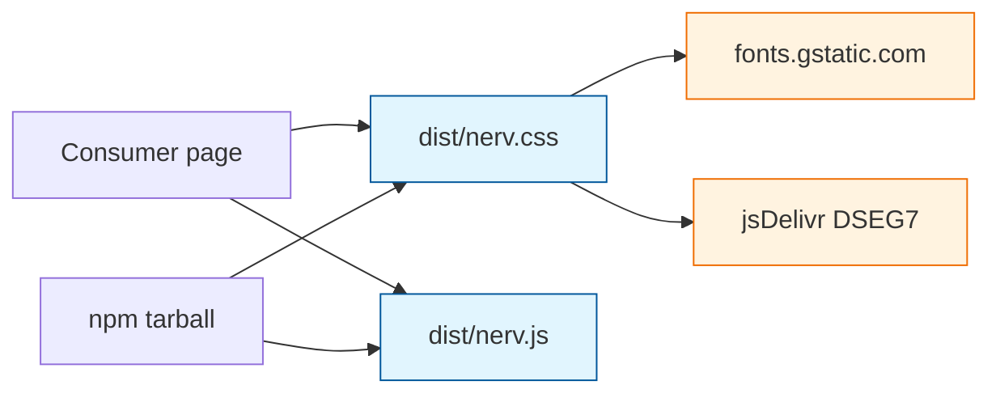
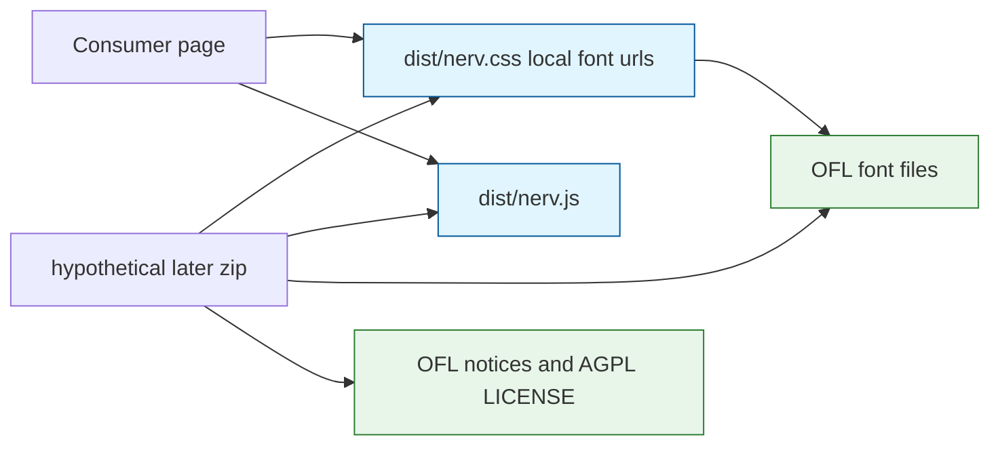

# Offline font-and-JS bundle — feasibility

Investigation date: 2026-09-12. Inventory taken from `@font-face` `src` URLs in [`src/_typography.scss`](../src/_typography.scss). This is a reading of published licenses, not legal advice.

**Verdict:** an offline bundle of the current CSS, JS, and the fonts those files load is **legally feasible**. Do not ship one in 0.1. This note is the investigation; it is not the bundle.

## What “offline” means here

Today the npm package already contains `dist/nerv.css` and `dist/nerv.js` ([`package.json` `files`](../package.json)). A consumer with that tarball still needs the network: the CSS `@font-face` rules fetch typefaces from `fonts.gstatic.com` and jsDelivr at paint time.

An offline bundle would be a later artifact that also contains the font files and `@font-face` URLs that point at those local files, plus the license notices the OFL and AGPL require.

## Loaded typefaces

Six families have their own `@font-face` `src`. Twenty-two distinct URLs. `planning/PHASE1.md` lists four families and is stale; do not use it as the inventory.

| Family | Role | CDN host | Files | License | SPDX | Upstream OFL |
|---|---|---|---|---|---|---|
| Barlow Condensed | HUD | `fonts.gstatic.com` | 2 | SIL Open Font License 1.1 | [OFL-1.1](https://spdx.org/licenses/OFL-1.1.html) | [google/fonts ofl/barlowcondensed/OFL.txt](https://github.com/google/fonts/blob/main/ofl/barlowcondensed/OFL.txt) |
| Antonio | Cartouche Latin | `fonts.gstatic.com` | 2 | SIL Open Font License 1.1 | OFL-1.1 | [google/fonts ofl/antonio/OFL.txt](https://github.com/google/fonts/blob/main/ofl/antonio/OFL.txt) |
| IBM Plex Mono | Data | `fonts.gstatic.com` | 2 | SIL Open Font License 1.1 | OFL-1.1 | [google/fonts ofl/ibmplexmono/OFL.txt](https://github.com/google/fonts/blob/main/ofl/ibmplexmono/OFL.txt) |
| DSEG7 Classic | Seven-segment | jsDelivr `@fontsource/dseg7-classic@5.2.5` | 2 | SIL Open Font License 1.1 | OFL-1.1 | [keshikan/DSEG DSEG-LICENSE.txt](https://github.com/keshikan/DSEG/blob/master/DSEG-LICENSE.txt) |
| Shippori Mincho B1 | Display / CJK | `fonts.gstatic.com` | 12 | SIL Open Font License 1.1 | OFL-1.1 | [google/fonts ofl/shipporiminchob1/OFL.txt](https://github.com/google/fonts/blob/main/ofl/shipporiminchob1/OFL.txt) |
| VT323 | Boot / DOS | `fonts.gstatic.com` | 2 | SIL Open Font License 1.1 | OFL-1.1 | [google/fonts ofl/vt323/OFL.txt](https://github.com/google/fonts/blob/main/ofl/vt323/OFL.txt) |

### Aliases, not extra licenses

- **NERV Mixed** points at the Barlow Condensed Latin `woff2` already in the table.
- **NERV Cartouche** points at the Antonio Latin `woff2` already in the table.

### Not loaded

These names appear only as CSS `font-family` fallbacks. They have no `@font-face` `src` and are out of scope for a bundle of “what the CSS currently loads”:

- Noto Serif JP
- Arial Narrow
- Courier New
- generic `serif` / `sans-serif` / `monospace`

## Per-family copyright and reserved names

Taken from the OFL header of each upstream file above.

| Family | Copyright line | Reserved Font Name |
|---|---|---|
| Barlow Condensed | Copyright 2017 The Barlow Project Authors | none stated |
| Antonio | Copyright 2013 The Antonio Project Authors | none stated |
| IBM Plex Mono | Copyright 2017 IBM Corp. | **Plex** |
| DSEG7 Classic | Copyright 2020 keshikan | **DSEG** |
| Shippori Mincho B1 | Copyright 2021 The Shippori Mincho Project Authors | none stated |
| VT323 | Copyright 2011 The VT323 Project Authors | none stated |

Unmodified files may keep those names. A modified version may not use a Reserved Font Name without permission ([OFL condition 3](https://openfontlicense.org/open-font-license-official-text/)).

Cite the font’s OFL, not Google Fonts CSS API terms. The files are OFL software. If a later milestone shipped a bundle, take bytes from official OFL packages (google/fonts or [fontsource](https://fontsource.org/)), not by copying opaque `gstatic` subset URLs.

## OFL conditions that matter for a bundle

All six families are [OFL-1.1](https://spdx.org/licenses/OFL-1.1.html). The conditions that bite here:

1. Do not sell the fonts by themselves.
2. Bundling with software is allowed if each copy includes the copyright notice and the OFL text.
3. Keep the fonts under OFL. Do not relicense them as AGPL.
4. Reserved Font Names apply only to modified versions.

## JavaScript

[`dist/nerv.js`](../src/nerv.js) is already in the npm tarball. SPDX on the package is **AGPL-3.0-only** ([`package.json`](../package.json) `license`, [`LICENSE`](../LICENSE)). Offline JS is already solved for anyone who has the package. The network gap is fonts.

AGPL still applies to the JS in any later zip: distribute corresponding source, and if you run a modified version as a network service, offer that source to users.

## One zip, two licenses

OFL fonts and AGPL CSS/JS can sit in the same archive as an aggregate.

- The JS and our CSS stay AGPL-3.0-only.
- The font files stay OFL-1.1. Condition 5 forbids distributing the fonts under a different license.
- The zip must carry both: `LICENSE` for the software, and each family’s copyright + OFL text for the fonts.

That is a go on **legal** feasibility. It is not a ship decision.

## Practical notes that are not license blockers

- **Shippori** is twelve subset files. A full CJK family is large; the current CSS already chose curated subsets. A later bundle should pin those same subsets or a documented full family, not scrape whatever `gstatic` hash is in the stylesheet on a given day.
- **Antonio** 400 and 700 currently share the same two `woff2` URLs. A bundler should follow the CSS as-is or fix weights as its own work; this note does not change the stylesheet.
- If a later milestone ships: generate a provenance manifest that pins each font package/version, file hash, upstream OFL URL, and copyright notice, plus the generator version. That keeps CDN-to-offline migration reviewable.

## Recommendation

- **0.1:** do not vendor fonts, do not add a zip, do not rewrite `@font-face`. Leave CDN loading as it is.
- **Later, if we want offline:** yes, it can be done under OFL-1.1 + AGPL-3.0-only, with notices, unmodified reserved names, fonts kept on OFL, and official OFL packages rather than `gstatic` copies.

This milestone stops here.
